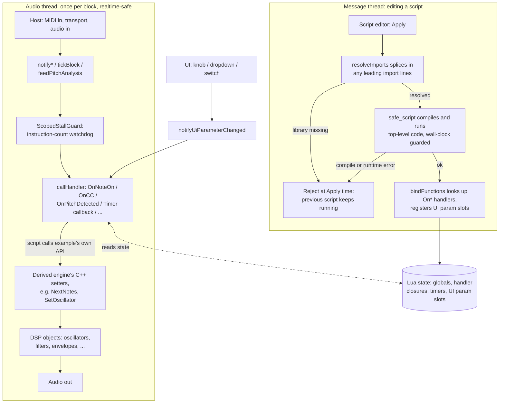

# Lua scripting

This covers how the shared Lua scripting engine works internally - the machinery lives in
`LuaScriptEngineBase.h` and `LuaMusicMathLib.h`, both fixed, always-copied components
(`CPP_SOURCE_FILES_FIXED` in `generate-juce-standalone.py`) that any generated example can
pull in. For the scripting API itself - what you actually call from a script - see
`LUA-MANUAL.md`. Six examples use this engine today - each one's own additional hooks are
documented in its own README.md's "Scripting" section:

| Example | README | Its own hooks |
|---|---|---|
| `dronesequencer` | `examples/dronesequencer/README.md` | `NextNotes`/`OnTiming`, note-table format, `Excite()` playing techniques |
| `morphexsynth` | `examples/morphexsynth/README.md` | `SetOscillator`/`SetAmpEnvelope`/`SetFilterEnvelope`/`SetPitchEnvelope`/`SetLfo`/`SetFilter`/`SetDistortion`/`SetCtrlSlot`/`SetMpeZone`/`SetPhaser`/`SetChorus`/`SetReverb` |
| `pingsynth` | `examples/pingsynth/README.md` | `SetHarmonics`/`SetPitchBendRange`, `OnMpeModeChanged` |
| `resonik` | `examples/resonik/README.md` | `SetFreqRange`/`SetDecayRange`/`SetGainRange`/`SetDelayRange`/`SetQ`/`SetResonanceBody` |
| `spectraltap` | `examples/spectraltap/README.md` | `SetMaxTaps`/`SetTap`, `SetFrequency`/`SetResonance`/`SetFormant`/`SetPan`/`SetGain` |
| `tapelooper` | `examples/tapelooper/README.md` | `SetTapeSpeed`/`SetBpm`/`SetGrooveVariation`/`SetTrackRecord`/`SetTrackPlay`/`SetTrackGain`/`SetTrackFilter`/`SetTrackReverbSend`/`SetReverbSize`/`SetReverbDecay`/`SetGrooveSource`/`SetTrackWow`/`SetTrackFlutter`/`SetTrackDrive`/`SetTrackChorus`/`SetTrackEcho`/`SetTrackCompressor`/`SetTrackRingMod`/`SetTrackTremolo`/`SetTrackChain`/`SetInstrumentGain`/`MuteInstrument`/`SetInstrumentReverbSend`, `OnRecordStateChanged` |

## How a script talks to the engine

Everything below happens inside one `LuaScriptEngineBase<Derived>` instance: loading a
script is message-thread work (may touch the heap), while dispatching to an already-loaded
script is realtime-safe and happens once per audio block.

A rejected "Apply" (bad import, compile error, or a runtime error in code that runs
immediately at load time) never touches `bindFunctions()`, so whatever script was running
before keeps playing underneath - see `LUA-MANUAL.md`'s "Notes on the sandbox". Once loaded,
every handler call (MIDI, timers, transport, pitch, UI params) goes through the same
`callHandler()` path, guarded by a pure instruction-count watchdog so a script bug can't
stall the audio thread.
