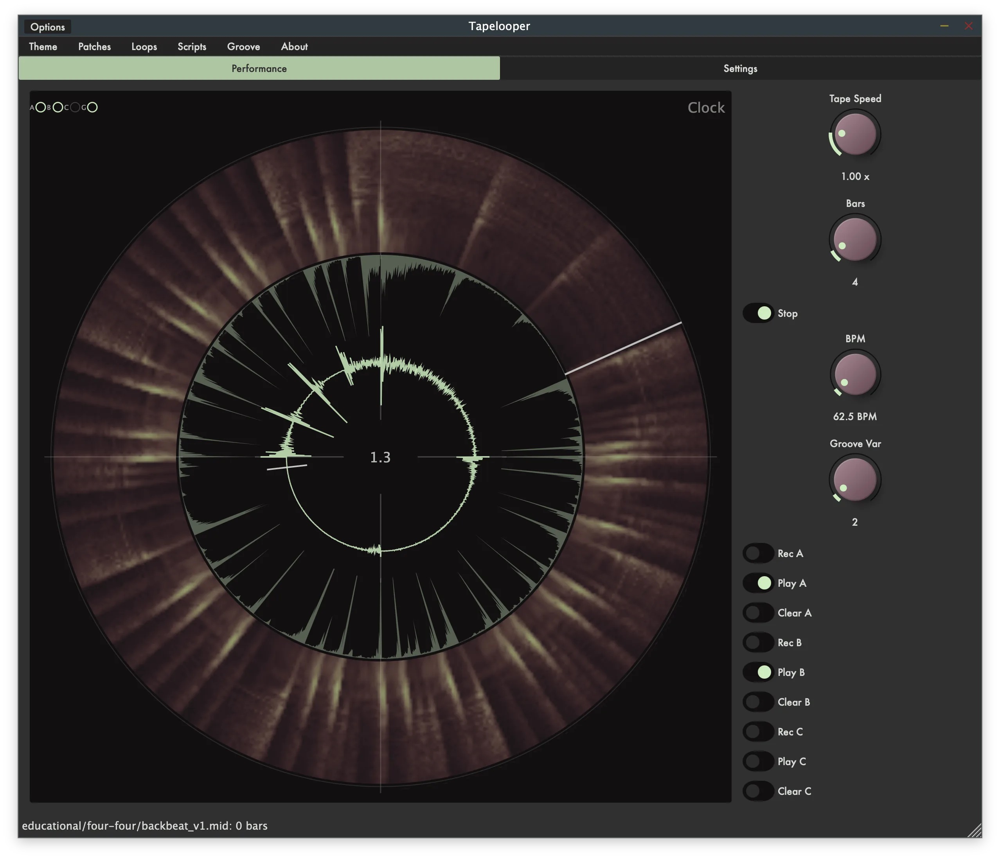
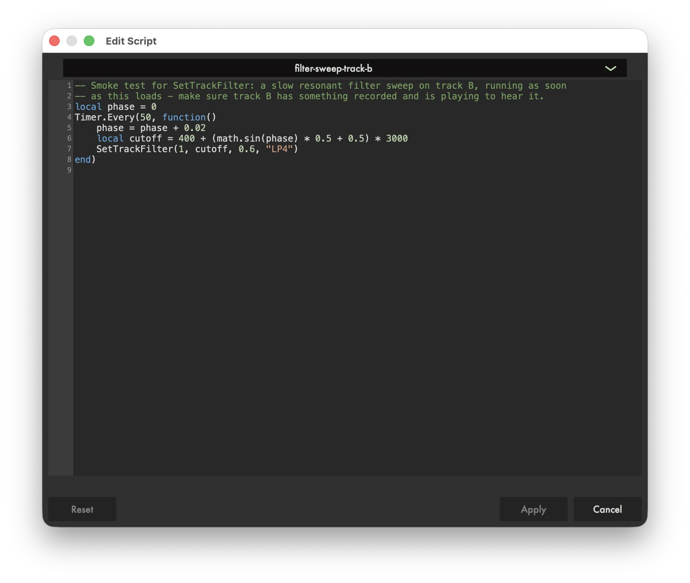

# AbacDsp

AbacDsp is a creative DSP library for audio plugins and standalone applications.
Header-only, zero-dependency C++20 building blocks, with Lua scripting designed for
LLM-assisted sound design.

Specialized building blocks typical for music/audio engineering, balancing efficiency
and originality: four-pole filters, diffusers, resonance modeling, delays, spectral
processing, samplers and more. See `docs/ARCHITECTURE.md` for the full feature list and
the class design rules behind them.

The examples under `examples/` showcase the library end to end: JUCE-based plugins that
combine its processing blocks, focus on accessibility (screen readers, parameter
labeling, color contrast), and - where noted - stay open-ended through embedded Lua
scripting (see `LUA.md` for the shared scripting API). Four are highlighted below; the
full list with a one-paragraph description of each is in `examples/README.md`.

## Examples

### Performance: Tapelooper

<!-- Screenshots are a UI snapshot, not generated - see docs/assets/README.md -->


A varispeed 3-track tape recorder (A, B, C) plus a parallel groove track, all riding one
shared transport speed. Each track records and plays back independently, overdubbing
onto whatever is already looping; the groove track plays a loaded MIDI groove (or a
Lua-scripted click) through the same varispeed transport. Filter, reverb, wow/flutter,
drive, chorus, echo, compression, ring mod and tremolo are all Lua-scriptable, keeping
the on-screen UI to the transport and record/play basics - shaped instead through the
built-in script editor:



See `examples/tapelooper/README.md`.

### Effects: Spectraltap

A Lua-scripted multitap delay: up to 24 taps share one delay buffer, each independently
timed, panned, and shaped by one of eight spectral voice types (bandpass, lowpass,
highpass, notch, resonator, formant, comb resonator, or ring modulator). A patch's script
owns tap topology; the engine owns Hz-to-coefficient mapping, smoothing and DSP safety.
See `examples/spectraltap/README.md`.

*(Screenshot pending - example is stable but not yet captured for this README.)*

### Synth: Pingsynth

A Lua-scripted modal resonator synth: each voice is a bank of ringing bandpass
resonators, excited by an impulse (plus an optional soft noise-burst tail) on every
note-on. A patch's script computes an arbitrary list of partials (frequency, gain, decay,
entry delay) per note, so odd/even/stretched/inharmonic timbres are all just different
Lua loops, not different C++ code paths. See `examples/pingsynth/README.md`.

*(Screenshot pending - example is stable but not yet captured for this README.)*

### Education: Metronome

A JUCE standalone metronome with damped-sine click sounds, odd-meter support, and a
drop-bars mute feature for timing training: lock to the click and use the waveform
display to see how tightly you land on the beat, switch to a shuffle/swing preset to work
on feel, or use drop-bar mode to test internal time. See `examples/metronome/README.md`.

*(Screenshot pending - example is stable but not yet captured for this README.)*

## Building and testing

```bash
mkdir build && cd build
cmake -DCMAKE_BUILD_TYPE=Release ..                          # library + tests only
cmake -DCMAKE_BUILD_TYPE=Release -DBUILD_FULL_PROJECT=ON ..  # + JUCE example plugins
cmake --build .
```

See `docs/BUILDING.md` for the full set of CMake switches, test/coverage tooling, the
Valgrind-vs-ASan note, and how to build the Doxygen API site. See `docs/IDE_SETUP.md` for
clangd/`compile_commands.json` setup.

## License

AbacDsp's own code is MIT licensed (see `LICENSE`). That covers the
header-only core library in `src/includes/` outright. The example plugins
under `examples/` additionally link JUCE, which is AGPLv3-or-commercial; no
commercial JUCE license is configured here, so a built example plugin is
effectively AGPLv3, not MIT. See `THIRD-PARTY-LICENSES.md` for the full
breakdown of every submodule's license and what that split means in
practice.
