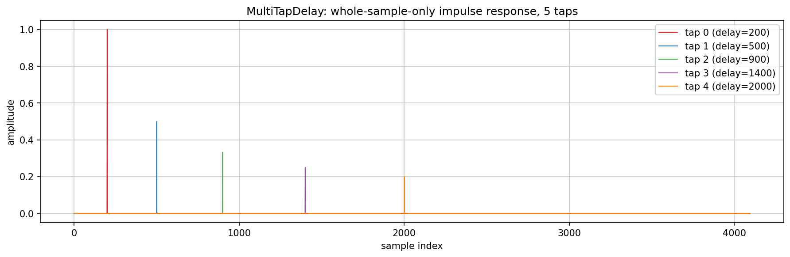

# MultiTapDelay verification plot

Checks `MultiTapDelay` (`src/includes/Delays/`): whole-sample tap spacing with no
interpolation. `MultiTapDelayExplore.cpp` writes a unit impulse once and reads it back through
five taps at different configured delays, each with a simple external gain of `1/(1+tapIndex)`.
`MultiTapDelay` has no built-in decay, so the gain stands in for what resonik and spectraltap
apply after `readTap()`.

`../generate.sh` builds and runs it and renders the PNG here.

## What the plot shows

Each of the five taps shows exactly one non-zero sample, precisely at its configured delay and
nowhere else. That confirms the contract: a tap's impulse response is a single spike, not a
smeared or split reflection around its target sample. The amplitude differences between taps are
only the external gain applied by the plot, showing how a caller layers decay and level on top of
a class that just stores and reads back samples.
