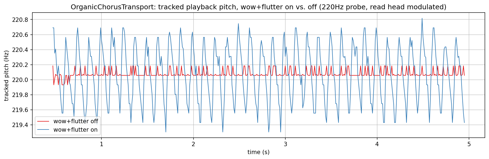
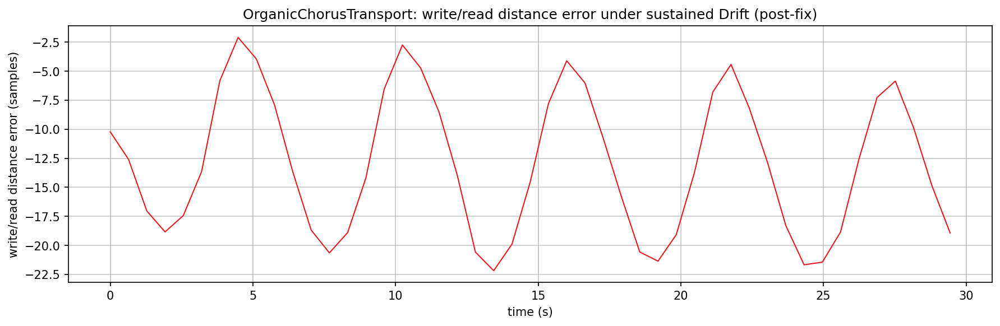
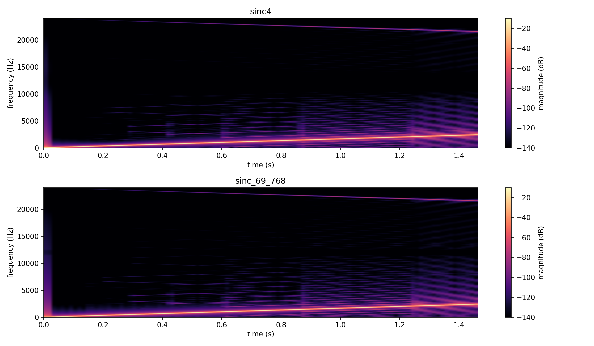
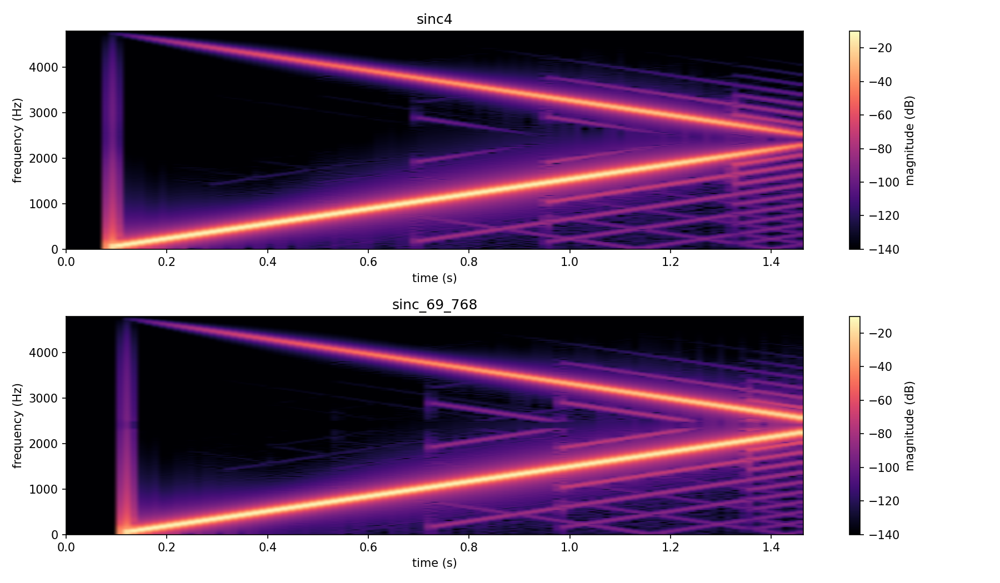
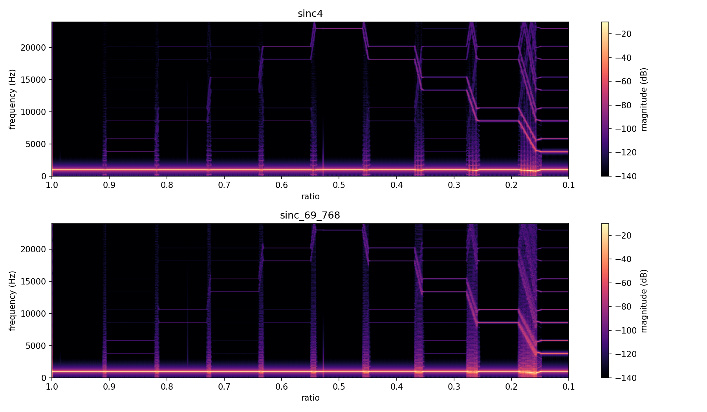

# Delays verification plots

Visualizes and verifies classes in `src/includes/Delays/` directly, with no
JUCE involved: `VariSpeedTapeDelay`'s wow/flutter-shaped recorded pitch and
its exponential/octave-based transport-speed glide; `WobbleDelay`
(organicchorus's own fork, where wow/flutter modulate the read head instead
of the write clock - see its own class doc comment), including a check that
its drift-tracking fix holds under stress; an aliasing comparison
(`sinc4` vs. `sinc_69_768`) of the shared base-ratio resampler across its
ratio range, including a measured SNR table that settled organicchorus's
own filter choice; and `MultiTapDelay`'s whole-sample-only, no-interpolation
tap spacing.

The `.png`s in this folder are checked-in samples of every plot, produced by
the pipeline described here. The aliasing check also saves `.wav` renders
(gitignored, in `generated/`) for listening.

## Quick start

`./generate.sh` runs the whole pipeline in one step: configures/builds
`DelaysExplore` (behind `EXPLORE_STUFF`, into a gitignored `build/` at the
repo root), runs it, sets up a local `.venv` from `requirements.txt`, and
renders every PNG in this folder. `generate.sh` writes the intermediate
data (`.txt` plot series, spectrogram grids, `.wav` renders) into a
gitignored `generated/` subfolder, leaving only the checked-in `.png`s at
the top level of this folder.

## Generating the data

Build (behind the `EXPLORE_STUFF` CMake option; no `dev-scripts/` wrapper
covers this) and run it from the repo root, passing the output directory
for its data files (default `.`):

```bash
mkdir -p build && cd build
cmake -DEXPLORE_STUFF=ON -DCMAKE_BUILD_TYPE=Release ..
cmake --build . --target DelaysExplore
./documentation/Delays/DelaysExplore ../documentation/Delays/generated
```

- `td_pitchwobble.txt`: one plot, two overlaid series - a 220 Hz test tone
  fed continuously into a `VariSpeedTapeDelay` (mirroring the read-then-write
  per-tile order its own callers use) while a read head plays back from
  0.5s behind the write head, with wow (rate 1.5 Hz, depth 0.8) and flutter
  (rate 8 Hz, depth 0.8) either engaged or both disabled. Tracked pitch is
  `Analysis/ZeroCrossings.h`'s `periodLengthByZeroCrossingAverage()` over a
  42ms sliding window, the same technique `Modulation/README.md`'s orbit
  plots use for period estimation.
- `td_speedglide.txt`: one plot, three overlaid series - the instantaneous
  transport ratio during a `setRatio()` glide, for a one-octave step up
  from two different starting points and a one-octave step down. Since
  `VariSpeedTapeDelay` has no public getter for its own smoothed ratio, this
  is measured indirectly: `feed()` resamples exactly `TileSize` input
  frames by the current ratio each call, so `writeHead()`'s advance per
  tile is directly proportional to it.
- `td_readheadwobble.txt`: the same measurement as `td_pitchwobble.txt`, but
  driving `WobbleDelay` instead - wow/flutter modulate the read
  head here, and the write clock stays clean throughout.
- `td_driftstability.txt`: `WobbleDelay`'s write/read distance
  error (`writeHead() - readHead()`, minus the target distance) over a 30s
  run under a sustained Drift-sized external ratio perturbation - the same
  scenario as `test/Delays/WobbleDelay_test.cpp`'s
  `ReadHeadVelocityStaysBoundedUnderSustainedDrift` regression test, verifying
  the drift-tracking fix (`m_lastFeedRatio`) holds over a longer run.
- `td_aliasing_<side>_<ratio>_<filter>.txt` / `.wav` (16 files: writeside/
  readside x 1to10/1to2 x sinc4/sinc69768): a linear 50Hz->2500Hz sweep fed
  at a forced, static transport ratio (Wow/Flutter/Drift all off - only the
  base-ratio resampler is under test), read back and captured as a
  time/frequency grid (`Analysis/Spectrogram.h`'s `SimpleSpectrogram`,
  rendered by this folder's own `spectrogram_plot.py`) and as a `.wav`.
  `1to10` forces ratio 0.1 (writing at an effective 4800 samples/sec,
  Nyquist 2400Hz - the sweep's top end crosses it); `1to2` forces ratio 0.5
  (24000 samples/sec, Nyquist 12000Hz - the same sweep stays well under it,
  a control). `writeside` drives `VariSpeedTapeDelay` (tapelooper's actual
  filter choice); `readside` drives `WobbleDelay`.
- `td_aliasing_ratioglide_<filter>.txt` / `.wav`: a constant 1000Hz probe
  fed into `VariSpeedTapeDelay` while its ratio steps from 1.0 down to 0.1
  in 10 stages, each held for 1s via the transport's own `setRatio(...,
  false)` accel/brake glide (not forced) so it actually settles before the
  next step - captured the same way as the sweep grids above.
- `td_multitap.txt`: one plot, five overlaid series - a unit impulse
  written once, read back through five taps at different configured
  delays, each with a simple external per-tap gain (`1/(1+tapIndex)` -
  `MultiTapDelay` itself has no built-in decay, matching how
  resonik/spectraltap apply their own gain after `readTap()`).

## What the plots show


**Pitch wobble (write clock)**: with wow/flutter disabled, the tracked
pitch sits flat at 220 Hz (the small residual jitter is the zero-crossing
tracker's own measurement noise, not the tape). With both engaged, the
tracked pitch wanders across roughly 218-222 Hz in a repeating
approximately-1.5 Hz sweep - the wow rate configured - with a faster,
jagged ripple riding on top from the 8 Hz flutter component. This is the
direct, audible consequence of `VariSpeedTapeDelay`'s own doc comment:
wow/flutter modulate the *recording* speed, not playback, so once a
passage is on tape its pitch wobble is fixed - what's shown here is that
baked-in wobble surfacing on playback, not a live effect on a steady tone.


**Speed glide**: both one-octave-up traces (`1.0->2.0` and `0.5->1.0`)
reach their target in the same approximately 0.167s, matching
`accelPerSec=6` exactly (`1 octave / 6 octaves-per-second`) and confirming
the doc comment's claim directly: transition time depends on the octave
distance travelled, not on the absolute starting ratio. The one-octave-down
trace (`2.0->1.0`) takes almost exactly twice as long, approximately
0.333s, matching `brakePerSec=3` - braking really is slower than
accelerating, not just documented as such.



**Pitch wobble (read head)**: same 220 Hz probe and wow/flutter settings as
the write-clock plot above, but driving `WobbleDelay`. The
wobble is visually similar in shape and depth - the wow/flutter *character*
carries over faithfully from write-side to read-side modulation - but here
it is a live playback effect: the recording underneath stays clean (see
`td_driftstability.png` and the aliasing plots below, which measure that
recording directly), and the wobble would apply fresh on every playback
pass rather than being fixed once recorded.



**Drift-tracking stability**: the distance error wanders smoothly within
roughly -23 to -3 samples over the full 30s run, tracking the Drift
process's own slow, mean-reverting wander - no discontinuous jumps. Before
the `m_lastFeedRatio` fix, the read head's baseline advance omitted the
Drift perturbation entirely, so this same error grew unchecked until it
crossed the configured correction threshold and triggered a hard, audible
50ms catch-up glide (read velocity dropping to roughly 8% of nominal); see
[[project_organicchorus_transport_fork]] and
`test/Delays/WobbleDelay_test.cpp` for the regression test that
pins this.


**Aliasing, extreme ratio (1:10)**: alongside the true, ascending sweep
ridge (50Hz rising to ~2500Hz), a second ridge descends from ~4800Hz - a
mirror image folding around the 4800Hz effective write rate (2x its
2400Hz Nyquist), confirmed as genuine aliasing by directly measuring the
reconstructed pitch (not a spectrogram-window artifact). **The two filters
produce this identically** - `sinc_69_768`'s deeper stopband does not
remove it. At this extreme a ratio, whatever lets the alias through is not
the loaded FIR table.



**Aliasing, mild ratio (1:2), control**: the same 50-2500Hz sweep, now
comfortably below the 12000Hz Nyquist of a 1:2 (24000 samples/sec) write
rate - a single clean ridge, no mirror, in both filters. Aliasing here is
specific to how extreme the ratio is, not an inherent flaw at any ratio.



**Aliasing, read-side transport**: `WobbleDelay` reproduces both
results (extreme: aliased identically in both filters; mild: clean in both
- see `td_aliasing_readside_1to2.png`) exactly, since this test exercises
only the base-ratio resampler the two classes share - Wow/Flutter, the one
thing that differs between them, are off throughout. In organicchorus's own
real use, Wow/Flutter/Depth push the ratio only a small percent from unity
(see `examples/organicchorus/src/impl/ChorusConfigurations.h`), nowhere
near this extreme 1:10 case.



**Aliasing vs. ratio, quantified**: a fixed 1000Hz tone stays clean at
ratio 1.0 and the alias only becomes clearly visible below roughly 0.7 -
each settled step shows one stable image at its own fixed frequency
(folding down past Nyquist as the ratio keeps falling), confirming this is
a real, reproducible property of the resampler at a given ratio, not an
artifact of how the ratio was driven there. Measuring the alias-to-
fundamental SNR per step (fundamental at 1000Hz, alias as the strongest
peak outside a guard band around it) gives:

| ratio | SNR sinc4 (dB) | SNR sinc_69_768 (dB) |
|---:|---:|---:|
| 1.0 | 89.1 | 89.0 |
| 0.9 | 82.0 | 89.1 |
| 0.8 | 88.9 | 87.8 |
| 0.7 | 85.7 | 83.8 |
| 0.6 | 79.3 | 79.8 |
| 0.5 | 72.3 | 75.5 |
| 0.4 | 68.3 | 68.3 |
| 0.3 | 60.3 | 60.3 |
| 0.2 | 49.2 | 49.2 |
| 0.1 | 29.5 | 29.5 |

Degradation is smooth, not a cliff, and stays at an acceptable level (SNR
comfortably above 60dB) down to about a 1:4 ratio - organicchorus's own
ratio never goes below that (Tape Speed's own -24 semitone floor is exactly
ratio 0.25, i.e. 1:4, and Wow/Flutter no longer touch the write ratio at
all in this fork). Below roughly ratio 0.4 the two filters are
indistinguishable (identical to 0.1dB); `sinc_69_768` only measurably helps
in the 0.9-0.5 range, where both are already well above 60dB regardless.
**Conclusion: `OrganicChorusImpl.h` uses `sinc4`**, same as tapelooper -
`sinc_69_768`'s deeper stopband does not earn its extra processing cost
anywhere in organicchorus's actual operating range.


**Multi-tap spacing**: each of the five taps shows exactly one non-zero
sample, precisely at its configured delay and nowhere else - direct
confirmation of the "whole samples only, no interpolation" contract: a
tap's impulse response is a single spike, not a smeared or split reflection
around its target sample. Amplitude differences between taps here are
purely this plot's own applied external gain, illustrating how a caller
like resonik or spectraltap layers decay/level on top of a class that
itself only stores and reads back samples.
