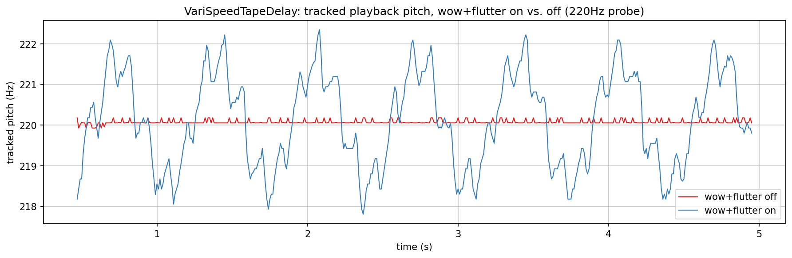
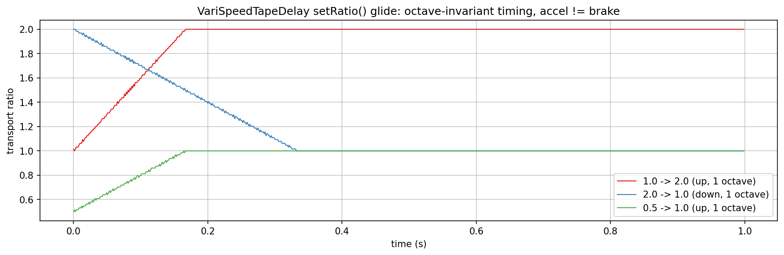

# Delays verification plots

Visualizes and verifies two classes in `src/includes/Delays/` directly, with
no JUCE involved: `VariSpeedTapeDelay`'s wow/flutter-shaped recorded pitch
and its exponential/octave-based transport-speed glide, and
`MultiTapDelay`'s whole-sample-only, no-interpolation tap spacing.

`td_pitchwobble.png`, `td_speedglide.png`, and `td_multitap.png` in this
folder are checked-in samples of all three plots, produced by the pipeline
described here.

## Quick start

`./generate.sh` runs the whole pipeline in one step: configures/builds
`DelaysExplore` (behind `EXPLORE_STUFF`, into a gitignored `build/` at the
repo root), runs it, sets up a local `.venv` from `requirements.txt`, and
renders all three PNGs in this folder. `generate.sh` writes the
intermediate `PyConPlot.py` text into a gitignored `generated/` subfolder,
leaving only the checked-in `.png`s at the top level of this folder.

## Generating the data

Build (behind the `EXPLORE_STUFF` CMake option; no `dev-scripts/` wrapper
covers this) and run it from the repo root (optional arguments are the
pitch-wobble, speed-glide, and multi-tap output files, default
`td_pitchwobble.txt` / `td_speedglide.txt` / `td_multitap.txt`):

```bash
mkdir -p build && cd build
cmake -DEXPLORE_STUFF=ON -DCMAKE_BUILD_TYPE=Release ..
cmake --build . --target DelaysExplore
./documentation/Delays/DelaysExplore
```

- `td_pitchwobble.txt`: one plot, two overlaid series - a 220 Hz test tone
  fed continuously into a `VariSpeedTapeDelay` (mirroring the read-then-write
  per-tile order its own callers use) while a read head plays back from
  0.5s behind the write head, with wow (rate 1.5 Hz, depth 0.8) and flutter
  (rate 8 Hz, depth 0.8) either engaged or both disabled. Tracked pitch is
  `Analysis/ZeroCrossings.h`'s `periodLengthByZeroCrossingAverage()` over a
  42ms sliding window, the same technique `Modulation/README.md`'s orbit
  plots use for period estimation.
- `td_speedglide.txt`: one plot, three overlaid series - the instantaneous
  transport ratio during a `setRatio()` glide, for a one-octave step up
  from two different starting points and a one-octave step down. Since
  `VariSpeedTapeDelay` has no public getter for its own smoothed ratio, this
  is measured indirectly: `feed()` resamples exactly `TileSize` input
  frames by the current ratio each call, so `writeHead()`'s advance per
  tile is directly proportional to it.
- `td_multitap.txt`: one plot, five overlaid series - a unit impulse
  written once, read back through five taps at different configured
  delays, each with a simple external per-tap gain (`1/(1+tapIndex)` -
  `MultiTapDelay` itself has no built-in decay, matching how
  resonik/spectraltap apply their own gain after `readTap()`).

## What the plots show



**Pitch wobble**: with wow/flutter disabled, the tracked pitch sits flat at
220 Hz (the small residual jitter is the zero-crossing tracker's own
measurement noise, not the tape). With both engaged, the tracked pitch
wanders across roughly 218-222 Hz in a repeating approximately-1.5 Hz
sweep - the wow rate configured - with a faster, jagged ripple riding on
top of each sweep from the 8 Hz flutter component. This is the direct,
audible consequence of the class's own doc comment: wow/flutter modulate
the *recording* speed, not playback, so once a passage is on tape its pitch
wobble is fixed - what's shown here is that baked-in wobble surfacing on
playback, not a live effect being applied to a steady tone.



**Speed glide**: both one-octave-up traces (`1.0->2.0` and `0.5->1.0`)
reach their target in the same approximately 0.167s, matching
`accelPerSec=6` exactly (`1 octave / 6 octaves-per-second`) and confirming
the doc comment's claim directly: transition time depends on the octave
distance travelled, not on the absolute starting ratio. The one-octave-down
trace (`2.0->1.0`) takes almost exactly twice as long, approximately
0.333s, matching `brakePerSec=3` - braking really is slower than
accelerating, not just documented as such.


**Multi-tap spacing**: each of the five taps shows exactly one non-zero
sample, precisely at its configured delay and nowhere else - direct
confirmation of the "whole samples only, no interpolation" contract: a
tap's impulse response is a single spike, not a smeared or split reflection
around its target sample. Amplitude differences between taps here are
purely this plot's own applied external gain, illustrating how a caller
like resonik or spectraltap layers decay/level on top of a class that
itself only stores and reads back samples.
