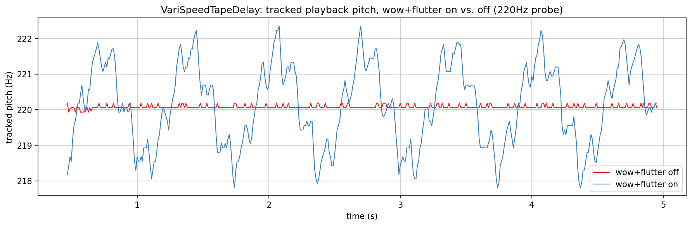
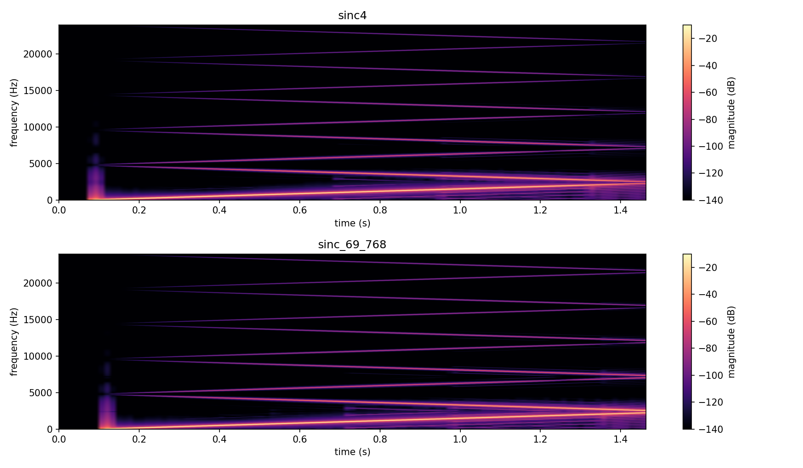
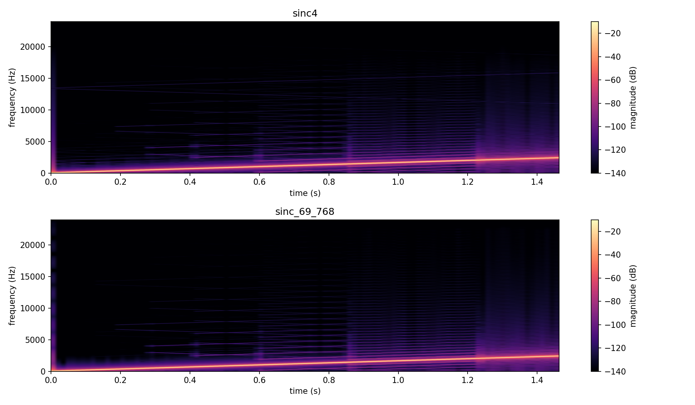

# VariSpeedTapeDelay verification plots

Checks `VariSpeedTapeDelay` (`src/includes/Delays/`): the pitch wobble that wow and flutter
bake into the recording, its octave-based transport-speed glide, and the aliasing of its
write-side resampler, including a measured SNR table that settled organicchorus's own filter
choice.

`../generate.sh` builds `VariSpeedTapeDelayExplore.cpp` together with the other two explore
programs, runs it, and renders every PNG here. Intermediate data (`.txt` plot series,
spectrogram grids, `.wav` renders for listening) goes into the gitignored `../generated/`.

## What the plots show

Pitch wobble. A 220 Hz tone is fed continuously into a `VariSpeedTapeDelay` while a read head
plays back from 0.5 s behind the write head, with wow (1.5 Hz, depth 0.8) and flutter (8 Hz,
depth 0.8) either engaged or both disabled. Tracked pitch is `Analysis/ZeroCrossings.h`'s
`periodLengthByZeroCrossingAverage()` over a 42 ms sliding window. With wow and flutter off the
pitch sits flat at 220 Hz (the small residual jitter is the tracker's own measurement noise).
With both on it wanders across roughly 218 to 222 Hz in a repeating sweep at the wow rate, with a
faster ripple from the flutter component riding on top. This is the consequence of the class
comment: wow and flutter modulate the recording speed, so once a passage is on tape its wobble is
fixed.

Speed glide. `VariSpeedTapeDelay` has no getter for its smoothed ratio, so the plot measures it
indirectly: `feed()` resamples exactly `TileSize` frames by the current ratio, so the write
head's advance per tile is proportional to it. Both one-octave-up traces (1.0 to 2.0 and 0.5 to
1.0) reach their target in the same 0.167 s, which is `accelPerSec = 6`, one octave in one
sixth of a second. Transition time depends on the octaves travelled, not on the starting ratio.
The one-octave-down trace (2.0 to 1.0) takes 0.333 s, matching `brakePerSec = 3`: braking is
slower than accelerating.

Aliasing at an extreme ratio. A linear 50 Hz to 2500 Hz sweep is fed at a forced, static ratio
with wow, flutter and drift off, so only the resampler is under test. At ratio 0.1 the tape is
written at an effective 4800 samples per second (Nyquist 2400 Hz) and the sweep crosses it. Next
to the true ascending ridge there is a mirrored descending one from 4800 Hz and a zigzag of
further images up to 24 kHz. Both filters show it identically: the deeper stopband of
`sinc_69_768` does not remove it, so at this ratio the alias does not come from the FIR table.
The same pair exists for ratios 0.25, 0.5 and 1.5 (`td_aliasing_writeside_<ratio>.png`).

Aliasing at a mild ratio, as a control. At ratio 0.99 the same sweep stays far below Nyquist and
shows one clean ridge in both filters, with only faint texture around it. The aliasing is a
property of how extreme the ratio is, not a flaw at every ratio.

Aliasing against ratio, quantified. A constant 1000 Hz probe is fed while the ratio steps from
1.0 down to 0.1 in ten stages, each held for one second through the transport's own accel/brake
glide so it settles before the next step. The tone is clean at 1.0 and an alias becomes visible
below roughly 0.7: each settled step shows one stable image at its own fixed frequency, folding
down past Nyquist as the ratio keeps falling. The alias-to-fundamental SNR per step (alias is the
strongest peak outside a guard band around the fundamental) is:

| ratio | SNR sinc4 (dB) | SNR sinc_69_768 (dB) |
|---:|---:|---:|
| 1.0 | 89.1 | 89.0 |
| 0.9 | 82.0 | 89.1 |
| 0.8 | 88.9 | 87.8 |
| 0.7 | 85.7 | 83.8 |
| 0.6 | 79.3 | 79.8 |
| 0.5 | 72.3 | 75.5 |
| 0.4 | 68.3 | 68.3 |
| 0.3 | 60.3 | 60.3 |
| 0.2 | 49.2 | 49.2 |
| 0.1 | 29.5 | 29.5 |

The degradation is smooth, and stays above 60 dB down to a ratio of 0.3. organicchorus never goes
below 0.25 (its Tape Speed floor of -24 semitones), and wow and flutter no longer touch the write
ratio in that fork. Below ratio 0.4 the two filters are identical to 0.1 dB, and `sinc_69_768`
only helps between 0.9 and 0.5, where both are already above 60 dB. Conclusion: `OrganicChorusImpl.h`
uses `sinc4`, like tapelooper, because the deeper stopband does not earn its processing cost in
organicchorus's operating range.
