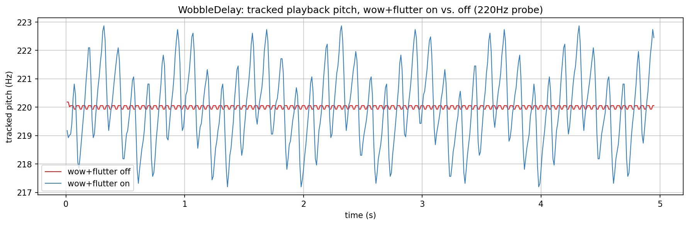
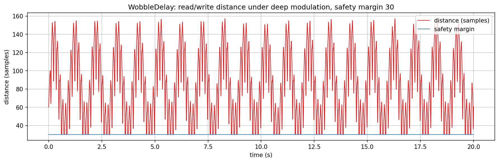
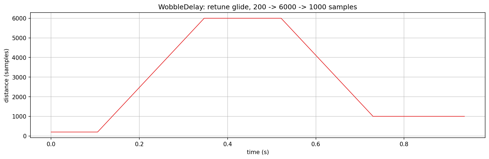
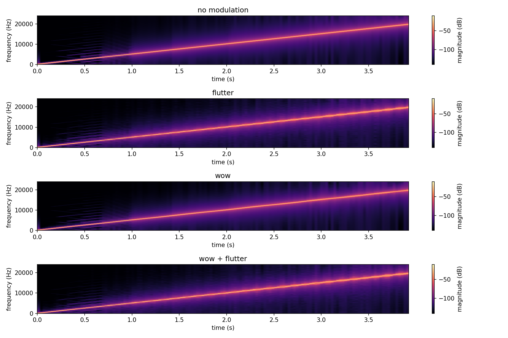
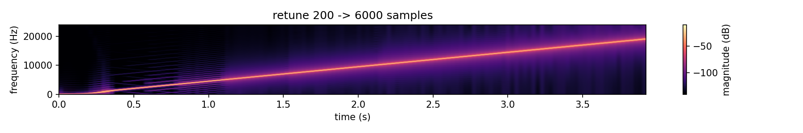

# WobbleDelay verification plots

Checks `WobbleDelay` (`src/includes/Delays/`): a mono delay at a single sample rate whose read
head is offset by Wow and Flutter. The read position is always the write head minus a delay, so
it can not drift from it. That delay is a smoothed base distance plus the Wow delay plus the
Flutter offset, updated every `TileSize` samples and interpolated linearly in between, clamped to
a safety margin so the read head can not reach the write head, and read with Catmull-Rom
interpolation. There is no resampling in the class. Running it at another rate is the job of
`UpDownSampler`, see `../../OverSampling/README.md`.

`../generate.sh` builds `WobbleDelayExplore.cpp` together with the other two explore programs,
runs it, and renders every PNG here. Intermediate data (plot series, spectrogram grids, `.wav`
renders for listening) goes into the gitignored `../generated/`.

## What the plots show

Pitch wobble. A 220 Hz tone passes through a 2000 sample delay, with wow (1.5 Hz, depth 0.8)
and flutter (8 Hz, depth 0.8) either engaged or off. The pitch is tracked with
`periodLengthByZeroCrossingAverage()` over a 42 ms window. With modulation off it sits flat at
220 Hz (the small ripple is the tracker's own noise). With both on it wanders across roughly 217
to 223 Hz, a slow wow cycle with the 8 Hz flutter riding on it. Flutter is a speed error, so its
delay offset is scaled by its own rate (sample rate over 2 pi times the flutter rate, floored at
0.1 Hz): the pitch swing then equals the configured depth at any flutter rate, while the delay
excursion grows as the rate falls.

Distance stability. A base delay of 60 samples with deep wow (depth 1.0) and flutter (3 %), and a
safety margin of 30 samples, over 20 s. The distance swings between the margin and about 155
samples and never goes below the margin line, which shows as flat stretches where the clamp
engages. The clamp acts on the modulated target, and the delay is then interpolated between two
clamped targets, so it holds between them as well. The unit test `ReadHeadNeverCrossesSafetyMargin`
pins this.

Retune glide. `setDelay()` moves the base delay along a smoothstep curve. Its steepest point is
0.5 samples per sample, meaning the read head runs at 0.5 or 1.5 times speed there and never
faster, and it runs at exactly 1.0 at both ends of the glide. Because the peak is bounded, the
glide takes 1.5 times as long as a linear ramp at that speed: 200 to 6000 samples takes 0.36 s and
6000 to 1000 takes 0.31 s. A retune started during a glide continues from where the delay is, at
zero speed.

Swept tone. A sine sweep from 50 Hz to 20 kHz over 4 s passes through a fixed 500 sample delay
with each modulation setting. The unmodulated delay is one clean ridge. Flutter and wow broaden it
into FM sidebands that grow toward the top of the sweep, as they must for a fixed modulation
depth, and there is no mirrored or aliased ridge in any panel. The sidebands stay in a band
around the ridge, with a slightly lifted floor at the top of the sweep.

Swept tone during a retune. While the delay grows the tone is read slower than normal, which
lowers the ridge for the length of the glide, and it recovers smoothly as the glide ends. An
earlier version of the glide used a linear ramp, whose read speed jumped from 0.5 to 1.0 at its
end. A step in instantaneous frequency splatters across the whole spectrum, and it showed here as
a full-height burst at the end of the glide. With the eased curve, whose delay speed is zero at
both ends, only a faint smear about 100 dB down remains near 0.3 s.
