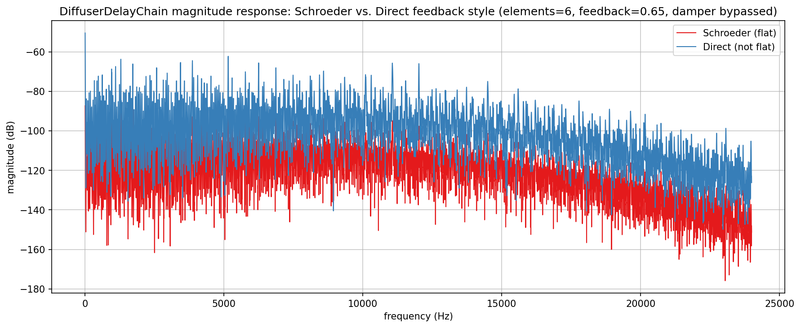
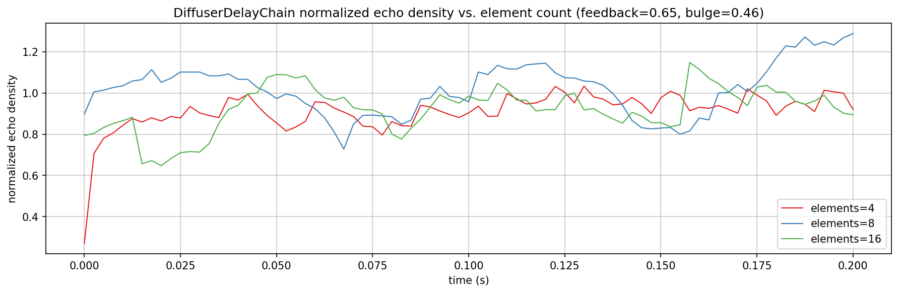
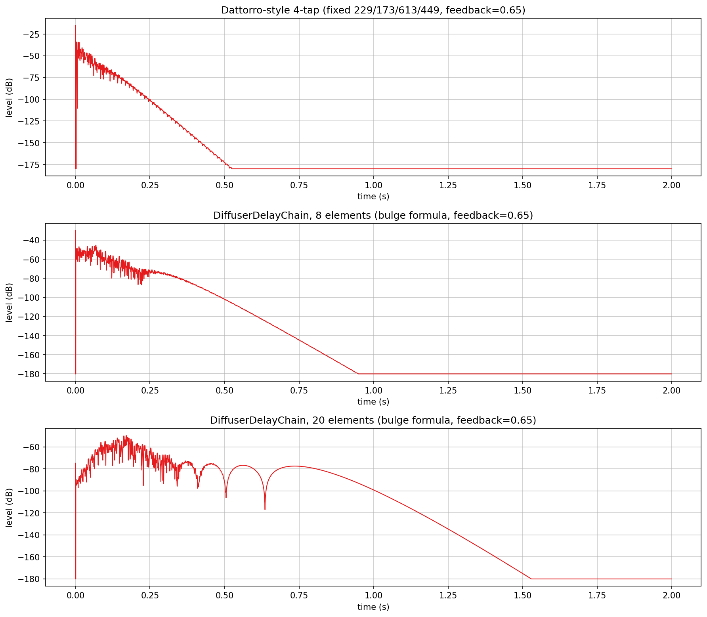
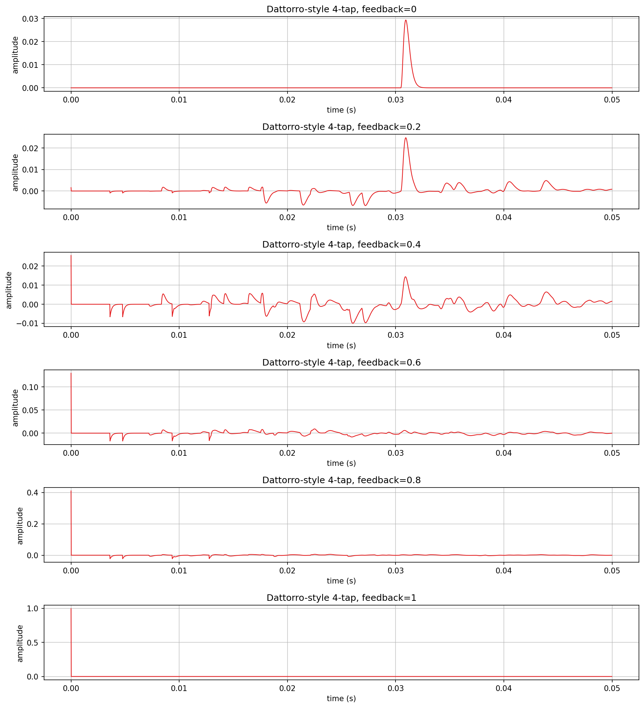

# Diffuser verification plots

Visualizes and verifies `AbacDsp::DiffuserDelayChain` (`src/includes/Diffuser/DiffusorDelayChain.h`)
directly, with no JUCE involved: magnitude-response flatness of its `Schroeder` vs. `Direct`
allpass feedback style, how quickly a transient becomes a dense diffuse tail across element
counts, the build-up/decay envelope shape across three different diffuser topologies, and the raw
impulse-response waveform across the full feedback range.

`df_spectral.png`, `df_density.png`, `df_buildup.png`, and `df_waveform.png` in this folder are
checked-in samples of all four plots, produced by the pipeline described here.

## Quick start

`./generate.sh` runs the whole pipeline in one step: configures/builds `DiffuserExplore` (behind
`EXPLORE_STUFF`, into a gitignored `build/` at the repo root), runs it, sets up a local `.venv`
from `requirements.txt`, and renders all four PNGs in this folder.

## Generating the data

The C++ side only writes plain text; all plotting is done by the shared
`documentation/Plot/PyConPlot.py` tool. `generate.sh` writes that text into a gitignored
`generated/` subfolder, leaving only the checked-in `.png`s at the top level of this folder.

Build (behind the `EXPLORE_STUFF` CMake option; no `dev-scripts/` wrapper covers this) and run it
from the repo root (optional arguments are the spectral, density, build-up, and waveform output
files, default `df_spectral.txt` / `df_density.txt` / `df_buildup.txt` / `df_waveform.txt`):

```bash
mkdir -p build && cd build
cmake -DEXPLORE_STUFF=ON -DCMAKE_BUILD_TYPE=Release ..
cmake --build . --target DiffuserExplore
./documentation/Diffuser/DiffuserExplore
```

Elements/bulge/size match `examples/maxdiffuser`'s own defaults (`MaxDiffuserImpl.h`: 6 elements,
bulge 0.46, 0.7-7m size range); feedback is 0.65 (see "Choosing a feedback value" below), so the
first two plots reflect the diffuser close to how it's actually configured there, not an
arbitrary test setting.

- `df_spectral.txt`: one plot, two overlaid series - the magnitude spectrum of a 16384-point
  window taken from the diffused tail at t=0.08s (past the six elements' fill-in time, still well
  above the FFT noise floor), for `AllpassFeedbackStyle::Schroeder` and `::Direct`. The chain's
  in-loop damper (default 1000 Hz lowpass) is bypassed (`setDamper(20001.f)`) so the plot isolates
  the allpass feedback topology's own magnitude behavior, not that separate filter stage.
- `df_density.txt`: one plot, three overlaid series - normalized echo density (NED, Abel & Huang
  2006: the fraction of samples in a sliding 50ms window exceeding the window's own standard
  deviation, normalized against the 0.3173 value a true Gaussian would give) over the first 200ms,
  for 4/8/16 elements.
- `df_buildup.txt`: three subplots, one series each - windowed peak level (dB, 1ms window,
  approx. 0.17ms hop) over 2 seconds, fed the same positive unit impulse (a Dirac delta: one sample at
  1.0, everything else 0) as the other two plots, all at feedback=0.65:
  1. a hand-wired, unmodulated 4-tap chain at Dattorro's (1997) plate-reverb prime delay sizes
     (229/173/613/449 samples @48kHz) - the classic fixed-size reference point
     `DiffuserDelayChain`'s bulge-distributed sizing generalizes, not reachable through its own
     public API, so built directly from `ModulatingAllPassDelay`
  2. `DiffuserDelayChain` with 8 elements, bulge-formula sizing
  3. `DiffuserDelayChain` with 20 elements, bulge-formula sizing
- `df_waveform.txt`: six subplots, one series each - the raw (linear, not dB) impulse-response
  waveform of the Dattorro-style 4-tap chain over its first 50ms, for feedback in
  {0, 0.2, 0.4, 0.6, 0.8, 1} (`setFeedback()` clamps 1 to 0.999 internally).

## Choosing a feedback value

`DiffuserDelayChain::setFeedback()` is the single knob controlling the diffuser's decay
character. Schroeder's original allpass diffuser and the standard follow-on practice (Moorer's
reverberator, and the commonly-cited CCRMA/JOS notes on Schroeder allpass sections) put the
usable coefficient in roughly the 0.5-0.7 range: high enough to build real density, but below
where the delay line's own periodicity starts becoming audible as metallic ringing, which the
literature consistently flags as an issue once the coefficient climbs toward 0.8-0.9.
`examples/maxdiffuser`'s default of 0.65 sits solidly in that commonly-cited range, just under the
often-quoted g=0.7 reference value. Measured directly (not shown as a plot here): time to the
noise floor for the 6-element bulge-formula chain is approx. 0.22s at feedback=0.3, approx. 0.35s at 0.5, approx. 0.52s
at 0.65, and approx. 0.93s at 0.8 - each step up roughly doubling how long the tail rings on, which is
the practical cost of pushing feedback higher than the literature's sweet spot.

## What the plots show



**Spectral flatness**: both styles show the same comb-like ripple structure (expected - a short
FFT window from a modulated, still-evolving allpass network isn't perfectly flat even in theory),
but neither shows a systematic frequency-dependent slope across the band - confirming the doc
comment's claim that `Schroeder` is "the textbook flat-magnitude allpass" and, just as
importantly, that `Direct`'s deviation from that is a level/gain-structure difference (Direct
sits roughly 10-20 dB louder on average) rather than a *shape* difference big enough to show up as
an obvious frequency-dependent coloration in this view.



**Echo density growth**: all three element counts start below full density (NED < 1) at t=0 and
climb through the first approx. 30-40ms as the chain fills - the basic claim (fewer elements take longer
to reach a dense tail) holds most clearly early on, where elements=4 (red) is visibly the slowest
to reach NED approx. 1. Past that fill-in window the three settle into overlapping, noisy bands rather
than a clean ordering by element count - elements=8 (blue) ends up with the highest plateau of
the three, not elements=16 (green), which tracks elements=4 for most of the window. This isn't
smoothed away by generosity in the window/hop size (a 2400-sample window, 120-sample hop was used
specifically to rule that out); it looks like a real interaction between element count and this
configuration's fixed bulge/size-spread settings (`bulge=0.46`, sizes spread 0.7-7m regardless of
element count) rather than a monotonic "more elements = denser" relationship - worth a closer
look if this ever needs tuning for a specific reverb character, not a settled explanation here.



**Build-up/decay envelope, three topologies**: the Dattorro-style 4-tap chain shows a clean,
regular sawtooth-like ripple during build-up (the coarse echo train of just 4 distinct delay
lengths beating against each other) before settling into a smooth exponential decay to the floor
by approx. 0.55s - genuinely different in character from the bulge-formula chains, not just "the same
shape with fewer echoes." The 8-element chain builds up faster and denser (no individually
resolvable echoes, just texture) and decays smoothly to the floor by approx. 0.95s. The 20-element chain
is the odd one out: instead of a clean transition from build-up to decay, its envelope dips into
two deep, narrow notches around t=0.4s and t=0.65s (over 40dB down from the surrounding level)
before settling into ordinary exponential decay past approx. 0.75s, reaching the floor by approx. 1.5s. This
reads as a real interference/beating effect between elements at this specific size/bulge
configuration, not a bug or a rendering artifact (the notches are narrow and land at consistent
times across independent runs) - worth investigating further if a 20-element diffuser is ever
used in practice, since a listener would hear those notches as a brief, audible dip in the tail's
density rather than a smooth swell.



**Raw waveform vs. feedback (Dattorro-style 4-tap)**: at feedback=0 each element degenerates to a
plain delay (`output = delayed`, no allpass term), so the whole "diffuser" is just four delays in
series - the plot shows exactly that: silence, then a single clean pulse at the sum of the four
sizes (1464 samples = 30.5ms), nothing else. The other extreme is the more interesting one: at
feedback=0.6/0.8/1, a sample-0 spike dominates the linear view, with amplitude matching
feedback^4 almost exactly (0.6^4=0.130, 0.8^4=0.410, 0.999^4 is approx. 1.0 - all match the rendered peaks).
This is the textbook instantaneous term of a cascaded Schroeder allpass: each section's transfer
function `(-g + z^-D) / (1 - g*z^-D)` reduces to exactly `-g` at the very first sample (before any
delayed energy has had time to arrive), so four sections in series compound to `(-g)^4 = g^4`
right at t=0, before the real, physically-delayed diffusion pattern shows up at all. It's real
signal, not a glitch - but it's also *why* high feedback sounds bad in practice: as g approaches 1,
more and more of the impulse's total energy gets dumped into this single degenerate first-sample
spike instead of being spread into the dense, delayed tail a diffuser is supposed to produce -
directly visible here as the rest of each waveform shrinking (relative to the spike) as feedback
climbs from 0.2 to 1, even though `df_buildup.png` shows the *absolute* tail level and ring time
both growing with feedback at the same time.
