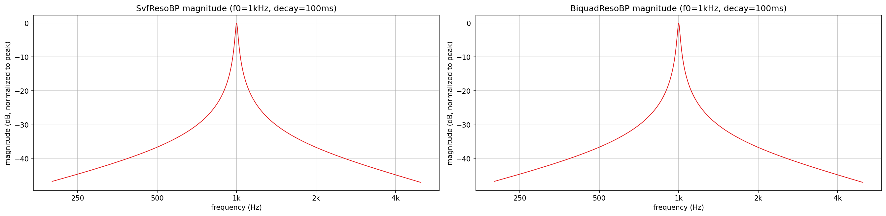
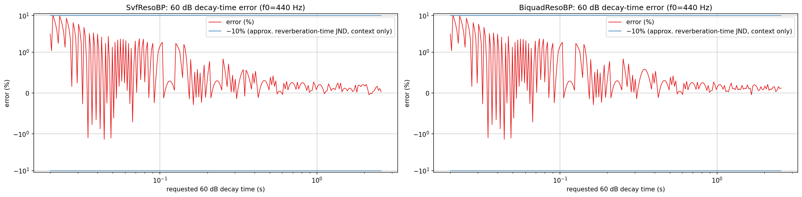
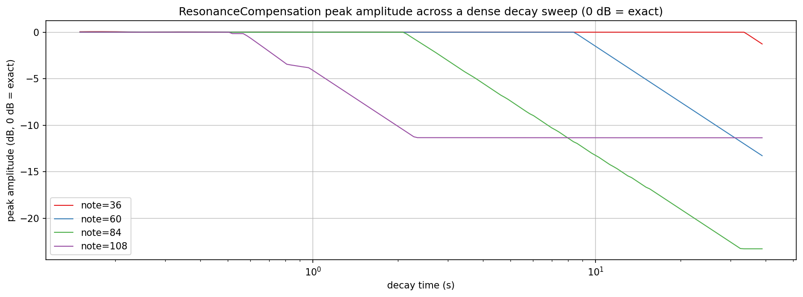
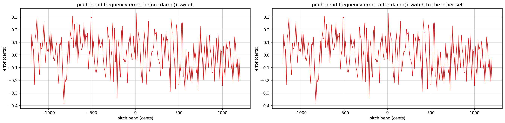
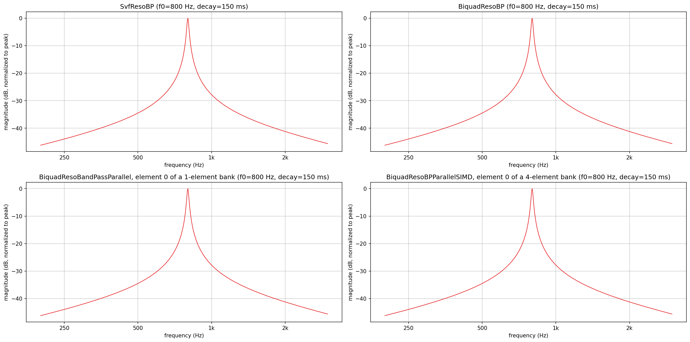
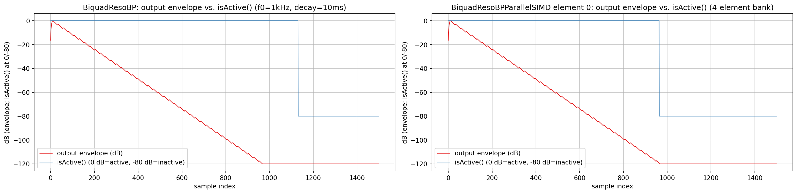

# ResoBP filter family verification plots

Visualizes and verifies `AbacDsp`'s resonant-bandpass family
(`src/includes/Filters/SvfResoBP.h`, `BiquadResoBP.h`, `BiquadResoBandPassParallel.h`,
`BiquadResoBPParallelSIMD.h`) directly, with no JUCE involved: magnitude response and
topology agreement across all four classes, 60 dB decay-time accuracy, `ResonanceCompensation`
peak-amplitude accuracy across a dense decay sweep, pitch-bend accuracy through a `damp()`
coefficient-set switch, and `isActive()` timelines for the two classes whose activity tracking
was fixed. This is the same measure-the-running-filter approach as
`documentation/Filters/PoleMixing/README.md`, scaled to a smaller family and a narrower goal:
demonstrating that six specific, previously-broken behaviors are now correct, not a general
design-space exploration.

`rb_response.png`, `rb_decay_accuracy.png`, `rb_compensation_accuracy.png`, `rb_pitchbend.png`,
`rb_topology.png` and `rb_isactive.png` in this folder are checked-in samples of all six plots,
produced by the pipeline described here.

## Quick start

`./generate.sh` runs the whole pipeline in one step: configures/builds `BandpassImpulseExplore`
(behind `EXPLORE_STUFF`, into a gitignored `build/` at the repo root), runs it, sets up a local
`.venv` from `requirements.txt`, and renders all six PNGs in this folder. The sections below
explain what it's doing and how to run each step by hand.

## Generating the data

The C++ side only writes plain text; all plotting is done by the shared
`documentation/Plot/PyConPlot.py` tool, avoiding a C++ plotting dependency. `generate.sh` writes
that text into a gitignored `generated/` subfolder, leaving only the checked-in `.png`s at the
top level of this folder.

Build (enabled behind the `EXPLORE_STUFF` CMake option; no `dev-scripts/` wrapper covers this,
so configure/build directly) and run it, from the repo root (optional arguments are the six
output files, default `rb_response.txt` / `rb_decay_accuracy.txt` /
`rb_compensation_accuracy.txt` / `rb_pitchbend.txt` / `rb_topology.txt` / `rb_isactive.txt`):

```bash
mkdir -p build && cd build
cmake -DEXPLORE_STUFF=ON -DCMAKE_BUILD_TYPE=Release ..
cmake --build . --target BandpassImpulseExplore
./documentation/Filters/BandpassImpulses/BandpassImpulseExplore
```

- `rb_response.txt`: two subplots, one per class, magnitude sweep for `SvfResoBP` and
  `BiquadResoBP` at a fixed 1 kHz / 100 ms decay, each curve normalized to its own peak. Split
  rather than overlaid: the two curves land on essentially the same shape, which is the point,
  but that makes a single overlay hard to read as two distinct lines rather than one. Absolute
  level is not compared either way: `SvfResoBP::step()` returns the raw, uncompensated bandpass
  tap (the class's own doc says as much - `ResonanceCompensation` exists precisely because that
  raw level is not flat with frequency/Q), so only shape and center frequency are meaningfully
  comparable here.
- `rb_decay_accuracy.txt`: two subplots, one per class, plotting relative error (measured vs.
  requested 60 dB decay time, as a percentage) rather than the two overlaid on a `y=x` reference -
  at this accuracy the overlay and the reference line would be indistinguishable, while the error
  is immediately readable. Fixed 440 Hz, swept 20 ms-2.56 s geometrically (`decay *= 1.02` each
  step, about 245 points) - the direct verification that the discarded-`Q` and ms/s unit bugs are
  fixed. Measured by driving a single impulse and tracking a per-period local maximum (like the
  unit tests do) until it falls 60 dB below the impulse's own peak, rather than a raw per-sample
  threshold, so a zero crossing isn't mistaken for decay; this also means the measurement itself
  is quantized to one period (about 2.3 ms at 440 Hz), which the fine sweep step makes visible as
  a shrinking sawtooth rather than smoothing it away.
- `rb_compensation_accuracy.txt`: peak amplitude after a `ResonanceCompensation`-derived
  `reset()`, across a decay sweep that deliberately does not land on the LUT's power-of-two
  columns (`decay *= 1.03` each step, not `*= 2`), at four representative notes two octaves
  apart. 0 dB is the target - an exactly compensated resonator. Measurement window matches
  `SvfResoBPTest.checkCompensationModelForWaveExcitation` (2000 samples: the compensated `reset()`
  is meant to place the state at the target amplitude directly, not ring up to it, so a short,
  fixed window is the right measurement regardless of decay time). The sweep starts at 0.15 s so
  even the lowest note plotted (36, approx. 65 Hz) gets several full periods before the 60 dB point;
  below that, decay time and period length become comparable and "peak amplitude" stops being a
  meaningful measurement of this fix specifically. Kept as one overlay, unlike the plots above:
  the four notes' curves separate cleanly on their own.
- `rb_pitchbend.txt`: two subplots - frequency error in cents (`1200 * log2(measured / expected)`,
  the natural unit for a pitch error, immediately comparable to the approx. 5-10 cent range commonly
  cited as the just-noticeable difference for pitch) vs. requested cents, swept in 10-cent steps
  (241 points), measured right after `pitchBendCents()`, and again after a `damp()` switch to the
  coefficient set that was never bent under the old code. Plotted as error against the expected
  frequency rather than three overlaid absolute-frequency curves, for the same legibility reason
  as decay accuracy above. The direct verification that `pitchBendCents()` now updates both sets.
- `rb_topology.txt`: four subplots, one per class, magnitude sweep at a fixed 800 Hz / 150 ms
  decay, each normalized to its own peak - `BiquadResoBandPassParallel` and
  `BiquadResoBPParallelSIMD` each used as a bank with only element 0 configured (a 1-element and
  a 4-element bank respectively, the latter being the SIMD class's minimum lane width). Split
  into a 2x2 grid rather than one four-curve overlay for the same reason as `rb_response.txt`.
- `rb_isactive.txt`: two subplots, one per class (`BiquadResoBP`; `BiquadResoBPParallelSIMD`
  element 0 of a 4-element bank; both 1 kHz, 10 ms decay), each overlaying two series on one dB
  axis: the real output envelope (a peak-hold follower, `~50`-sample time constant, normalized to
  its own peak) and `isActive()` itself, mapped to 0 dB when active and -80 dB when inactive. A
  bare active/inactive timeline doesn't say whether the state actually tracks anything real; this
  does, by putting the boolean on the same axis as the signal it's supposed to be describing. Both
  classes are seeded the same way (`reset(1.f, 0.f)`, then `triggered()` for `BiquadResoBP` to
  also exercise its forced decay-count window) so the two panels' energy-threshold crossings are
  directly comparable rather than being scaled differently by an arbitrary impulse amplitude.

`BpImpulseExplore.cpp` also still contains `checkCompensationModelForWaveExcitation()`,
`computeCompensationModelForWaveExcitation()` and `writeRawCompensationLutDump()` - the tool that
originally generated `ResonanceCompensation`'s LUT source data, printed to stdout for hand-pasting
into `SvfResoBP.h`. Not wired into `main()`: like `PoleMixingFilter`'s own correction-regeneration
step (see `PoleMixing/README.md`), this is a separate, rarely-run, manually-invoked step, not part
of `generate.sh`. To use it, temporarily call `writeRawCompensationLutDump()` from `main()`,
rebuild, run, and capture stdout.

## Rendering the plots

From `documentation/Filters/BandpassImpulses/` (the venv and `requirements.txt` below live here,
not in `build/`):

```bash
python3 -m venv .venv && source .venv/bin/activate
pip install -r requirements.txt

python3 ../../Plot/PyConPlot.py -f generated/rb_response.txt -o rb_response.png \
    --labelx "frequency (Hz)" --labely "magnitude (dB, normalized to peak)" --width 900 --height 450 --cols 2

python3 ../../Plot/PyConPlot.py -f generated/rb_decay_accuracy.txt -o rb_decay_accuracy.png \
    --labelx "requested 60 dB decay time (s)" --labely "error (%)" --width 900 --height 450 --cols 2

python3 ../../Plot/PyConPlot.py -f generated/rb_compensation_accuracy.txt -o rb_compensation_accuracy.png \
    --labelx "decay time (s)" --labely "peak amplitude (dB, 0 dB = exact)" --width 1200 --height 450 --cols 1

python3 ../../Plot/PyConPlot.py -f generated/rb_pitchbend.txt -o rb_pitchbend.png \
    --labelx "pitch bend (cents)" --labely "error (cents)" --width 900 --height 450 --cols 2

python3 ../../Plot/PyConPlot.py -f generated/rb_topology.txt -o rb_topology.png \
    --labelx "frequency (Hz)" --labely "magnitude (dB, normalized to peak)" --width 900 --height 450 --cols 2

python3 ../../Plot/PyConPlot.py -f generated/rb_isactive.txt -o rb_isactive.png \
    --labelx "sample index" --labely "dB (envelope; isActive() at 0/-80)" --width 900 --height 450 --cols 2
```

## Bugs fixed

Six correctness bugs, all documented in `TODO.md` before the fix, are verified directly by the
plots above:

1. `SvfResoBP::computeCoefficients()` discarded its `Q` argument, always recomputing `k` from
   `m_decayT` instead. Fixed by inverting the decay-time formula to derive an equivalent
   `m_decayT` from the given `Q`.
2. `SvfResoBP::setDecay()` and `BiquadResoBP::setDecay()` treated their argument as milliseconds
   for the decay-sample count but as seconds in the `Q` formula - a 1000x error. Fixed by
   converting once, up front. (1) and (2) together are what `rb_decay_accuracy.png` verifies.
3. `SvfResoBP::pitchBendCents()` only recomputed the active coefficient set, so a `damp()` switch
   after a bend snapped back to the unbent pitch. Fixed by recomputing both sets. Verified by
   `rb_pitchbend.png`.
4. `ResonanceCompensation::compensate()` interpolated linearly across a geometric (power-of-two)
   time axis, despite its own comment claiming log-space interpolation. Fixed by computing the
   column index and its fraction from the same log-index. Verified by `rb_compensation_accuracy.png`
   staying near 0 dB between LUT columns, not just at them.
5. `BiquadResoBP::isActive()` never decremented its forced-active counter, so a triggered
   resonator reported active forever.
6. `BiquadResoBPParallelSIMD::isActive()` read `m_z`, which the SIMD paths never write (only
   `reset()` and an unreachable scalar fallback do - `USE_SIMD_FRAMEWORK`/`USE_X86_INTRINSICS`
   is always defined on any platform this builds on). Fixed by reading the lane-major state
   `process()` actually advances. (5) and (6) together are what `rb_isactive.png` verifies.

Left alone, and documented as such in `TODO.md`: the differing `isActive()` epsilon thresholds
between siblings, `damp()` being global on the SIMD bank vs. per-element on its non-SIMD sibling,
the `BiquadResoBPParallelSIMD`/`BiquadResoBpParallelSIMD` class/file name mismatch, the three
near-duplicate coefficient-design implementations, and `setDecay()`'s cached-frequency reuse -
all inconsistencies or design questions, not bugs with a single clear fix.

## What the plots show



**Response** (`rb_response.png`): `SvfResoBP` and `BiquadResoBP`'s side-by-side panels are visually
indistinguishable from each other - the same bandpass shape, peaking at 1 kHz - confirming the
topology-preserving and direct-form designs agree.



**Decay accuracy** (`rb_decay_accuracy.png`): both panels show a shrinking sawtooth on a symlog
axis (linear within +/-1%, log beyond, so both the large early spike and the small settled region
stay legible in one plot), peaking around 10% error near the 20 ms start and settling under 1%
past about 145 ms. The +/-10% band is a commonly-cited, approximate order-of-magnitude reference
for reverberation-time JND (room-acoustics literature gives figures from about 5% to over 20%
depending on source and listening context, so treat this as orientation, not a precise threshold):
against it, this error is inaudible everywhere except a brief stretch near the very shortest,
least musically realistic decay times. The sawtooth itself is `measureT60Seconds()`'s own
quantization made visible by the fine sweep step: the measurement resolves to whole periods at
440 Hz (about 2.3 ms each), a large fraction of a 20 ms target and a negligible one of a
multi-second target - it is the measurement's resolution decaying away with target size, not the
filter. Before the fix, `setByDecay()`'s constructor-time default and `setDecay()`'s ms/s bug
would have put this error in the tens-of-percent to 1000x range throughout - far outside the
reference band for its entire length, not converging toward it.



**Compensation accuracy** (`rb_compensation_accuracy.png`): all four notes stay within a fraction
of a dB of 0 dB across most of their range, including the fine, off-LUT-column decay steps this
sweep uses - direct evidence the log-space interpolation fix is smooth between columns, not just
correct at them. The plot also surfaces a separate, pre-existing characteristic worth flagging: at
very high effective Q (high note combined with a long decay - note 108's curve, for instance,
starts drifting from 0 dB by around a 0.6 s decay, and every note eventually drifts several dB or
more toward the sweep's upper end), the LUT itself is measurably less accurate. This is not
addressed by this pass - the interpolation axis and the underlying per-cell measurement/fit
accuracy are independent things - but it is a real gap worth a future re-fit or note in the class
documentation.



**Pitch bend** (`rb_pitchbend.png`): the two panels - before and after the `damp()` switch - are
pixel-identical, error bounded to about +/-0.39 cents and clearly dominated by zero-crossing
measurement noise (it has the same jagged shape in both panels, not a trend). That is roughly an
order of magnitude below the approx. 5-10 cents commonly cited as the threshold at which a pitch
difference becomes audible, i.e. inaudible by a comfortable margin. Before the fix, the "after
switch" panel would have shown a large, cents-dependent error instead: the unbent 440 Hz carrier
compared against the bent expected frequency - a difference easily in the audible range for large
bend amounts.



**Topology** (`rb_topology.png`): all four panels show the same normalized peak shape at 800 Hz.
`BiquadResoBP`, `BiquadResoBandPassParallel` and `BiquadResoBPParallelSIMD` share the exact same
per-element coefficient formulas, which shows here as three visually identical panels;
`SvfResoBP` is the only genuinely different topology, and its panel still agrees in shape.



**isActive timeline** (`rb_isactive.png`): in both panels, `isActive()` (blue) drops from 0 dB to
-80 dB right where the real envelope (red) has already run into the display floor - not early,
and not never. `BiquadResoBP` drops at sample 1131 (its forced decay-count window, 480 samples,
runs out well before the energy-threshold check would have caught it here, so this panel is really
verifying the energy check on top of the window, not the window alone); `BiquadResoBPParallelSIMD`
drops at sample 964, matching its own envelope's descent (no forced window used for this panel,
by design - see above). Before their respective fixes, `BiquadResoBP`'s blue line would have
stayed at 0 dB indefinitely regardless of the red envelope, and `BiquadResoBPParallelSIMD`'s would
have dropped to -80 dB almost immediately, while the red envelope was still near its peak.
