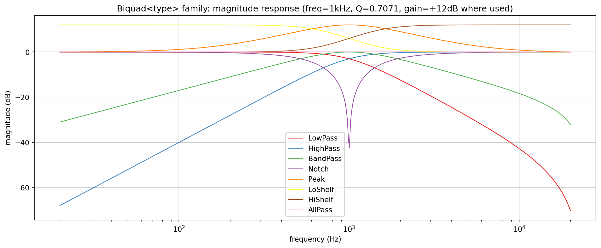
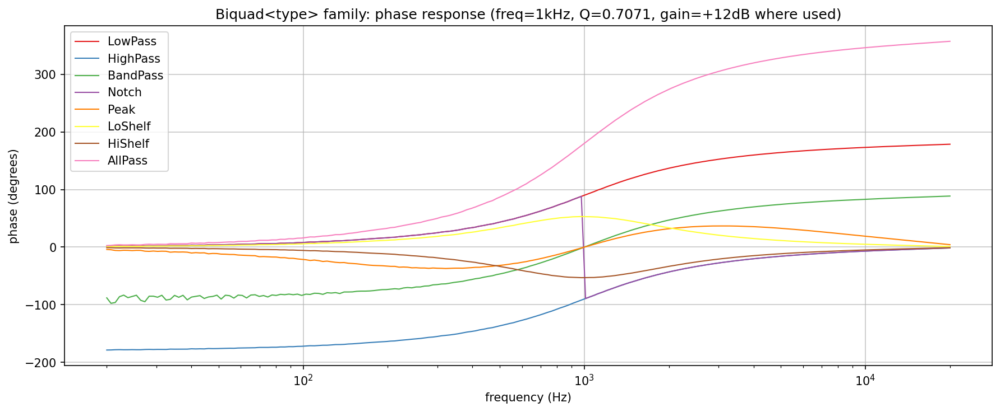
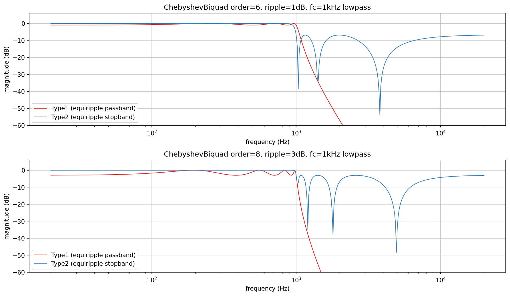
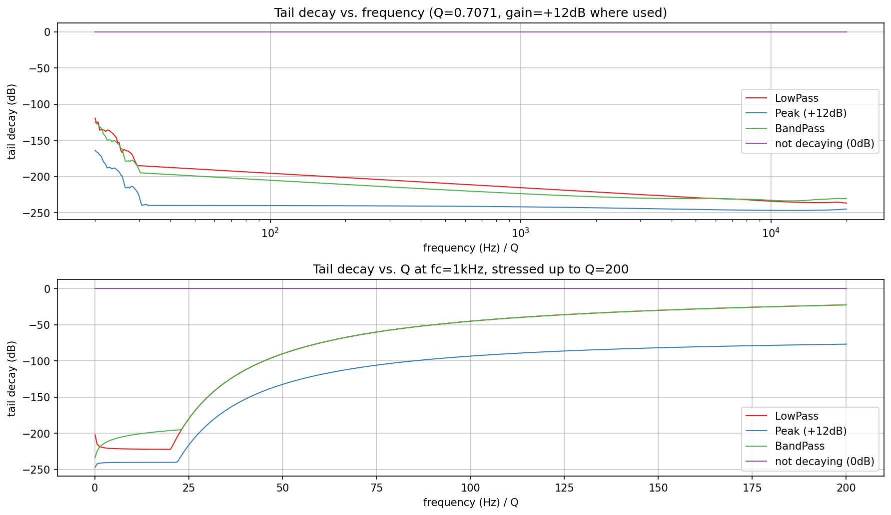
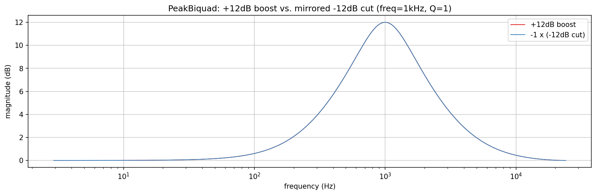

# Biquad verification plots

Visualizes and verifies all four classes in `src/includes/Filters/Biquad.h`
directly, with no JUCE involved: the `Biquad<type>` family's magnitude and
phase response across all eight response shapes, `ChebyshevBiquad`'s Type1
vs. Type2 ripple placement, empirical stability under a stressed Q sweep,
and `PeakBiquad`'s exact boost/cut mirror symmetry.

`bq_response.png`, `bq_phase.png`, `bq_chebyshev.png`, `bq_stability.png`,
and `bq_peaksymmetry.png` in this folder are checked-in samples of all five
plots, produced by the pipeline described here.

## Quick start

`./generate.sh` runs the whole pipeline in one step: configures/builds
`BiquadsExplore` (behind `EXPLORE_STUFF`, into a gitignored `build/` at the
repo root), runs it, sets up a local `.venv` from `requirements.txt`, and
renders all five PNGs in this folder. `generate.sh` writes the intermediate
`PyConPlot.py` text into a gitignored `generated/` subfolder, leaving only
the checked-in `.png`s at the top level of this folder.

## Generating the data

Build (behind the `EXPLORE_STUFF` CMake option; no `dev-scripts/` wrapper
covers this) and run it from the repo root (optional arguments are the
family-response, phase, Chebyshev, stability, and peak-symmetry output
files, default `bq_response.txt` / `bq_phase.txt` / `bq_chebyshev.txt` /
`bq_stability.txt` / `bq_peaksymmetry.txt`):

```bash
mkdir -p build && cd build
cmake -DEXPLORE_STUFF=ON -DCMAKE_BUILD_TYPE=Release ..
cmake --build . --target BiquadsExplore
./documentation/Filters/Biquads/BiquadsExplore
```

- `bq_response.txt`: one plot, eight overlaid series - `Biquad<type>`'s
  magnitude response for every `BiquadFilterType` (LowPass, HighPass,
  BandPass, Notch, Peak, LoShelf, HiShelf, AllPass) at 1kHz, Q=0.7071,
  +12dB where gain applies. Computed analytically via `magnitudeInDb()`
  (`biquadMagnitudeInDb()`'s closed-form phi-substitution) - no rendering
  needed, since the class exposes its own exact frequency response.
- `bq_phase.txt`: one plot, the same eight series - phase response at the
  same settings. `Biquad<type>` has no analytical phase, so this is
  measured like a lock-in amplifier would: drive each design with a settled
  sine at the test frequency, correlate the output against sin/cos
  references at that exact frequency to get its I/Q pair directly (no FFT
  bin-width or windowing error), and take the phase difference from the
  input's own I/Q the same way. Sequentially unwrapped across the sweep so
  a full-range curve (`AllPass`) reads as one continuous line instead of
  wrapping at +/-180 degrees.
- `bq_chebyshev.txt`: two subplots - `ChebyshevBiquad::computeType1()` vs.
  `computeType2()` at two order/ripple combinations, via the class's own
  `getMagnitudeInDb()`.
- `bq_stability.txt`: two subplots - since `a1`/`a2` are `protected` (no
  coefficient getter), stability is checked empirically instead: render an
  8192-sample impulse response and compare its last 256 samples' peak to
  its overall peak, in dB. A properly decaying (stable) filter reads
  strongly negative; a non-decaying one would sit near 0dB. First subplot
  sweeps frequency at Q=0.7071; second sweeps Q from 0.1 up to a stressed
  200 at a fixed 1kHz.
- `bq_peaksymmetry.txt`: one plot, two overlaid series - `PeakBiquad`'s
  measured spectrum at +12dB and at -12dB (negated, to overlay against the
  boost curve), verifying the doc comment's "a cut of -x dB inverts a boost
  of +x dB exactly" claim directly.

### A measurement bug caught before it shipped

The first version of the peak-symmetry measurement used a Hann-windowed
FFT (`HannWindowMagnitudesFft`, the same tool this session's other
documentation folders use for spectral snapshots) directly on `PeakBiquad`'s
impulse response, and got a flat, near-silent curve nowhere close to
+/-12dB. `PeakBiquad`'s impulse response is short and front-loaded (most of
its energy in the first few dozen samples), and a Hann window tapers to
zero at sample 0 - so the window was discarding almost the entire signal
before the FFT ever saw it. A direct steady-state sine test (feed a tone,
measure settled output amplitude, no FFT involved) confirmed the class
itself was correct (exactly 12.00 dB at 1kHz, near 0 dB well away from it)
before concluding the bug was in this measurement, not the library.
Switched to `BasicFFT::realDataToMagnitude<float, FftRectangularWindow>` -
no window at all, appropriate for a short, transient-dominated impulse
response - which produces the expected result. A reminder that a Hann (or
any tapering) window belongs on a *steady* signal, not directly on a
transient.

## What the plots show



**Family response**: every shape matches its name exactly - `LowPass` and
`HighPass` are mirror-image -12dB/octave rolloffs either side of 1kHz,
`BandPass` peaks there and rolls off both directions, `Notch` cuts a sharp
null precisely at 1kHz, `Peak`/`LoShelf`/`HiShelf` all show the requested
+12dB, and `AllPass` stays flat at 0dB across the entire band - an allpass
moves phase, not magnitude, and this confirms the magnitude side of that
claim directly.



**Family phase**: `AllPass` is the standout - a single continuous sweep
across the full 360 degrees, exactly twice the roughly-180-degree range
every other type covers, matching an allpass section's textbook property
of contributing a full cycle of phase shift while leaving magnitude
untouched. `LowPass` and `HighPass` are exact mirror images of each other
across the whole sweep, consistent with their mirror-image magnitude
responses on the previous plot. `Notch` shows a sharp, near-discontinuous
jump right at 1kHz - the zero sitting on the unit circle at exactly the
notch frequency forces an abrupt phase flip there, not a gradual one.
`Peak`/`LoShelf`/`HiShelf` all return to 0 degrees away from 1kHz, unlike
`LowPass`/`HighPass`/`AllPass` which carry a non-zero asymptotic phase -
the bell/shelf shapes only disturb phase near their own band, matching
their magnitude responses only disturbing gain there too.



**Chebyshev Type1 vs. Type2**: Type1's passband visibly ripples by exactly
the configured amount (subtle at 1dB/order 6, clearly visible at 3dB/order
8) while its stopband rolls off monotonically with no ripple at all.
Type2 is the exact mirror of that trade: a flat, ripple-free passband, and
a stopband with equiripple notches that bottom out and return partway
back up - the finite zeros the doc comment describes, not a monotonic
rolloff.



**Stability**: every tested type stays well clear of the 0dB "not decaying"
reference line across the full 20Hz-20kHz sweep and, more importantly,
across an aggressive Q sweep up to 200 - a level well past anything a
normal use case would reach. Decay does slow as Q climbs (a higher-Q
resonance rings longer, as expected), but even at Q=200 the tail is still
20-75dB down after only 8192 samples, comfortably inside stable territory.
No instability found anywhere in this sweep - a real result, not a
foregone conclusion, since the cookbook bilinear design this class uses
does not guarantee stability by inspection alone.



**Peak boost/cut symmetry**: the two curves land exactly on top of each
other across the whole spectrum, not just near the peak - direct,
quantitative confirmation that `PeakBiquad`'s cut path is a precise
mirror of its boost path, exactly as the doc comment claims, not just
"close" or "similar in shape".
