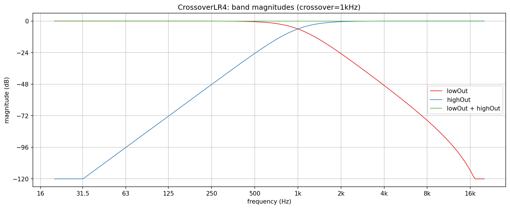
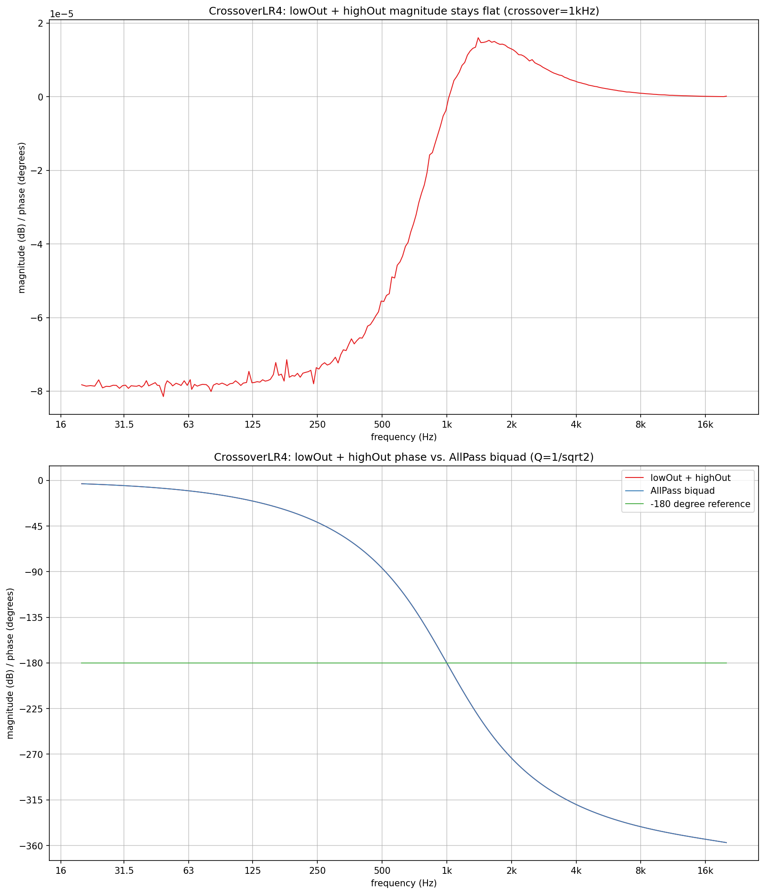
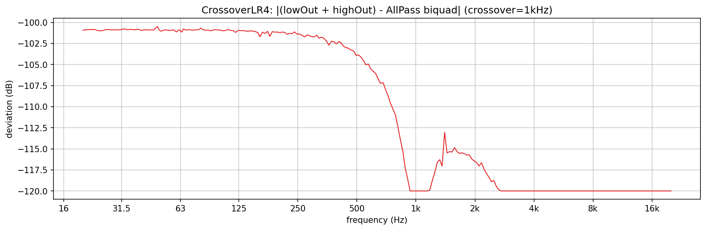

# CrossoverLR4 verification plots

Visualizes and verifies `AbacDsp::Graph::Nodes::CrossoverLR4`
(`src/includes/Graph/Nodes/CrossoverLR4.h`) directly, with no JUCE involved:
the two band magnitudes, the behaviour of their sum, and how closely that sum
matches the theoretical allpass.

`cl4_response.png`, `cl4_sum_allpass.png`, and `cl4_error.png` in this folder
are checked-in samples of all three plots, produced by the pipeline described
here.

## Design in one paragraph

Each band is two cascaded Butterworth biquads (Q = 1/sqrt(2)) at the same
frequency: `lowOut` is `LowPass` twice, `highOut` is `HighPass` twice. Both
bands are -6 dB at the crossover and in phase there. Their sum is not the
input: analytically `LP^2 + HP^2 = D(-s)/D(s)`, a 2nd-order Butterworth
allpass. Magnitude is flat, phase lags from 0 to -360 degrees, and it passes
exactly -180 degrees at the crossover frequency. `lowOut + highOut == in` is
therefore not a property of a Linkwitz-Riley crossover and is not tested.
The correct check is against an `AllPass` biquad at the same frequency and Q.

## Quick start

`./generate.sh` runs the whole pipeline in one step: configures/builds
`CrossoverLR4Explore` (behind `EXPLORE_STUFF`, into a gitignored `build/` at
the repo root), runs it, sets up a local `.venv` from `requirements.txt`, and
renders all three PNGs in this folder. The intermediate `PyConPlot.py` text
goes into a gitignored `generated/` subfolder.

## How the data is measured

`CrossoverLR4` has no analytical `magnitude()`, so every point is measured by
driving the node sample by sample with a settled sine and correlating each
output against `exp(-j*phase)` over exactly one second (an integer number of
cycles at whole-Hz frequencies). That gives the complex gain of `lowOut`,
`highOut` and their sum in one pass; magnitude and phase come from it. The
reference `AllPass` biquad runs through the identical measurement.

- `cl4_response.txt`: one plot with `lowOut`, `highOut`, and their sum.
- `cl4_sum_allpass.txt`: two subplots, sum magnitude and sum phase against the
  `AllPass` biquad's phase.
- `cl4_error.txt`: one plot, the complex difference between the sum and the
  `AllPass` biquad in dB.

## What the plots show

**Band magnitudes**: grid lines are one octave apart horizontally and 24 dB apart
vertically, so a 24 dB/octave slope runs along the grid diagonals. The bands cross at -6 dB at 1 kHz. `lowOut` is flat below
and falls at 24 dB/octave above (about -24 dB at 2 kHz, -48 dB at 4 kHz).
`highOut` mirrors it: about -48 dB at 250 Hz and -80 dB at 100 Hz, so it is a
real highpass well below the crossover. The sum stays on the 0 dB line.

**Sum**: the top subplot is the sum's magnitude. The axis scale is 1e-5 dB, so
the sum is flat to about 0.00001 dB (float rounding, not a response error).
The bottom subplot shows the phase lagging from 0 toward -360 degrees and
crossing the -180 degree reference line at 1 kHz. The `AllPass` biquad's
curve lies exactly under the crossover's, so only one line is visible.

**Deviation**: the difference between `lowOut + highOut` and the reference
`AllPass` biquad stays below -100 dB across the whole band (the plot floor
is -120 dB), which is float precision. This is the quantitative form of the
statement above: the sum equals a 2nd-order Butterworth allpass, not a
different filter that merely looks similar.
