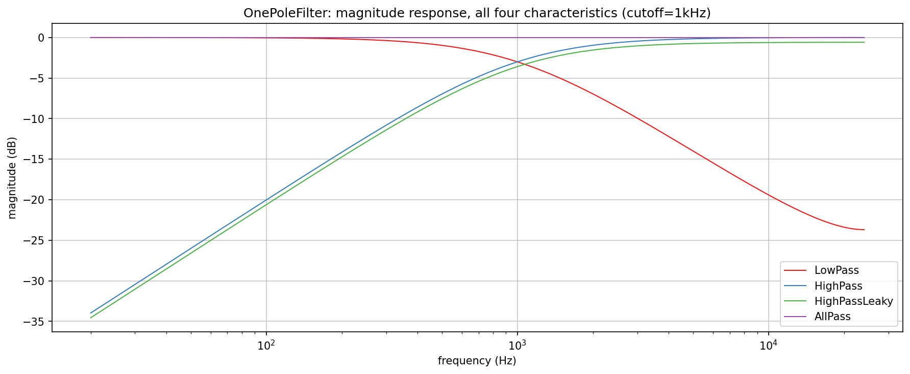
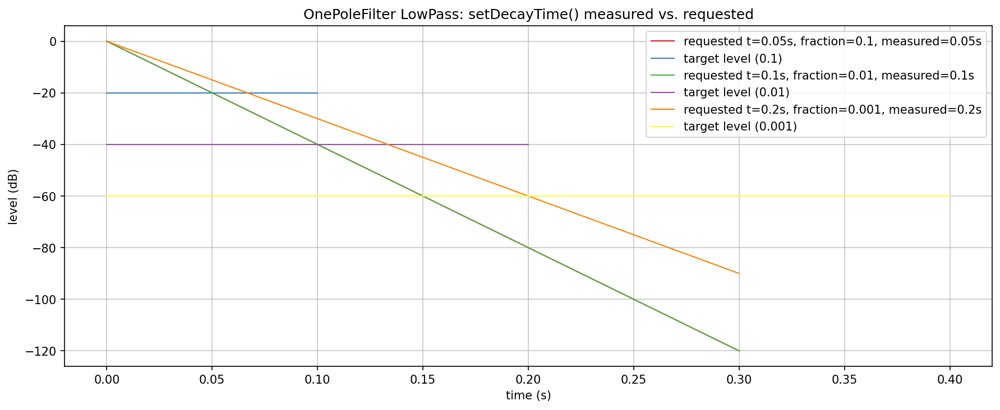
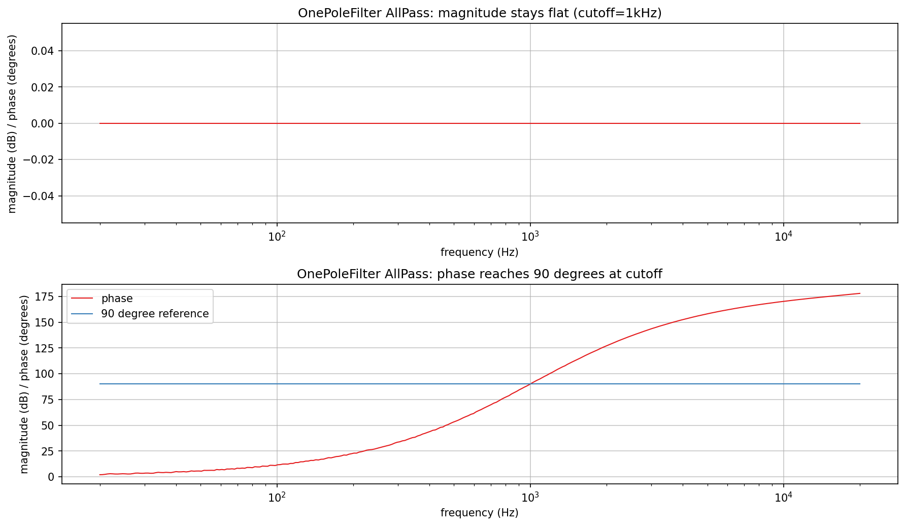

# OnePoleFilter verification plots

Visualizes and verifies `AbacDsp::OnePoleFilter`
(`src/includes/Filters/OnePoleFilter.h`) directly, with no JUCE involved:
magnitude response across all four `OnePoleFilterCharacteristic` values,
`setDecayTime()`'s exact timing, and `AllPass`'s flat-magnitude/
90-degrees-at-cutoff phase behavior.

`op_response.png`, `op_decaytime.png`, and `op_allpass_phase.png` in this
folder are checked-in samples of all three plots, produced by the pipeline
described here.

## Quick start

`./generate.sh` runs the whole pipeline in one step: configures/builds
`OnePoleExplore` (behind `EXPLORE_STUFF`, into a gitignored `build/` at the
repo root), runs it, sets up a local `.venv` from `requirements.txt`, and
renders all three PNGs in this folder. `generate.sh` writes the
intermediate `PyConPlot.py` text into a gitignored `generated/` subfolder,
leaving only the checked-in `.png`s at the top level of this folder.

## Generating the data

Build (behind the `EXPLORE_STUFF` CMake option; no `dev-scripts/` wrapper
covers this) and run it from the repo root (optional arguments are the
response, decay-time, and AllPass-phase output files, default
`op_response.txt` / `op_decaytime.txt` / `op_allpass_phase.txt`):

```bash
mkdir -p build && cd build
cmake -DEXPLORE_STUFF=ON -DCMAKE_BUILD_TYPE=Release ..
cmake --build . --target OnePoleExplore
./documentation/Filters/OnePoleFilter/OnePoleExplore
```

- `op_response.txt`: one plot, four overlaid series - `LowPass`, `HighPass`,
  `HighPassLeaky`, and `AllPass` at a 1kHz cutoff, via the class's own
  analytical `magnitude()` method - no rendering needed.
- `op_decaytime.txt`: one plot, three configurations of `setDecayTime()`
  (fraction/seconds pairs), each an impulse-response decay curve in dB
  *relative to that response's own peak* (see below), plus a short target-
  level marker spanning from t=0 to the measured crossing time.
- `op_allpass_phase.txt`: two subplots - `AllPass`'s magnitude (from
  `magnitude()`) and its phase, measured the same lock-in-amplifier way
  `Filters/Biquads/README.md` describes (no analytical phase on this
  class either): drive a settled sine at the test frequency, correlate
  against sin/cos references to get output and input I/Q directly, take
  the difference.

### Why the decay curves are relative to their own peak, not 0dB

`OnePoleFilter`'s lowpass recursion is `y[n] = (1-p)*x[n] + p*y[n-1]` -
DC-gain-normalized to exactly 1, not impulse-peak-normalized. Its impulse
response is `h[n] = (1-p)*p^n`, so `h[0] = 1-p`: for a slow decay (`p`
close to 1, as `setDecayTime()` produces for a long requested time), `h[0]`
itself is tiny - nowhere near the full-scale `1.0` an absolute-dB plot
would implicitly assume. The first version of this plot compared the raw
impulse response against an *absolute* fraction threshold and got
"measured=0s" for every configuration, since `h[0]` already sat below that
absolute threshold before any real decay had happened. `setDecayTime()`'s
own formula (`p = fraction^(1/(t*fs))`) is a statement about `h[t*fs] /
h[0]`, a *relative* ratio - so the fix normalizes every decay curve by its
own `h[0]` before comparing against `fraction`, matching what the class
actually promises.

## What the plots show



**Magnitude response**: `LowPass` and `HighPass` are complementary 6dB/
octave slopes crossing near -3dB at the 1kHz cutoff. `AllPass` stays
exactly flat at 0dB across the whole band, confirming "unity magnitude at
every frequency; only the phase is shaped" directly. `HighPassLeaky`
tracks `HighPass` closely but visibly stays a fraction of a dB *below* 0dB
even at the top of the audible band, rather than reaching unity at
Nyquist like `HighPass` does - exactly the doc comment's claim that its
Nyquist gain `2p/(1+p)` "stays under unity".



**Decay time**: all three configurations' measured crossing time matches
the requested time exactly (0.05s, 0.1s, and 0.2s all measured to the
same value, well within a sample), and each curve visibly crosses its own
target-level marker right at that point - direct, quantitative
confirmation of `setDecayTime()`'s formula, not just a plausible-looking
curve.



**AllPass phase**: magnitude sits at a flat, exact 0dB line (top subplot -
essentially a formality after `op_response.png`, included here so
magnitude and phase are checked from the same run). Phase sweeps smoothly
from near 0 degrees to nearly 180 degrees and crosses the 90-degree
reference line precisely at 1kHz, the configured cutoff - confirming
`setCutoff()`'s doc comment that for `AllPass` specifically, the cutoff
names "the frequency at which the phase shift reaches 90 degrees", a
different meaning than the -3dB point `LowPass`/`HighPass` use the same
parameter name for.
