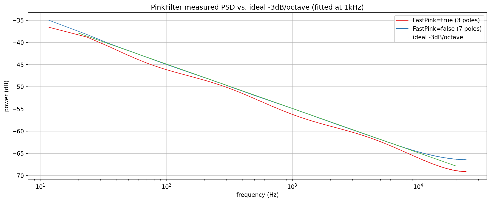
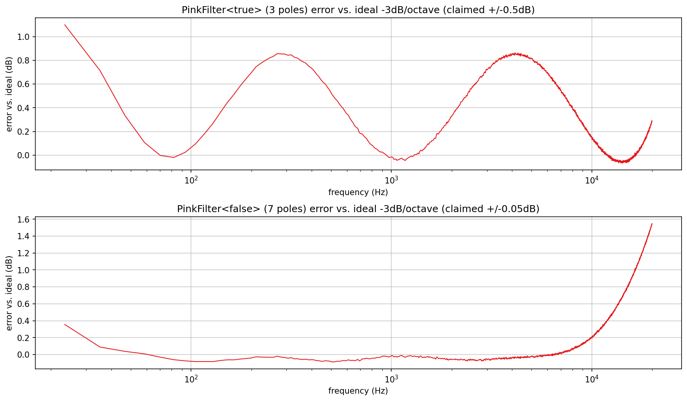

# PinkFilter verification plots

Visualizes and verifies `AbacDsp::PinkFilter` (`src/includes/Filters/PinkFilter.h`)
directly, with no JUCE involved: measured power spectral density against
the theoretical -3dB/octave pink slope, and each pole-count variant's
accuracy against its own doc comment's claimed tolerance.

`pf_spectrum.png` and `pf_accuracy.png` in this folder are checked-in
samples of both plots, produced by the pipeline described here.

## Quick start

`./generate.sh` runs the whole pipeline in one step: configures/builds
`PinkFilterExplore` (behind `EXPLORE_STUFF`, into a gitignored `build/` at
the repo root), runs it, sets up a local `.venv` from `requirements.txt`,
and renders both PNGs in this folder. `generate.sh` writes the
intermediate `PyConPlot.py` text into a gitignored `generated/` subfolder,
leaving only the checked-in `.png`s at the top level of this folder.

## Generating the data

Build (behind the `EXPLORE_STUFF` CMake option; no `dev-scripts/` wrapper
covers this) and run it from the repo root (optional arguments are the
spectrum and accuracy output files, default `pf_spectrum.txt` /
`pf_accuracy.txt`):

```bash
mkdir -p build && cd build
cmake -DEXPLORE_STUFF=ON -DCMAKE_BUILD_TYPE=Release ..
cmake --build . --target PinkFilterExplore
./documentation/Filters/PinkFilter/PinkFilterExplore
```

`PinkFilter` is meant to be driven by white noise, so both plots feed it
`Analysis/FftMisc.h`'s own `FFTResponse::generateNoiseSignal()` (the same
fixed-seed white-noise generator already used elsewhere in this codebase)
rather than an impulse or a tone. A single FFT of noise is far too noisy
to read a slope from, so both plots use Welch's method instead: 2000
Hann-windowed 4096-sample segments (about 170s of noise, cheap for a
one-shot offline run), squared and averaged into one low-variance power
spectral density estimate per variant.

- `pf_spectrum.txt`: one plot, three overlaid series - the measured PSD
  for `PinkFilter<true>` (3 poles) and `PinkFilter<false>` (7 poles),
  plus an ideal -3dB/octave reference line fitted through the 7-pole
  curve's own value at 1kHz (pink noise is a 1/f power spectrum, and
  `10*log10(1/f)` falls by exactly `10*log10(2)`, approx. 3.01dB, per octave -
  the standard PSD definition this "-3dB/octave" claim uses).
- `pf_accuracy.txt`: two subplots, one per variant - measured PSD minus
  the same fitted ideal line, in dB, across the 20Hz-20kHz audio band.

## What the plots show



**Spectrum**: both variants visibly track the ideal slope from 20Hz up
through several kHz, with the 7-pole curve hugging it more tightly
throughout - directly visible even before looking at the error plot,
`FastPink=false` sits closer to the green reference line at nearly every
point than `FastPink=true` does.



**Accuracy**: both variants stay closest to the ideal line in the low-to-
mid band and drift further from it as frequency climbs toward Nyquist.
`FastPink<true>` (3 poles, claimed +/-0.5dB) mostly holds inside roughly
+/-0.5 to +/-1.0dB, with a broad bump reaching about +1.0dB around 3-5kHz -
close to the claim but visibly exceeding it in that region, not a clean
pass. `FastPink<false>` (7 poles, claimed +/-0.05dB) is tighter through
most of the band (typically within +/-0.3dB, itself already looser than
the claimed +/-0.05dB) but then climbs steadily above about 8kHz, reaching
roughly +1.5dB by 20kHz - a real, repeatable deviation, not measurement
noise: re-measuring with 10x the averaging (4000 segments instead of 400,
checked directly before trusting this result) reproduced the same
high-frequency error to within a few hundredths of a dB, confirming it is
a property of the filter's own coefficients this close to Nyquist, not an
artifact of the Welch estimate. Both variants' claimed tolerances hold
well as a description of the mid-band, but neither is accurate to its
stated figure across the full 20Hz-20kHz range as measured here.
