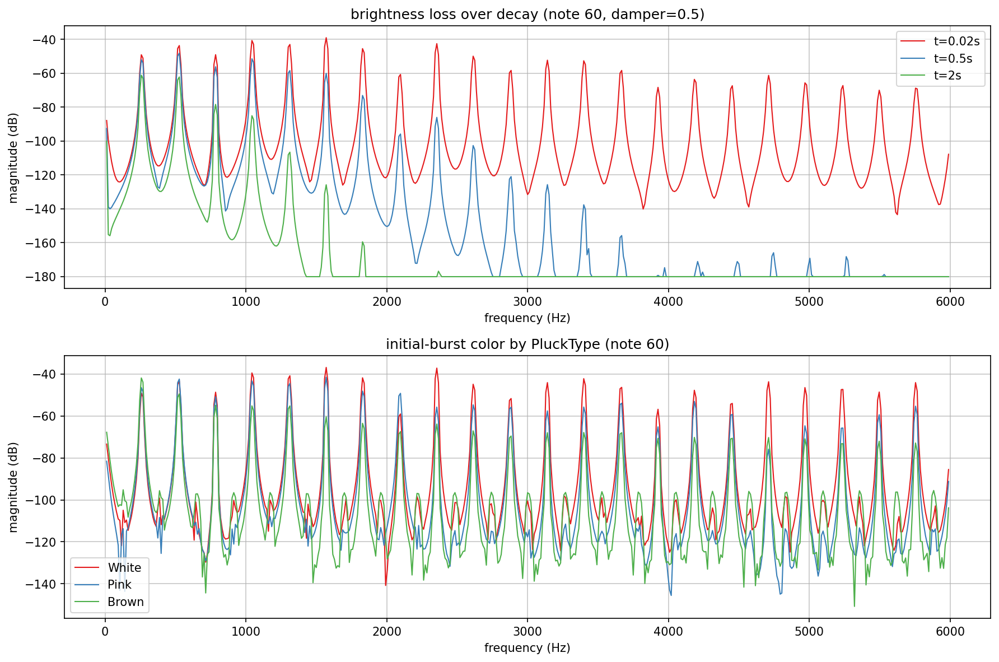
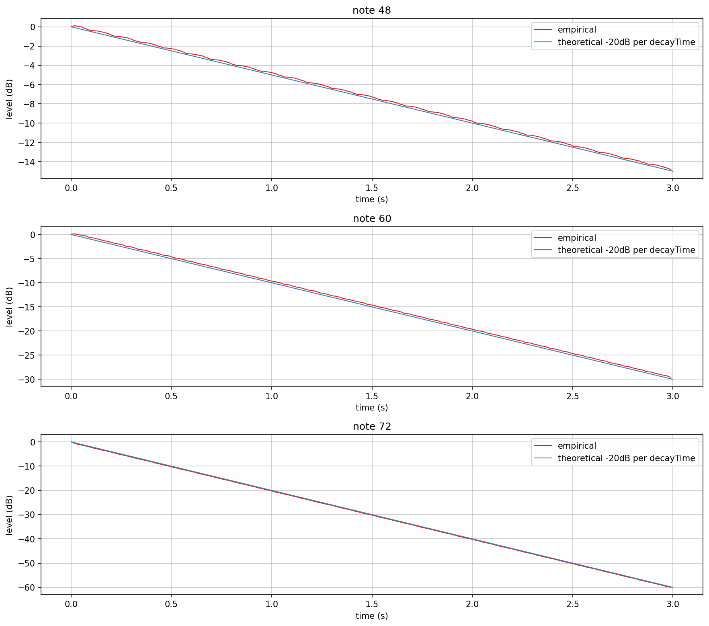
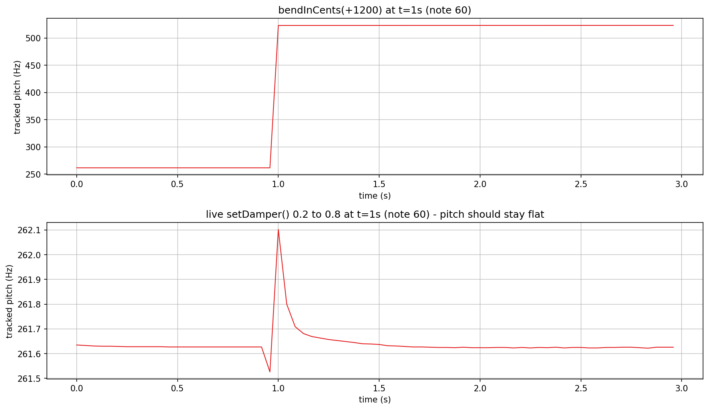
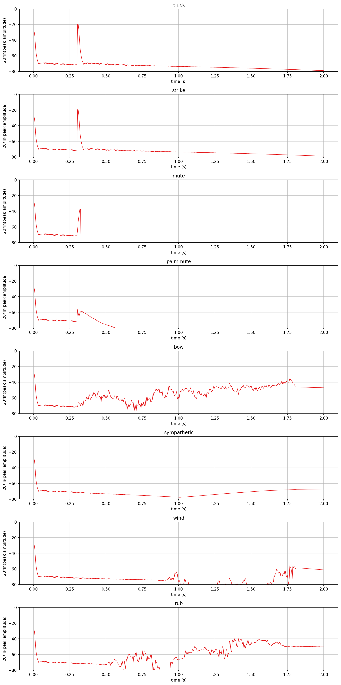

# Karplus-Strong verification plots

Visualizes and verifies `AbacDsp::KarplusStrongString`/`KarplusStrongVoice`
(`src/includes/Generators/KarplusStrongString.h`, `KarplusStrongVoice.h`) directly, with no
JUCE/Lua involved: spectral brightness loss over decay, empirical decay time against the
theoretical `-20 dB` reference, pitch behavior across a `bendInCents` slide and a live
`setDamper()` change, and one envelope timeline per excitation technique added for
DroneSequencer's `Excite()` (see `examples/dronesequencer/README.md`).

`ks_spectral.png`, `ks_decay.png`, `ks_bend.png`, and `ks_excitation.png` in this folder are
checked-in samples of all four plots, produced by the pipeline described here.

## Quick start

`./generate.sh` runs the whole pipeline in one step: configures/builds `KarplusStrongExplore`
(behind `EXPLORE_STUFF`, into a gitignored `build/` at the repo root), runs it, sets up a
local `.venv` from `requirements.txt`, and renders all four PNGs in this folder. The sections
below explain what it's doing and how to run each step by hand.

## Generating the data

The C++ side only writes plain text; all plotting is done by the shared
`documentation/Plot/PyConPlot.py` tool, avoiding a C++ plotting dependency. `generate.sh` writes
that text into a gitignored `generated/` subfolder, leaving only the checked-in `.png`s at the
top level of this folder.

Build (enabled behind the `EXPLORE_STUFF` CMake option; no `dev-scripts/` wrapper covers
this, so configure/build directly) and run it, from the repo root (optional arguments are the
spectral, decay, bend, and excitation output files, default `ks_spectral.txt` /
`ks_decay.txt` / `ks_bend.txt` / `ks_excitation.txt`):

```bash
mkdir -p build && cd build
cmake -DEXPLORE_STUFF=ON -DCMAKE_BUILD_TYPE=Release ..
cmake --build . --target KarplusStrongExplore
./documentation/KarplusStrong/KarplusStrongExplore
```

All four outputs use `PyConPlot.py`'s `@New plot:` / `#group` text format, one `@New plot:`
section per subplot:

- `ks_spectral.txt`: two subplots. The first is a single note's magnitude spectrum snapshotted
  at three points after the pluck (`t=0.02s`/`0.5s`/`2s`), showing the damper rolling off the
  upper harmonics over time. The second overlays the initial burst's own spectrum across three
  `PluckType` noise colors (White/Pink/Brown), with the damper bypassed so only the burst's own
  color is under test.
- `ks_decay.txt`: one subplot per note (48/60/72), each an `#empirical` peak-level trace against
  the `#theoretical -20dB per decayTime` reference line - the same check as
  `KarplusStrongString_test.cpp`'s `decayScalesPerOctave` test, made visible.
- `ks_bend.txt`: two subplots, both a self-seeded autocorrelation pitch track (narrow +/-10%
  search radius per window, same idea as the unit tests' own
  `measureFrequencyByAutocorrelation`, not a raw zero-crossing count - that conflates harmonic
  content with the fundamental and reads several kHz on a approx. 262 Hz string). The first tracks a
  `bendInCents(+1200)` slide (seeded at the known target frequency either side of the jump,
  since a bend is a real, intentional pitch step); the second tracks a live
  `setDamper(0.2 -> 0.8)` change mid-note - the actual verification for the pitch-compensation
  fix (`KarplusStrongString::recomputePitchRatio()`, shared by `setDamper()`/`setDamperCutoff()`
  and the new `PalmMute` technique): pitch should stay essentially flat across the change, not
  step like the bend does.
- `ks_excitation.txt`: one subplot per `ExcitationType` (`Pluck`/`Strike`/`Mute`/`PalmMute`/
  `Bow`/`Sympathetic`/`Wind`/`Rub`), each a windowed peak-amplitude envelope over 2 seconds.
  `Mute`/`PalmMute` first let the string ring normally for 0.3s so the technique's effect on an
  already-sounding string is visible, not just its own isolated onset.

## Rendering the plots

From `documentation/KarplusStrong/` (the venv and `requirements.txt` below live here, not in
`build/`):

```bash
python3 -m venv .venv && source .venv/bin/activate
pip install -r requirements.txt

python3 ../Plot/PyConPlot.py -f ../../build/ks_spectral.txt -o ks_spectral.png \
    --labelx "frequency (Hz)" --labely "magnitude (dB)" --width 1200 --height 400 --cols 1

python3 ../Plot/PyConPlot.py -f ../../build/ks_decay.txt -o ks_decay.png \
    --labelx "time (s)" --labely "level (dB)" --width 1200 --height 350 --cols 3

python3 ../Plot/PyConPlot.py -f ../../build/ks_bend.txt -o ks_bend.png \
    --labelx "time (s)" --labely "tracked pitch (Hz)" --width 1200 --height 350 --cols 1

python3 ../Plot/PyConPlot.py -f ../../build/ks_excitation.txt -o ks_excitation.png \
    --labelx "time (s)" --labely "peak amplitude" --width 1600 --height 500 --cols 4
```

## What the plots show



**Spectral behavior** confirms the damper does what its own doc comment claims: the loop's
upper harmonics decay faster than its fundamental, so a string played into a room over time
loses brightness before it loses level - the `t=2s` trace in `ks_spectral.png`'s top subplot
has essentially nothing left above approx. 1.5 kHz while the fundamental region is still present. The
bottom subplot's three `PluckType` colors are visibly different but not dramatically so at a
single note/short window - White and Pink are close together, with Brown rolling off faster
into the highs, matching what each noise color's own name implies.



**Decay verification** is a direct, plotted version of the `decayScalesPerOctave` unit test:
`decayOctaveFactor=1` should make each octave up decay twice as fast in real time, and the
`-20 dB per decayTime` theoretical line should track the actual empirical peak-level trace
closely at all three notes - which it does.



**Bend/pitch-compensation behavior** is the one plot in this set built specifically to catch a
regression rather than just illustrate a feature. `KarplusStrongString::setDamper()`/
`setDamperCutoff()` (and the new `PalmMute` technique, which reuses them) change the damper
cutoff live, mid-note - and the damper sits inside the feedback loop, so its phase lag at the
loop's own resonant frequency contributes to the effective loop period. Left uncorrected, a
live damper change would audibly nudge pitch. `recomputePitchRatio()` (factored out of
`setSizeByNote()`, now also called from the live setters) is the fix; `ks_bend.png`'s second
subplot is the actual evidence it works, not just "compiles and doesn't crash" - genuinely
unverified beyond this and the unit tests until it's been checked by ear too.



**Excitation techniques**: `Bow` sustains as a fairly steady noise feed once woken; `Wind` and
`Rub` are both the same mechanism at different `OrnsteinUhlenbeckProcess` tunings, and the
plot shows why that's a real distinction and not just a parameter tweak - `Wind`'s subplot has
one slow, wide swell around the 1.2-1.5s mark, while `Rub`'s has many small, fast fluctuations
throughout; `Sympathetic`'s envelope is smooth (a sine, not noise, driving it) and quieter than
`Bow`'s, by design. `Mute` and `PalmMute` both show the pre-roll ring cleanly, then the
technique's effect kicks in partway through - `Mute` drops to silence, `PalmMute` continues
ringing but decays faster afterward.
