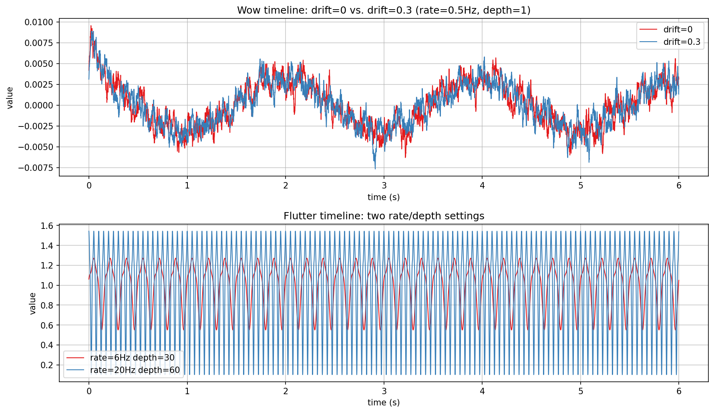
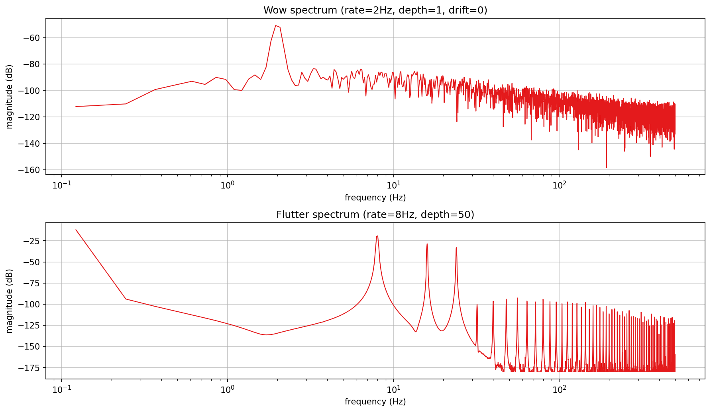
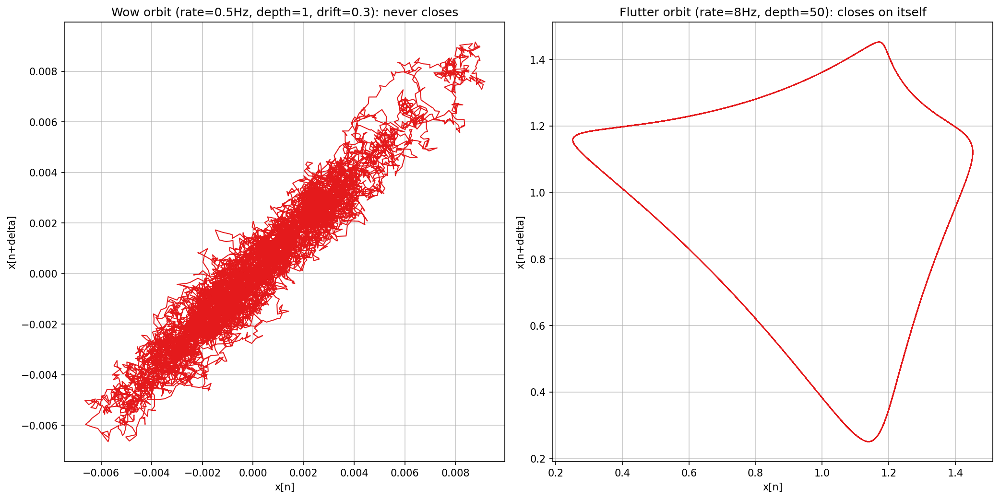
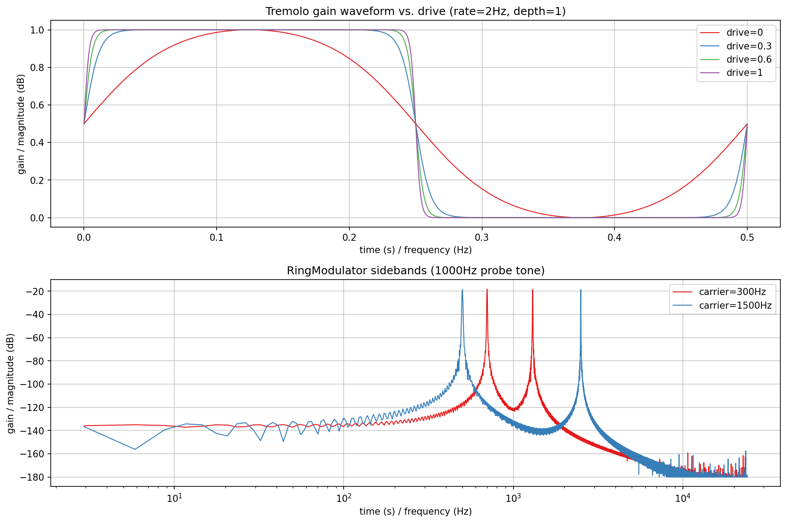

# Modulation verification plots

Visualizes and verifies all four classes in `src/includes/Modulation/`
directly, with no JUCE involved: `Wow` and `Flutter`'s LFO character
(timeline, spectrum, and a Poincare-style orbit plot), `Tremolo`'s
sine-to-square drive morph, and `RingModulator`'s sum/difference sidebands.

`Wow`/`Flutter` are only exercised indirectly elsewhere in the library (via
`Delays/VariSpeedTapeDelay.h`, used by tapelooper) - this is the first place
either is looked at in isolation.

`md_timelines.png`, `md_spectra.png`, `md_orbit.png`, and
`md_tremolo_ringmod.png` in this folder are checked-in samples of all four
plots, produced by the pipeline described here.

## Quick start

`./generate.sh` runs the whole pipeline in one step: configures/builds
`ModulationExplore` (behind `EXPLORE_STUFF`, into a gitignored `build/` at
the repo root), runs it, sets up a local `.venv` from `requirements.txt`,
and renders all four PNGs in this folder. `generate.sh` writes the
intermediate `PyConPlot.py` text into a gitignored `generated/` subfolder,
leaving only the checked-in `.png`s at the top level of this folder.

## Generating the data

Build (behind the `EXPLORE_STUFF` CMake option; no `dev-scripts/` wrapper
covers this) and run it from the repo root (optional arguments are the
timelines, spectra, orbit, and tremolo/ring-mod output files, default
`md_timelines.txt` / `md_spectra.txt` / `md_orbit.txt` /
`md_tremolo_ringmod.txt`):

```bash
mkdir -p build && cd build
cmake -DEXPLORE_STUFF=ON -DCMAKE_BUILD_TYPE=Release ..
cmake --build . --target ModulationExplore
./documentation/Modulation/ModulationExplore
```

- `md_timelines.txt`: two subplots - `Wow`'s raw `step()` output (a delay
  *derivative*, not a delay amount - see "What `step()` actually returns"
  below) at `drift=0` vs. `drift=0.3`, and `Flutter`'s raw `step()` output
  at two rate/depth settings. Decimated to 1kHz for the text file (still
  20x oversampled for content under 50Hz) since a plotted line doesn't need
  every one of several hundred thousand raw samples.
- `md_spectra.txt`: two subplots - the magnitude spectrum of each class's
  `step()` output, verifying the configured rate shows up where it should.
  Computed on a decimated (1kHz effective) copy for a manageable FFT size
  at this resolution, not the raw 48kHz signal - see "Why decimate before
  the FFT" below.
- `md_orbit.txt`: two subplots, `aspect=equal` - `x[n]` plotted against
  `x[n+delta]`, `delta` a quarter of the signal's own average period
  (`Analysis/ZeroCrossings.h`'s `periodLengthByZeroCrossingAverage()`,
  the same technique used for this exact purpose elsewhere in this
  codebase's toolchain history). A closed loop means genuinely periodic
  motion; a diffuse cloud means the signal never repeats - a direct,
  visual version of the "never repeats" vs. "repeating cycle" distinction
  both classes' own doc comments draw.
- `md_tremolo_ringmod.txt`: two subplots - `Tremolo`'s output gain over one
  full cycle (constant `1.0` input, `rate=2Hz`, `depth=1`) at four `drive`
  settings, and `RingModulator`'s output spectrum for a 1000 Hz probe tone
  at two carrier frequencies.

### What `step()` actually returns

`Wow::step()` does not return a delay amount - it returns the *derivative*
of an internal delay signal (`(currentDelay - previousDelay) * sampleRate /
1000`), i.e. something closer to an instantaneous pitch-deviation signal
than a raw modulation depth. `Flutter::step()` is different again: a
multiplicative speed factor centered on `1.0` (`1 + depth * flutterValue`).
Both are plotted as-is, exactly what a caller actually receives from
`step()`, not a reconstructed "true" LFO shape - the difference in what
each class hands back is itself worth knowing before wiring either into
new code.

### Why decimate before the FFT

Both classes' interesting content sits under a few hundred Hz at most, so
an FFT directly on the raw 48kHz signal would need an enormous transform
size to get any useful low-frequency resolution. Both are decimated to a
1kHz effective rate first (plain sample-drop, no anti-alias filter - both
signals are already far below the new Nyquist before decimating) and then
put through an 8192-point FFT, giving about 0.12 Hz resolution for a
10-second render instead of needing a 480000-point FFT to get the same
resolution directly.

## What the plots show



**Timelines**: `Wow`'s trace is slow, noisy, and never settles into a
repeating shape - visibly the sum of a 0.5 Hz sine and low-passed
mean-reverting noise, exactly as its doc comment describes. `drift=0` and
`drift=0.3` are nearly indistinguishable at this timescale, though - six
seconds isn't long enough for the drift term's own approx. 20-50 second time
constant (`m_driftTimeConstant`) to visibly separate the two; a
much longer render would be needed to see drift's effect clearly, which
this plot doesn't attempt. `Flutter`'s two settings are unambiguous by
contrast: clean, fast, strictly periodic oscillation, amplitude and rate
both scaling exactly with the configured `depth`/`rate`.



**Spectra**: `Wow` shows one clear peak at exactly 2 Hz - the configured
`rate` - sitting on a broadband, low-frequency-weighted noise floor from
the Ornstein-Uhlenbeck process, decaying smoothly into the noise floor past
a few tens of Hz. `Flutter` shows three sharp, clean peaks at 8, 16, and
24 Hz - exactly the 1x/2x/3x components `FlutterLfo` sums, confirming the
doc comment's claim directly. The low-level regular comb of extra peaks
above roughly 30 Hz (40-160 dB below the fundamental triad) is an artifact
of this measurement's own decimation step, not a property of `Flutter`
itself - not chased down further here, since it sits so far below the
signal that actually matters.



**Orbit plots**: this is the clearest single piece of evidence in this
folder for the "periodic vs. wandering" distinction both doc comments draw.
`Wow`'s orbit is a dense, diffuse scribble with no repeating shape at
all - it never returns to the same state twice. `Flutter`'s orbit is a
single, clean, closed loop - genuinely periodic motion, traced over and
over without drifting.



**Tremolo / RingModulator**: the drive sweep shows exactly the morph the
class doc comment promises - `drive=0` is a plain sine-shaped gain curve,
and increasing drive pushes both the rise and fall increasingly toward a
sharp, near-square transition, matching "stutter is just this effect at
full drive and depth, not a separate mechanism". `RingModulator`'s spectrum
shows exactly two peaks per carrier and nothing else: `|1000-300|=700Hz`
and `1000+300=1300Hz` for the 300 Hz carrier, `|1000-1500|=500Hz` and
`1000+1500=2500Hz` for the 1500 Hz carrier - textbook sum/difference
sidebands, with no trace of the original 1000 Hz probe tone surviving, as
the doc comment claims ("the output carries no trace of the original
pitch").
