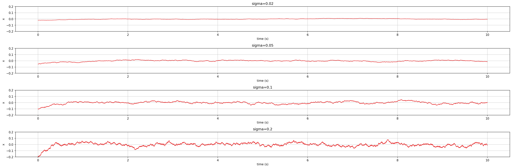
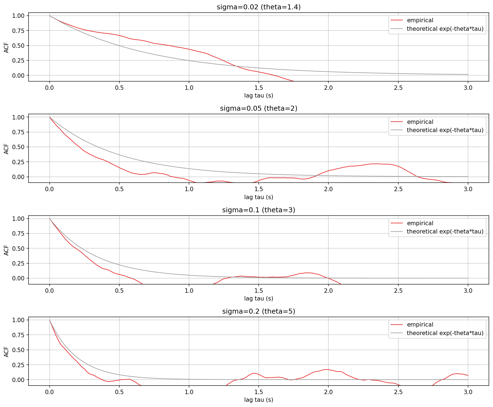
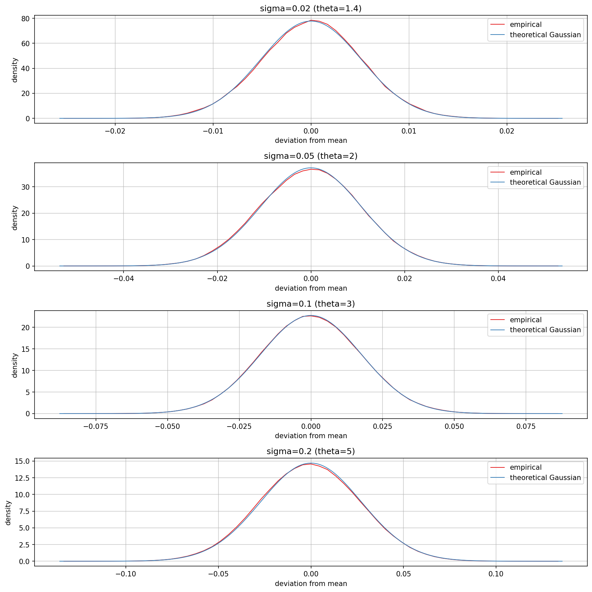

# Ornstein-Uhlenbeck timeline plot

Visualises `AbacDsp::OrnsteinUhlenbeckProcess` (`src/includes/Generators/OrnsteinUhlenbeckProcess.h`)
at work: several instances at different `sigma` "speeds" each trace a timeline, stacked as
wide subplots - one per speed - on one shared y-scale so their relative jitter and reversion
rate are directly comparable at a glance - the mean-reverting noise the class exists to
produce, made visible instead of just heard.

Because a timeline alone makes it hard to tell "faster" from "just noisier" by eye, a second
plot shows each speed's empirical autocorrelation against the process's theoretical decay
`exp(-theta*tau)` - the actual quantitative check that the reversion rate is correct, not
just a visual impression. A third plot bins a much longer run into a histogram and compares
it against the theoretical stationary Gaussian - the process is mean-reverting noise, and a
Gaussian stationary distribution is the actual mathematical property that name promises, not
just something it should look like on a timeline.

`ou_timeline.png`, `ou_autocorr.png`, and `ou_distribution.png` in this folder are checked-in
samples of all three plots, produced by the pipeline described here.

## Quick start

`./generate.sh` runs the whole pipeline below in one step: configures/builds
`OrnsteinUhlenbeckTimeline` (behind `EXPLORE_STUFF`, into a gitignored `build/` at the repo
root), runs it, sets up a local `.venv` from `requirements.txt`, and renders all three PNGs
in this folder. The sections below explain what it's doing and how to run each step by hand.

## Generating the data

The C++ side only writes plain text; all plotting is done by the shared
`documentation/Plot/PyConPlot.py` tool, avoiding a C++ plotting dependency. `generate.sh` writes
that text into a gitignored `generated/` subfolder, leaving only the checked-in `.png`s at the
top level of this folder.

Build (enabled behind the `EXPLORE_STUFF` CMake option; no `dev-scripts/` wrapper covers
this, so configure/build directly) and run it, from the repo root (optional arguments are
the timeline, autocorrelation, and distribution output files, default `ou_timelines.txt` /
`ou_autocorr.txt` / `ou_distribution.txt`):

```bash
mkdir -p build && cd build
cmake -DEXPLORE_STUFF=ON -DCMAKE_BUILD_TYPE=Release ..
cmake --build . --target OrnsteinUhlenbeckTimeline
./documentation/OrnsteinUhlenbeck/OrnsteinUhlenbeckTimeline ou_timelines.txt ou_autocorr.txt ou_distribution.txt
```

All three outputs use `PyConPlot.py`'s `@New plot:` / `#group` text format, one `@New plot:`
section per sigma so each renders as its own subplot:

- `ou_timelines.txt`: one `#sigma=<value>` group of `t x` pairs (time in seconds) per
  section, from a 20000-sample run.
- `ou_autocorr.txt`: 100 independent `#empirical` runs per section (each its own
  20000-sample simulation, post burn-in), overlaid so their spread around the true decay is
  visible directly, followed by `#theoretical exp(-theta*tau)` (the closed-form decay)
  written last so it renders on top of all of them.
- `ou_distribution.txt`: two groups per section, `#empirical` (a 61-bin, density-normalized
  histogram from its own separate, much longer 10000000-sample run) and `#theoretical
  Gaussian` (the closed-form stationary density, see below), overlaid in one subplot.

## Rendering the plots

From `documentation/OrnsteinUhlenbeck/` (the venv and `requirements.txt` below live here,
not in `build/`):

```bash
python3 -m venv .venv && source .venv/bin/activate
pip install -r requirements.txt

python3 ../Plot/PyConPlot.py -f ../../build/ou_timelines.txt -o ou_timeline.png \
    --labelx "time (s)" --labely "x" --width 2400 --height 200 --cols 1 --miny -0.2 --maxy 0.2

python3 ../Plot/PyConPlot.py -f ../../build/ou_autocorr.txt -o ou_autocorr.png \
    --labelx "lag tau (s)" --labely "ACF" --width 1200 --height 250 --cols 1 --miny -0.5 --maxy 1.05

python3 ../Plot/PyConPlot.py -f ../../build/ou_distribution.txt -o ou_distribution.png \
    --labelx "deviation from mean" --labely "density" --width 1200 --height 300 --cols 1
```

`--cols 1` (added to `PyConPlot.py` for this) stacks the four subplots in a single column
top to bottom, instead of the tool's default roughly-square grid. `--width`/`--height` give
the timeline subplots a 12:1 aspect ratio - readable as one long timeline rather than a
squarer plot with heavy horizontal compression. `--miny`/`--maxy` fix one shared y-axis range
across all four subplots for the timeline and autocorrelation plots, rather than letting each
auto-scale to its own data - see below for why a shared range matters for the timelines
specifically; the autocorrelation is already naturally bounded to roughly `[-1, 1]` so a
shared range there is just for tidy, consistent axes rather than correctness. The
distribution plot is left auto-scaled per subplot instead: what it's checking is each
speed's *shape* (is it Gaussian?), not comparing absolute widths across speeds - that
comparison already belongs to the timeline/autocorrelation plots.

## Why the timelines look the way they do



`OrnsteinUhlenbeckProcess::setSigma()` derives both the reversion rate `theta` and the mean
`mu` from `sigma` (`theta = sigma * 20 + 1`, `mu = sigma`) - one control moves speed and
amplitude together, by that class's own design (see its doc comment). Three consequences
worth knowing before reading the plots:

- Every timeline point is written relative to its own `mu` (`process.step() - sigma`), so
  all four are centred on zero for comparison. Left as-is, larger `sigma` would just shift
  the whole timeline up instead of visibly changing how much it moves.
- Higher `sigma` reverts *faster* but also injects *more* noise per step. The process's
  stationary variance still grows with `sigma` despite the faster pull-back (see the
  distribution section below for the exact formula) - so the higher-speed timelines are both
  quicker to jitter and wider, not smaller. That is the real, if slightly counter-intuitive,
  behaviour of this exact class, not an artefact of the plot - and exactly why the timelines
  share one y-axis range: on auto-scaled axes, "wider" and "narrower" would look the same
  size and the actual amplitude difference would be invisible.
- Because speed and amplitude are entangled, the timeline plot alone can't really confirm
  *how much* faster a higher sigma reverts - only that it looks jitterier. The
  autocorrelation plot isolates that: each empirical curve's decay rate is a direct estimate
  of `theta`, independent of amplitude, and the theoretical curve drawn on top shows exactly
  where they should center. A single run gets noisier at longer lags, since fewer
  independent sample pairs are available there in one finite run - 100 overlaid runs make
  that visible as a spread around the theoretical curve instead of one arbitrarily noisy
  line, and show that the spread, not the theoretical line itself, is what widens with lag.



## Is it actually Gaussian?



An Ornstein-Uhlenbeck process's defining property isn't just "mean-reverting" - its
stationary distribution is provably Gaussian. The distribution plot checks that directly,
rather than taking it on faith from the timeline's general shape: bin a long run into a
histogram and compare it against the theoretical stationary density.

Textbook OU theory gives stationary variance `sigma^2 / (2*theta)` for the SDE
`dx = theta(mu-x)dt + sigma*dW` with `dW` a unit-variance Wiener increment. This class's own
driving noise is not unit-variance, though - `OrnsteinUhlenbeckProcess`'s `m_normalDist` is
constructed as `N(0, (1/2.33)^2)`, not `N(0, 1)`. Missing that the first time round this
plot was built produced a theoretical curve visibly wider than the empirical one - it wasn't
the *shape* that was wrong (both were already clearly Gaussian, not just similar-looking),
only the theoretical formula's assumed noise scale. Folding in that `1/2.33` factor gives
the corrected stationary standard deviation actually used in `OrnsteinUhlenbeckTimeline.cpp`:
`stddev = sigma / 2.33 / sqrt(2*theta)`. With that correction, empirical and theoretical
curves line up closely for all four speeds, confirming both that the distribution really is
Gaussian and that its width matches theory once the class's actual noise scale is accounted
for - not just something that resembles a bell curve by eye.
