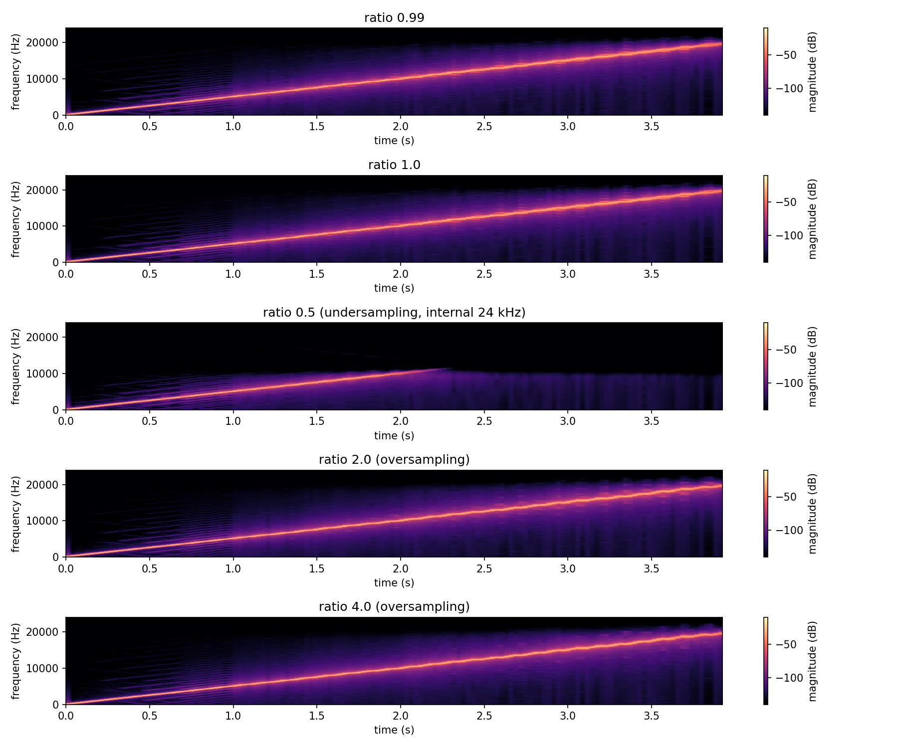
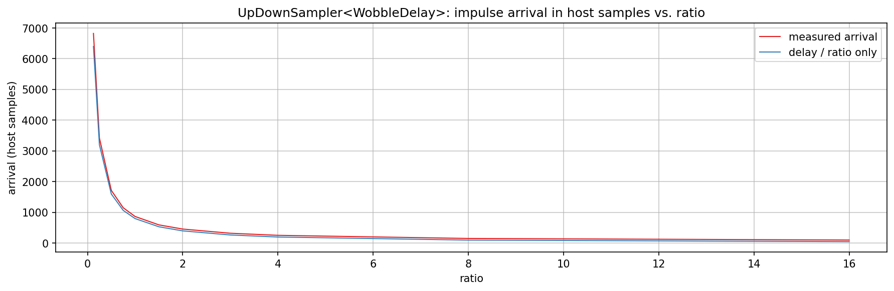
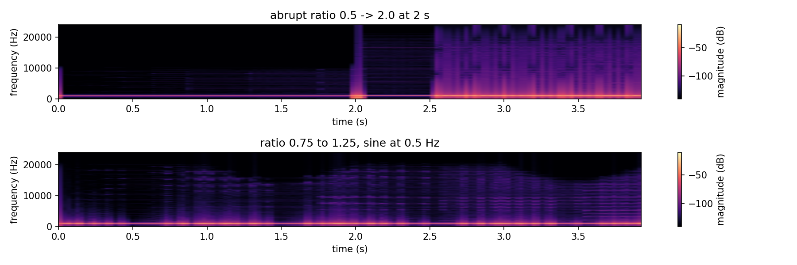
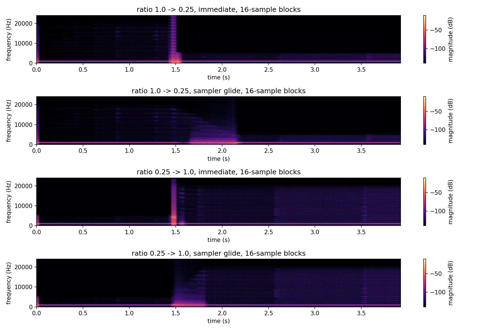

# OverSampling verification plots

Checks `UpDownSampler` (`src/includes/SamplerateConverter/`) wrapping `WobbleDelay`
(`src/includes/Delays/`): the delay with Wow and Flutter runs at `hostRate * ratio`, and the
ratio is a live parameter. Ratio above 1 is oversampling (quality), below 1 is undersampling
(cheaper, or deliberately lo-fi). The same composition gives a transport-speed effect, because the
wrapped delay time is fixed in internal samples and so changes in host time with the ratio.

```cpp
using Delay = AbacDsp::WobbleDelay<48000, 16>;
AbacDsp::UpDownSampler<Delay, 16> sampler(maxBlockSize, hostRate * ratio);
sampler.setRatio(ratio);
sampler.processor().setDelay(500.f * ratio, true);
sampler.processBlock(source, target);
```

The wrapped delay is constructed with the internal rate, and its delay values are internal
samples. With a ratio that changes while running it keeps the construction-time rate, so Wow and
Flutter run faster or slower in host time by the ratio, like a transport.

`./generate.sh` builds `OverSamplingExplore.cpp`, runs it, and renders every PNG here.
Intermediate data (spectrogram grids, plot series, `.wav` renders for listening) goes into the
gitignored `generated/`.

## What the plots show



Swept tone. A sine sweep from 50 Hz to 20 kHz at 48 kHz passes through the composition with wow
(1.5 Hz) and flutter (8 Hz) engaged, at ratios 0.99, 1.0, 0.5 (undersampling), 2.0 and 4.0
(oversampling). Every panel shows one ridge with modulation sidebands around it and no mirrored or
aliased ridge. At ratio 0.5 the internal rate is 24 kHz, and the ridge stops at the internal
Nyquist of 12 kHz instead of reflecting back down: the down-conversion filter removes what the
lower rate can not carry.



Delay time. An impulse passes through the composition with the wrapped delay fixed at 800 internal
samples. The arrival in host samples is that delay divided by the ratio, plus the latency of the
converters and the re-blocker. That latency is measured as the difference:

| ratio | arrival | delay / ratio | converter latency |
|---:|---:|---:|---:|
| 0.125 | 6824 | 6400 | 424 |
| 0.25 | 3420 | 3200 | 220 |
| 0.5 | 1718 | 1600 | 118 |
| 1.0 | 868 | 800 | 68 |
| 2.0 | 459 | 400 | 59 |
| 4.0 | 255 | 200 | 55 |
| 8.0 | 153 | 100 | 53 |
| 16.0 | 102 | 50 | 52 |

The latency is smallest at high ratios and grows steeply below ratio 1, because the sinc kernel
is stretched in proportion to the rate reduction. It does not depend on the host block size, which
the unit test `LatencyDoesNotDependOnBlockSize` pins for blocks of 1 to 512 samples. It is
continuous across ratio 1.0, since the converters always run, also at exactly 1.0.



Ratio changes. A steady 1 kHz tone passes through with modulation off, so everything visible is
the ratio change. Top: the ratio jumps from 0.5 to 2.0 at 2 s. The ridge stays at 1 kHz, but a
broadband burst, no wider than one analysis window (85 ms), appears at the jump. The delay inside
is fixed in internal samples, so the jump moves its host-time delay from 500 to 125 samples at
once, and that step in the signal path is what remains as a burst. Bottom: the ratio moves between
0.75 and 1.25 as a slow sine, and the ridge stays clean. So a ratio that moves gradually is fine,
while a step should be glided, which `setRatio()` does by default, see below.



Ratio glides. `setRatio(ratio)` glides to the new ratio at a fixed speed given per host sample,
1/8000 octave up and 1/16000 down (6 and 3 octaves per second at 48 kHz), and `setRatio(ratio,
true)` jumps. `OrganicChorusVoice` does its own gliding and adds a drift on top, so it forces its
ratio every tile. The panels show a 1 kHz tone through 16-sample blocks, the standard block size,
with the ratio changed at 1.5 s either at once or by the sampler's own glide. Going up (0.25 to
1.0, bottom pair) the glide removes the burst of the immediate jump. Going down (1.0 to 0.25, top
pair) the glide is clean too. What remains during a glide is a soft widening around the tone:
the pitch shift of the delay time changing, as on a tape machine that changes speed.

The table gives the worst 256-sample window of the second difference against the steady tone,
where 1.0 is clean, and the number of FIFO underruns. The numeric rates in octaves per second
drive the ratio from outside (forced each block) and show that the level correction below holds at
any speed; "sampler glide" is `setRatio()` itself. Repeated samples add broadband energy
without a large sample-to-sample step, which is why a peak step does not show this. The full
table for all rates is written to `generated/os_glide_metrics.txt`.

| change | rate (oct/s) | broadband ratio | underruns |
|---|---|---|---|
| 0.25 to 1.0 | immediate | 10.1 | 0 |
| 0.25 to 1.0 | sampler glide | 1.21 | 0 |
| 0.25 to 1.0 | 6 | 1.21 | 0 |
| 0.25 to 1.0 | 1.5 | 1.06 | 0 |
| 1.0 to 0.5 | immediate | 1.01 | 2 |
| 1.0 to 0.5 | sampler glide | 1.01 | 0 |
| 1.0 to 0.25 | immediate | 1.36 | 2 |
| 1.0 to 0.25 | sampler glide | 1.01 | 0 |
| 1.0 to 0.25 | 24 | 1.01 | 0 |
| 1.0 to 0.25 | 6 | 1.01 | 0 |
| 1.0 to 0.25 | 1.5 | 1.01 | 0 |
| 1.0 to 0.0625 | sampler glide | 1.01 | 20 |
| 1.0 to 0.0625 | 6 | 1.01 | 31 |
| 1.0 to 0.0625 | 1.5 | 1.01 | 0 |

- Upward glides remove the burst at every rate, and slower is cleaner.
- Downward glides of up to two octaves are clean at every rate, with no underruns.
- Immediate jumps are not smoothed: the delay time steps, and the two downward jumps still
  underrun twice.
- A four octave drop at 6 octaves per second is clean but still underruns, see the limit below.

Two mechanisms keep a glide clean. First, the up stage uses the ratio of the previous chunk: the
data still in flight was made at the previous ratio, and reading it at the new one caused most of
the burst of an upward jump (through the converters alone it went from about 6 to 1.01). Second,
when the ratio falls the look-ahead of the converters grows (about 50 host samples between 1.0 and
0.25), which would run the output FIFO dry and repeat samples. A proportional correction of the
up-stage ratio holds the FIFO at its 16-sample cushion instead: at most 5%, about 2% at 6 octaves
per second (roughly 35 cents), and exactly zero at a constant ratio, so steady output is
unchanged. Changes much larger than two octaves at fast rates reach the 5% cap, which is why the
four octave row still shows underruns.
