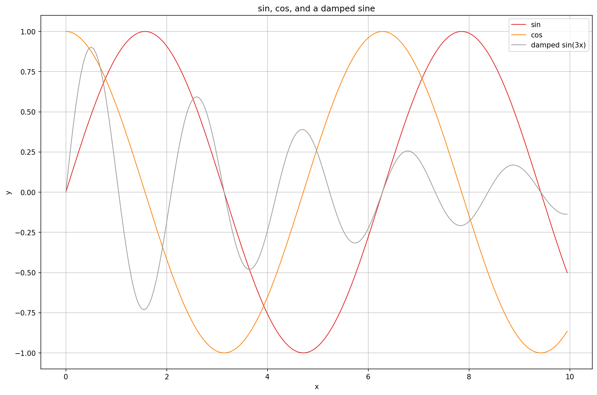
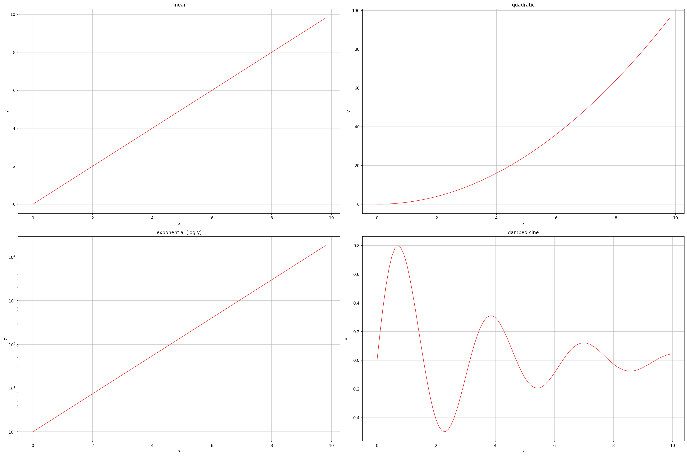

# PyConPlot

A small, shared matplotlib wrapper for the `documentation/` tree: reads a plain text file of
named `x y` series and renders one or more line plots. Several `documentation/*` folders
generate their data in C++ and hand it to this script instead of linking a plotting library
into C++ - see e.g. `documentation/OrnsteinUhlenbeck/README.md` for a worked example.

## Setup

```bash
python3 -m venv .venv
source .venv/bin/activate
pip install matplotlib numpy
```

There is no shared `requirements.txt` here; callers that depend on this script pin their own
(matplotlib/numpy) versions in their own folder, since it is just a Python module imported by
path, not an installed package.

## Usage

```bash
python3 PyConPlot.py -f data.txt -o plot.png [options]
```

`-f/--infile` and `-o/--outfile` are the only required-ish arguments (outfile defaults to
`plot.svg`); everything else has a default. Run `python3 PyConPlot.py --help` for the full
list, including available colour palettes and legend positions.

## Examples

`example_overlay.txt` and `example_subplots.txt` (checked in alongside their rendered
`.png`s) are regenerated by `generate_examples.py`:

```bash
python3 generate_examples.py
python3 PyConPlot.py -f example_overlay.txt -o example_overlay.png --labelx "x" --labely "y" --grid
python3 PyConPlot.py -f example_subplots.txt -o example_subplots.png --labelx "x" --labely "y" --grid
```

Multiple series overlaid on one plot with a legend (`example_overlay.png`):



Multiple `@New plot:` sections, auto-arranged into a grid, each with its own title and one
using a per-plot `logy=true` override (`example_subplots.png`):



## Input file format

Each named series is a `#name` line followed by one `x y` pair per line:

```
#group1
x1 y1
x2 y2
#group2
x3 y3
x4 y4
```

All series without an intervening `@New plot:` line are overlaid on one set of axes and
share one legend.

### Multiple subplots: `@New plot:`

A `@New plot:` line starts a new subplot; everything after it (until the next `@New plot:`
or end of file) belongs to that subplot instead of the previous one:

```
@New plot: title="Low sigma" miny=-0.2 maxy=0.2
#sigma=0.02
0.0 -0.02
0.005 -0.019

@New plot: title="High sigma" miny=-0.2 maxy=0.2
#sigma=0.2
0.0 -0.20
0.005 -0.198
```

With more than one `@New plot:` section, subplots are laid out in a grid: `--cols` fixes the
column count (e.g. `--cols 1` stacks every subplot in a single column, top to bottom);
omitted or `0` picks a roughly square `ceil(sqrt(n))` grid automatically.

### Per-plot options

Anything after the `:` on an `@New plot:` line is `key=value key2="quoted value"` pairs
(shell-like quoting via `shlex`, so spaces need quotes). They override the equivalent
command-line flag for that subplot only - useful when different subplots need different
titles or axis limits from otherwise-shared CLI defaults:

| Key | Type | Meaning |
|---|---|---|
| `title` | string | Subplot title |
| `labelx`, `labely` | string | Axis labels |
| `logx`, `logy` | bool | Logarithmic axis scale |
| `normalize` | bool | Rescale this subplot's data into `[0, 1]` |
| `miny`, `maxy` | number | Y-axis limits |
| `linewidth` | number | Line width |
| `palette` | string | matplotlib colormap name |
| `legendpos` | string | Legend location |
| `grid`, `grid_major`, `grid_minor` | bool | Grid lines |
| `aspect` | `auto` \| `equal` | Axes aspect ratio |

Booleans accept `true`/`false`/`1`/`0`/`yes`/`no` (case-insensitive).

## Command-line options

| Flag | Default | Meaning |
|---|---|---|
| `-f`, `--infile` | (required) | Input text file |
| `-o`, `--outfile` | `plot.svg` | Output file; format is inferred from the extension (png, svg, pdf, ...) |
| `-w`, `--width` | `1200` | Figure width per subplot column, in `pixels/100` inches at 150 dpi |
| `--height` | `800` | Figure height per subplot row, same units |
| `--cols` | `0` (auto) | Force this many subplot columns; `1` stacks subplots vertically |
| `-n`, `--normalize` | off | Rescale every series into `[0, 1]` (global; per-plot `normalize=` overrides) |
| `--labelx`, `--labely` | `x`, `y` | Axis labels |
| `--palette` | `Set1` | matplotlib colormap used to colour each series in a subplot |
| `--legendpos` | `best` | matplotlib legend location |
| `--linewidth` | `1.0` | Line width |
| `--miny`, `--maxy` | auto | Shared y-axis limits, applied to every subplot unless overridden per-plot |
| `--logx`, `--logy` | off | Logarithmic axis scale |
| `--aspect` | `auto` | `equal` keeps x/y units the same size on screen - use for orbit/phase-plane style plots where a circle should look circular, not stretched |
| `--grid` | off | Enable grid (same as `--grid-major`) |
| `--grid-major` | on | Major grid lines |
| `--grid-minor` | off | Minor grid lines |
| `--no-grid` | off | Disable all grid lines, overriding the above |
| `--inverse` | off | Dark theme (white on black) instead of the default light theme |

`--width`/`--height` scale with the grid: a 2x2 layout at the defaults renders at
`(1200/100*2, 800/100*2)` inches = 24x16in overall, i.e. each subplot individually keeps
its requested size regardless of how many others surround it.

## Notes

- A line that isn't `x y` (two floats) is skipped with a `Warning: Could not parse line: ...`
  message rather than aborting the whole plot.
- An empty or entirely unparseable input file prints `No data found in input file` and exits
  without writing anything.
- `--palette` names come from matplotlib's registered colormaps; an unknown name falls back
  to `Set1` with a warning rather than failing.
