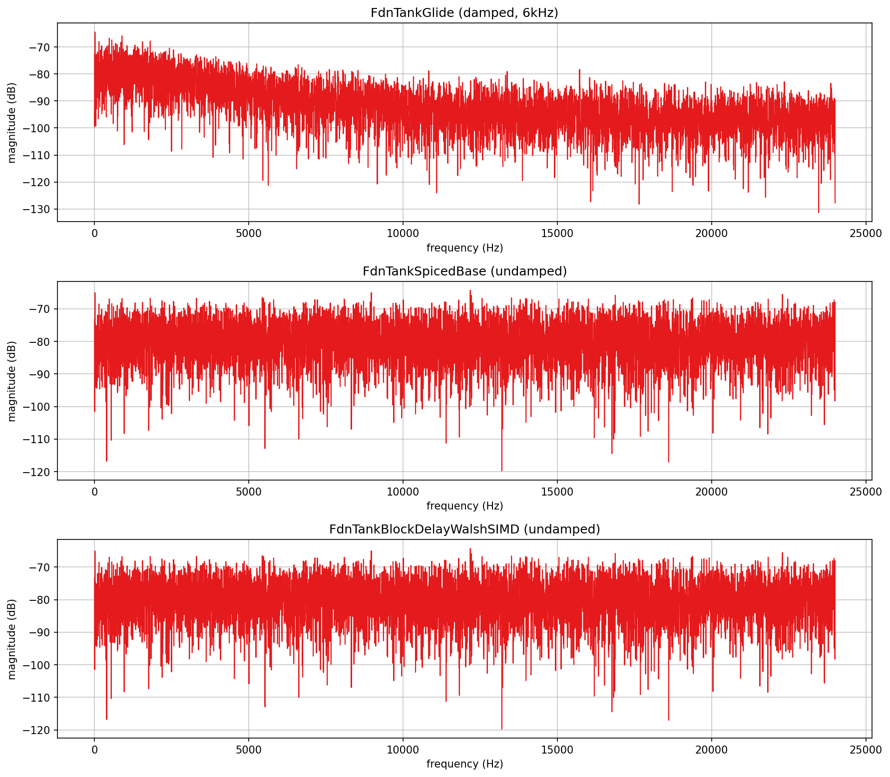
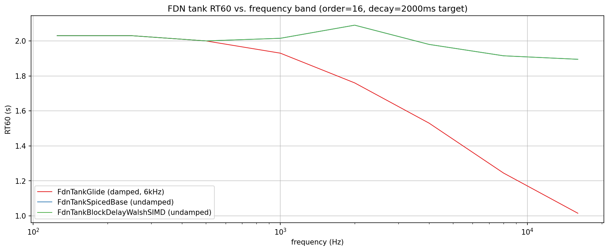
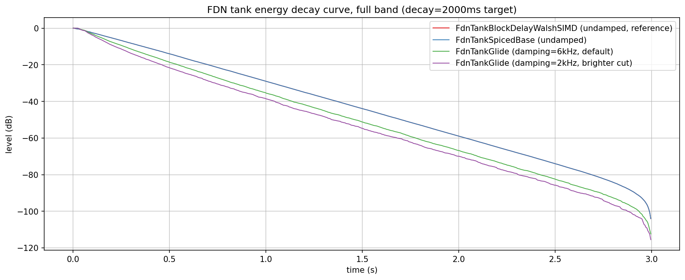

# FDN tank verification plots

Visualizes and verifies the three FDN tank classes examples actually use
(`src/includes/Reverbs/`): `FdnTankGlide`, `FdnTankSpicedBase` (standing in for
`FdnTankSpiced`, which adds only a per-line callback injection point on top),
and `FdnTankBlockDelayWalshSIMD`. Late-tail magnitude response, RT60 vs.
frequency band, and Schroeder energy decay curves, with no JUCE involved.

`Reverbs/FDN/` (a sibling folder) only covers generating the Hadamard
matrices these tanks mix through; this folder covers the tanks themselves.

`rv_spectral.png`, `rv_rt60.png`, and `rv_decay.png` in this folder are
checked-in samples of all three plots, produced by the pipeline described
here.

## Quick start

`./generate.sh` runs the whole pipeline in one step: configures/builds
`FdnTankExplore` (behind `EXPLORE_STUFF`, into a gitignored `build/` at the
repo root), runs it, sets up a local `.venv` from `requirements.txt`, and
renders all three PNGs in this folder. `generate.sh` writes the intermediate
`PyConPlot.py` text into a gitignored `generated/` subfolder, leaving only
the checked-in `.png`s at the top level of this folder.

## Generating the data

Build (behind the `EXPLORE_STUFF` CMake option; no `dev-scripts/` wrapper
covers this) and run it from the repo root (optional arguments are the
spectral, RT60, and decay output files, default `rv_spectral.txt` /
`rv_rt60.txt` / `rv_decay.txt`):

```bash
mkdir -p build && cd build
cmake -DEXPLORE_STUFF=ON -DCMAKE_BUILD_TYPE=Release ..
cmake --build . --target FdnTankExplore
./documentation/Reverbs/Tanks/FdnTankExplore
```

All three tanks are configured identically wherever the class exposes the
setting: order 16, minSize 8m, maxSize 20m, `setDecay(2000)` (a 2-second
target). minSize is kept comfortably above the point where a line's
discrete sample length would be shorter than `2 * BlockSize` - see "A real
bug found along the way" below.

- `rv_spectral.txt`: three subplots, one per tank - the magnitude spectrum
  of a 16384-point window taken from the tail at t=0.3s (past fill-in,
  still well above the FFT noise floor). Split rather than overlaid: all
  three land in roughly the same dB range, and overlaid the three colors
  just merged into noise - stacked, each one's own shape (or lack of one)
  is legible.
- `rv_rt60.txt`: one plot, three overlaid series - measured RT60 (bandpass
  the impulse response at each of 8 octave-ish centers from 125 Hz to
  16 kHz, `Q=4`, then find the last point a windowed peak envelope stays
  within 60 dB of its own peak) vs. band center frequency, one series per
  tank.
- `rv_decay.txt`: one plot, four overlaid series - full-band Schroeder
  energy decay curves (backward-cumulative energy, normalized to the
  signal's own total - Schroeder 1965, the standard reverberation
  decay-curve estimator): `FdnTankBlockDelayWalshSIMD`, `FdnTankSpicedBase`,
  and `FdnTankGlide` at both its default 6 kHz damping cutoff and a
  brighter 2 kHz cutoff.

## A real bug found along the way

Building the RT60 plot first surfaced something that turned out not to be a
plotting quirk: `FdnTankSpicedBase` and `FdnTankBlockDelayWalshSIMD` (and,
by the same shared code, `FdnTankSpiced`) all set each delay line's actual
buffer length via

```cpp
m_delay.setSize(index, value - 2 * BlockSize);
```

`value` and `BlockSize` are both `size_t`. Whenever a line's computed
length in samples is shorter than `2 * BlockSize`, this subtraction
underflows to a huge unsigned number; `ParallelPlainDelay::setSize()`'s own
clamp (`std::min(newSize, MAXSIZE - 1)`) then silently sets that line's
buffer length to almost the *entire* delay buffer instead of the intended
short value. The line goes on to read stale/uninitialized tail content once
the write head has cycled that far - measured directly as a sudden,
massive amplitude spike (up to approx. 6x unity) landing exactly at
`t = MaxSizePerElement / sampleRate`, confirmed by changing that buffer
size and watching the spike move in lockstep. First-generation `rv_rt60.png`
also showed the symptom quietly, without an obvious spike: the undamped
tanks measured a flat RT60 of 1.0s against a 2.0s `setDecay()` target,
exactly half, because the corrupted long line was itself part of what got
measured.

Fixed (all three files) by clamping instead of subtracting blind:

```cpp
m_delay.setSize(index, value > 2 * BlockSize ? value - 2 * BlockSize : 0);
```

This documentation program's own `BlockSize=480` (chosen for efficient
offline batch rendering, not a realtime constraint) made the bug easy to
hit with a `minSize` under about 6.7m; real plugins typically use a
`BlockSize` of 8-64, where the threshold room size drops to a few tens of
centimeters - unlikely but not impossible to hit with an aggressive preset.
`FdnTankGlide` was never affected: it uses a different delay
implementation (`ModulationDelayNoFeedback`) with no such subtraction.
`ReverbsTests` (`ctest -R ReverbsTests`) still passes after the fix.

## What the plots show



**Spectral flatness / modal density**: all three tanks show the same
dense, comb-like ripple typical of an FDN's still-evolving impulse
response at this snapshot time. The two undamped tanks (middle and bottom
subplots) show no systematic frequency-dependent slope - `FdnTankSpicedBase`
and `FdnTankBlockDelayWalshSIMD` sit in the same roughly -65 to -90 dB band
throughout, visually indistinguishable in shape, confirming their shared
doc comment: "Delay handling, sizing and decay are identical across all
four [tanks], they differ only in the mixing implementation". `FdnTankGlide`
(top subplot) is the one that looks different: a visible downward slope
from around -70 dB near DC to -95 to -100 dB by 20 kHz - its damping
already audible in the spectrum at this early snapshot, before the RT60
plot's per-band breakdown makes the effect explicit.



**RT60 vs. frequency band**: the two undamped tanks hold a flat approx. 2.0s RT60
across the entire 125 Hz-16 kHz range, tracking the `setDecay(2000)` target
almost exactly - the expected behavior for a per-line gain calibrated
purely against elapsed time, with no frequency-dependent element in the
feedback path at all. `FdnTankGlide` instead slopes from approx. 2.0s at 125 Hz
down to approx. 1.0s at 16 kHz: its per-line one-pole damping filter (default
6 kHz cutoff, applied to only `NumDampedLines` of the 16 lines) rolls off
high-frequency energy every circulation, and the Hadamard mix spreads that
damped character across the whole network within a few circulations - so
even though only a quarter of the lines carry a damper, the *entire* tank's
high end decays measurably faster than its low end.



**Energy decay curves**: `FdnTankBlockDelayWalshSIMD` and
`FdnTankSpicedBase` draw the same straight line (a genuine exponential
decay on this dB scale) essentially on top of each other, again matching
their shared-implementation doc comment. Both `FdnTankGlide` curves sit
visibly below that reference line and decay faster - direct evidence of
the RT60 plot's finding from the time-domain side instead of the frequency
side - and the brighter 2 kHz damping cutoff decays faster still than the
default 6 kHz cutoff throughout, confirming `setDamping()`'s cutoff
behaves as a genuine decay-shape control (darker cutoff = shorter
perceived tail), not just a static tone adjustment on top of an unchanged
decay time.
