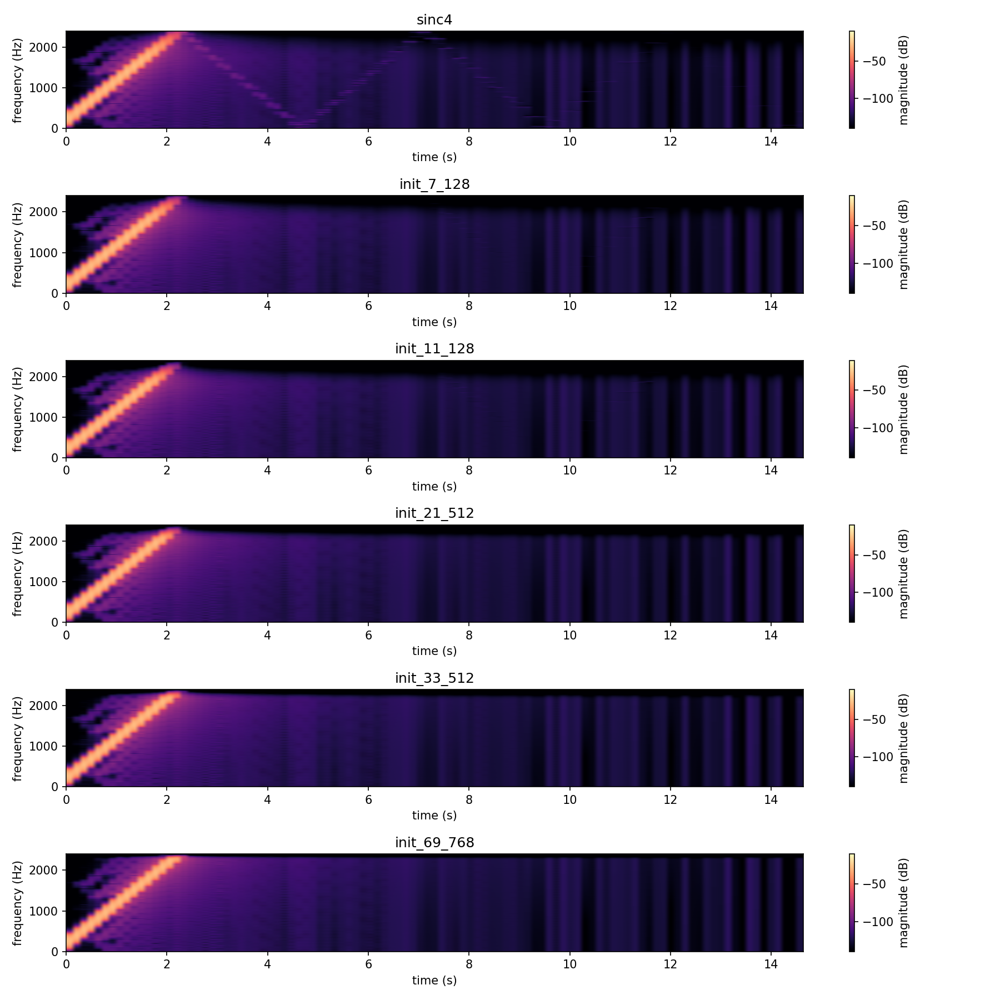
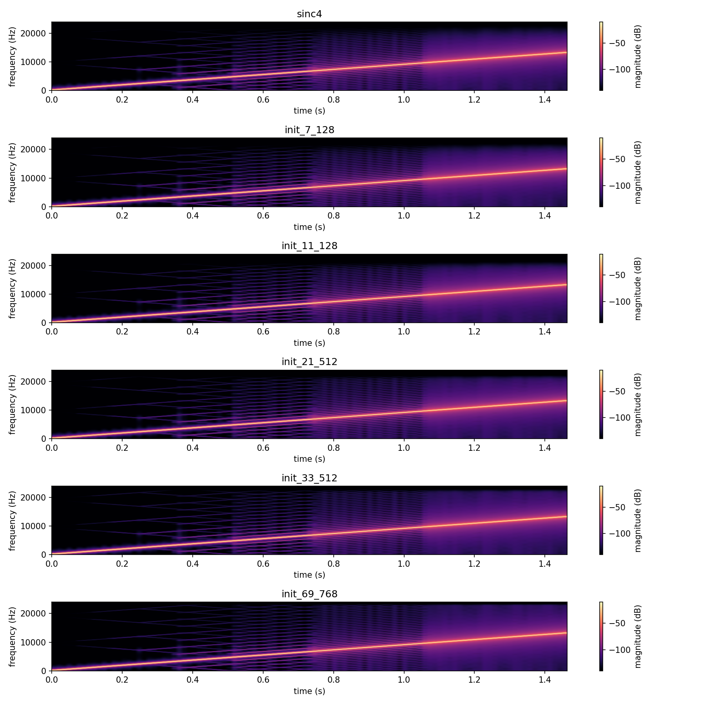
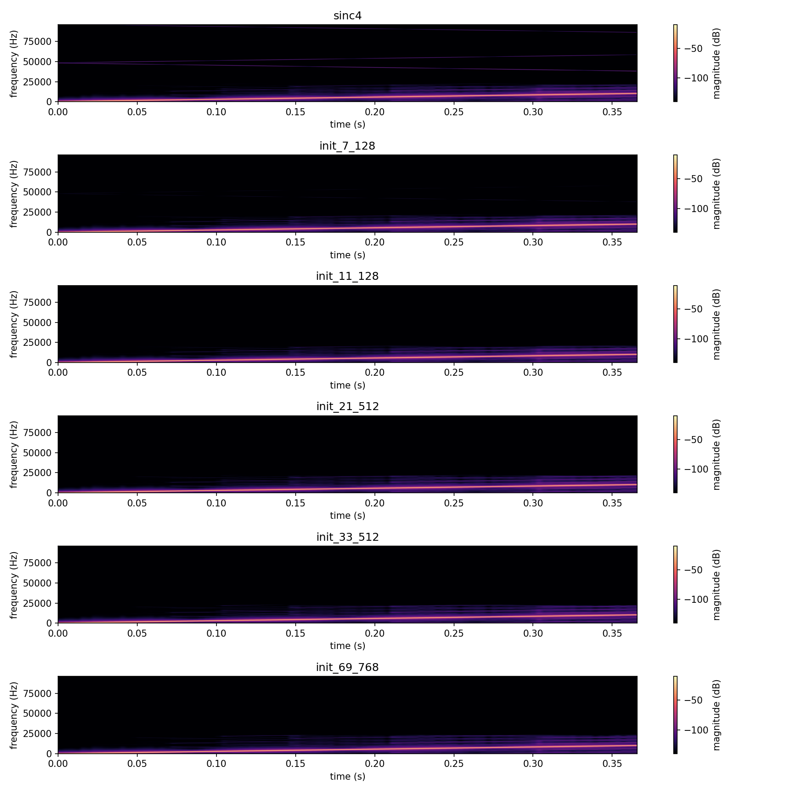

# SamplerateConverter verification plots

Visualizes and verifies `src/includes/SamplerateConverter/`'s `SrPullConverter` and
`SrPushConverter` directly, with no JUCE involved: aliasing spectrograms across the
supported ratio range, and a quantified alias-to-fundamental SNR table, for all six
sinc kernels shipped in `src/includes/Filters/Sinc/`. Both converter classes wrap the
same `SincFilter`-based interpolation core (`SrPullConverter` asks a callback for input
as it needs it; `SrPushConverter` takes whatever input the caller hands it and returns
whatever output that produced) - every measurement here was run against both, and they
agree exactly (see "Does it matter which class drives it?" below).

`documentation/Filters/SincFilterDesign/` is the offline generator that produced these
six coefficient tables; this folder only consumes them.

The `.png`s in this folder are checked-in samples of every plot, produced by the
pipeline described here. The aliasing check also saves `.wav` renders (gitignored, in
`generated/`) for listening, one pair (`_push_`/`_pull_`) per ratio per filter.

## Quick start

`./generate.sh` runs the whole pipeline in one step: configures/builds
`SamplerateConverterExplore` (behind `EXPLORE_STUFF`, into a gitignored `build/` at the
repo root), runs it, sets up a local `.venv` from `requirements.txt`, and renders every
PNG in this folder. Intermediate data (spectrogram grids, `.wav` renders, the raw SNR
table) goes into a gitignored `generated/` subfolder, leaving only the checked-in
`.png`s at the top level of this folder.

## Generating the data

Build (behind the `EXPLORE_STUFF` CMake option; no `dev-scripts/` wrapper covers this)
and run it from the repo root, passing the output directory for its data files (default
`.`):

```bash
mkdir -p build && cd build
cmake -DEXPLORE_STUFF=ON -DCMAKE_BUILD_TYPE=Release ..
cmake --build . --target SamplerateConverterExplore
./documentation/SamplerateConverter/SamplerateConverterExplore ../documentation/SamplerateConverter/generated
```

- `sr_aliasing_<class>_<ratio>_<filter>.txt` / `.wav` (36 files: push/pull x
  0.1/1.0/4.0 x the six filters): a fixed-ratio, no-glide render of a 50Hz-15000Hz
  linear sweep through `SrPushConverter`/`SrPullConverter` (one `fetchBlock()` call,
  matching each class's own test suite), captured as a time/frequency grid
  (`Analysis/Spectrogram.h`'s `SimpleSpectrogram`, rendered by this folder's own
  `spectrogram_plot.py`) and as a `.wav`. Both the grid and the `.wav` are labeled at
  the render's **true resulting sample rate**, `48000 * ratio` - not the input's
  nominal 48000Hz. `fetchBlock()` produces exactly `ratio` output frames per input
  frame, so labeling every render at a constant rate would play a downsample ratio's
  output back too fast, sweeping straight through its own anti-aliasing cutoff in a
  fraction of the intended 15-second duration instead of the full sweep.
- `sr_snr_table.txt`: alias-to-fundamental SNR, in dB, for all six filters across 16
  ratio steps (0.1 to 1.0 in 0.1 steps, 1.5 to 4.0 in 0.5 steps) - see "Alias-to-
  fundamental SNR" below for how the probe frequency and the measurement itself work.

## Does it matter which class drives it?

`documentation/Delays/VariSpeedTapeDelay/`'s own aliasing check drives the shared resampler
through one caller, `VariSpeedTapeDelay`'s write side; here the question is
`SrPushConverter` vs. `SrPullConverter` over the exact same `SincFilter`. Every spectrogram pair below (`_push_*.png` vs. `_pull_*.png`,
generated separately, both checked in) is visually identical, and the SNR measurement
confirms it numerically: at ratio 0.1, `sinc4` push and pull both measure 87.7955dB; at
ratio 2.0, both measure 44.1347dB - not "close," but bit-for-bit identical given the
same input. **No, it does not matter** - both classes reduce to the same
`variProcess()`/`SincFilter` core, so only that core's own behavior is worth
characterizing, and the rest of this README does that once rather than twice.

## Aliasing spectrograms



**Extreme downsample (ratio 0.1, true rate 4800Hz, Nyquist 2400Hz)**: the true sweep
ridge climbs cleanly from 0 to 2400Hz over the first ~2.3s, then the anti-aliasing
kernel correctly suppresses everything past that as the sweep continues on up to
15000Hz - the remaining ~13s is near-silent in every filter, which is the intended
behavior of a decimator, not a bug (an earlier version of this render mislabeled the
`.wav`/spectrogram at a constant 48000Hz regardless of ratio, which played this same
data back 10x too fast and made the cutoff look like an instability rather than a
correctly-timed passband edge). Look closely at `sinc4`'s panel around 4-5s: a faint
second ridge descends from around 1000Hz down toward 0Hz - a genuine alias, the
swept tone folding back around the 2400Hz Nyquist. It is not visible in any of the
other five, wider filters. This is the one place in this sweep where filter width
visibly buys something: `sinc4`'s narrower kernel lets a weak image through that the
other five suppress below the plot's noise floor.



**Unity ratio, clean control**: the same sweep, now unconstrained (48000Hz Nyquist),
climbs cleanly to 24000Hz with no artifacts beyond faint FFT-window cross-hatching
(present identically in all six panels - a property of the spectrogram capture, not the
converter). At ratio 1.0 the interpolator is still active (it always resamples through
the same fractional-delay path; nothing here special-cases the identity ratio), so this
is a genuine "does the shared core do the obvious thing when asked for no change"
check, not just a formality - and it does.



**Extreme upsample (ratio 4.0, true rate 192000Hz)**: the sweep only reaches this
render's 15000Hz endpoint by the very end of the (now much shorter, 0.375s) clip,
staying far below the 96000Hz Nyquist throughout - interpolation adds samples without
discarding bandwidth, so there is nothing to alias here by construction, and all six
filters render identically. The faint horizontal line near 48000Hz in every panel is a
residual image of the *original* 48000Hz rate, well down in level and not something any
of these filters is trying to suppress (nothing downstream of the converter is sampled
at the original rate any more).

`sr_aliasing_pull_*.png` (checked in alongside, not reproduced here) show the same
three cases through `SrPullConverter` - pixel-for-pixel the same story, per the
equivalence established above.

## Alias-to-fundamental SNR

A probe held at one fixed real frequency across the whole ratio sweep does not work
here: 1000Hz (tried first) never crosses any tested ratio's actual cutoff and gives a
uniformly clean, filter-independent table; 8000Hz sits so deep in the stopband at the
low-ratio end that the true tone is attenuated below the measurement noise floor, and
the "SNR" degenerates into noise-floor noise rather than the filter's own aliasing
performance. Both symptoms disappear once the probe tracks each ratio's own new
Nyquist instead of a fixed Hz value: **probe = 0.9 x (48000Hz x min(ratio, 1) / 2)** -
90% of the way to whatever the current ratio's own cutoff is, always exercising the
transition band under test regardless of how extreme the ratio is. The measurement
itself averages a Welch periodogram (`Analysis/FftMisc.h`'s `FFTResponse::analyse`,
many overlapping windows) rather than one FFT snapshot - a single window lands at an
arbitrary phase of the beating between the probe and any nearby spurious component,
which was making one-shot readings swing by tens of dB between otherwise-identical
runs. Fundamental is the strongest bin of that averaged spectrum; alias is the
strongest bin at least 50Hz away from it (Delays/VariSpeedTapeDelay/README.md's own
ratioglide SNR measurement uses the same "strongest peak outside a guard band" definition).

| ratio | sinc4 | init_7_128 | init_11_128 | init_21_512 | init_33_512 | init_69_768 |
|---:|---:|---:|---:|---:|---:|---:|
| 0.1 | 87.8 | 86.3 | 83.2 | 84.8 | 90.1 | 86.3 |
| 0.2 | 69.2 | 70.2 | 72.1 | 71.9 | 68.6 | 67.2 |
| 0.3 | 13.1 | 13.9 | 15.4 | 15.2 | 12.6 | 11.6 |
| 0.4 | 9.2 | 9.8 | 10.9 | 10.7 | 8.7 | 8.0 |
| 0.5 | 8.9 | 9.3 | 10.2 | 10.1 | 8.5 | 8.0 |
| 0.6 | 0.6 | 1.4 | 2.9 | 2.7 | 0.1 | 0.9 |
| 0.7 | 0.3 | 1.0 | 2.3 | 2.1 | 0.2 | 1.0 |
| 0.8 | 3.3 | 2.7 | 1.6 | 1.8 | 3.8 | 4.5 |
| 0.9 | 3.5 | 3.0 | 2.0 | 2.2 | 3.9 | 4.5 |
| 1.0 | 5.0 | 4.5 | 3.6 | 3.8 | 5.3 | 5.9 |
| 1.5 | 44.4 | 73.9 | 74.0 | 74.0 | 73.9 | 73.9 |
| 2.0 | 44.1 | 63.7 | 63.5 | 63.5 | 63.9 | 64.0 |
| 2.5 | 44.6 | 61.8 | 61.5 | 61.6 | 62.1 | 62.2 |
| 3.0 | 33.2 | 33.2 | 33.3 | 33.3 | 33.2 | 33.2 |
| 3.5 | 23.3 | 23.3 | 23.3 | 23.3 | 23.3 | 23.3 |
| 4.0 | 29.8 | 29.8 | 29.8 | 29.8 | 29.8 | 29.8 |

Two findings, neither the smooth single-cliff story `Delays/VariSpeedTapeDelay/README.md`'s
own sinc4-vs-sinc_69_768 table tells, and both worth taking at face value rather than
forcing into that shape:

**All six filters move together at every ratio.** Across the entire table the spread
between the best and worst filter at a given ratio is at most a few dB, while the
spread between ratios is 10-90dB - filter *width* barely matters to this measurement
almost everywhere. The probe sits at 90% of each ratio's own new Nyquist by
construction, and the sharp dip from ratio 0.2 (~70dB) to ratio 0.6-0.9 (under 5dB)
tracks the probe's rising *absolute* frequency (4320Hz at 0.2, up to 19200-21600Hz at
0.8-1.0), not the decimation ratio itself: content near the shared interpolation
kernel's own Nyquist is hard for every one of these six filters alike, extreme
downsample ratios included, because at those ratios the probe itself is a low absolute
frequency. This is a different, and arguably more useful, thing to know than "does
aliasing get worse as the ratio gets more extreme": it does not, on its own: what
matters is how close the content is to *whatever* Nyquist is in play.

**The one place filter width clearly shows up is the 1.5-2.5 upsample range**, where
`sinc4` sits 20-30dB behind the other five, which cluster within 1dB of each other.
`sinc4`'s short kernel is the one case in this whole sweep where its narrower design
measurably underperforms - matching the faint extra alias ridge visible only in
`sinc4`'s ratio-0.1 spectrogram panel above. Everywhere else, the five wider filters'
extra taps are not buying anything this measurement can detect.
