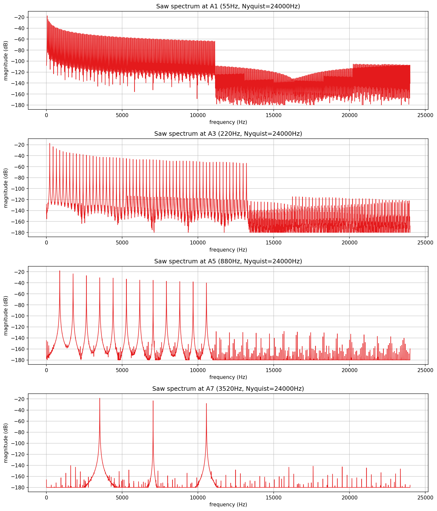
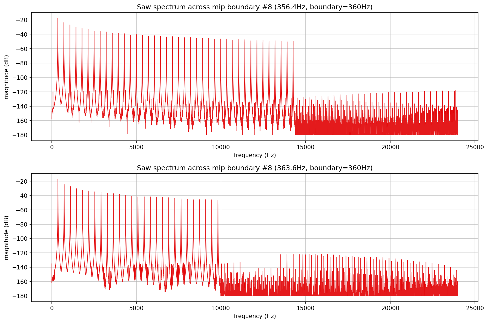
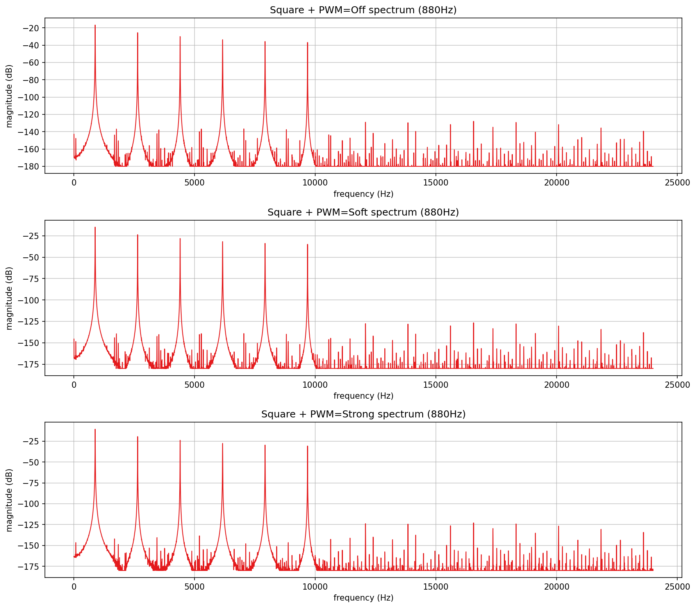
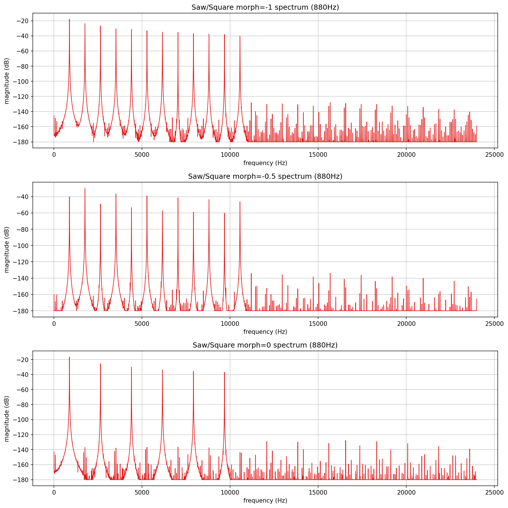
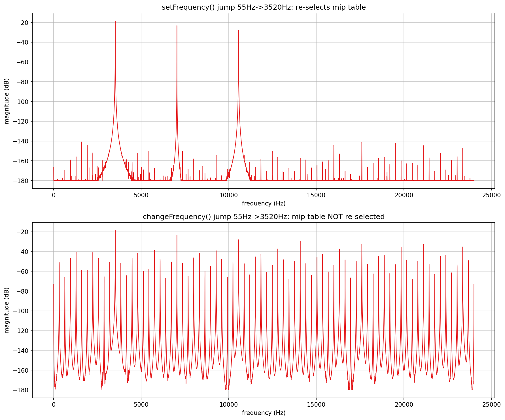
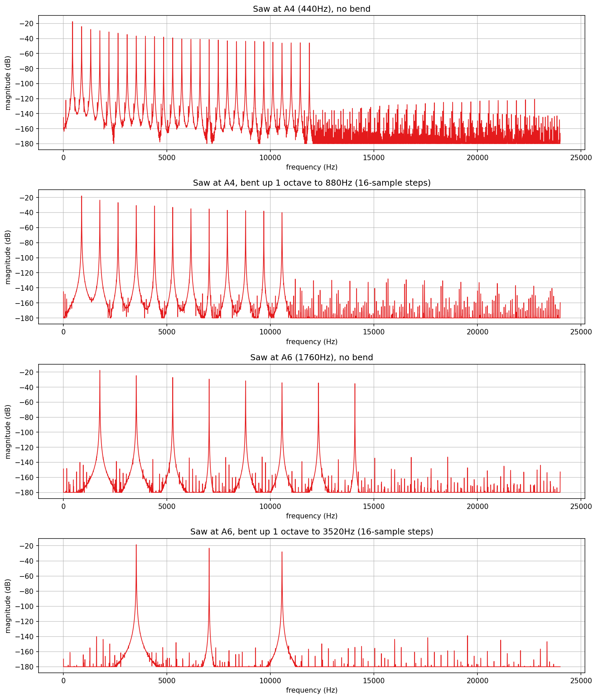
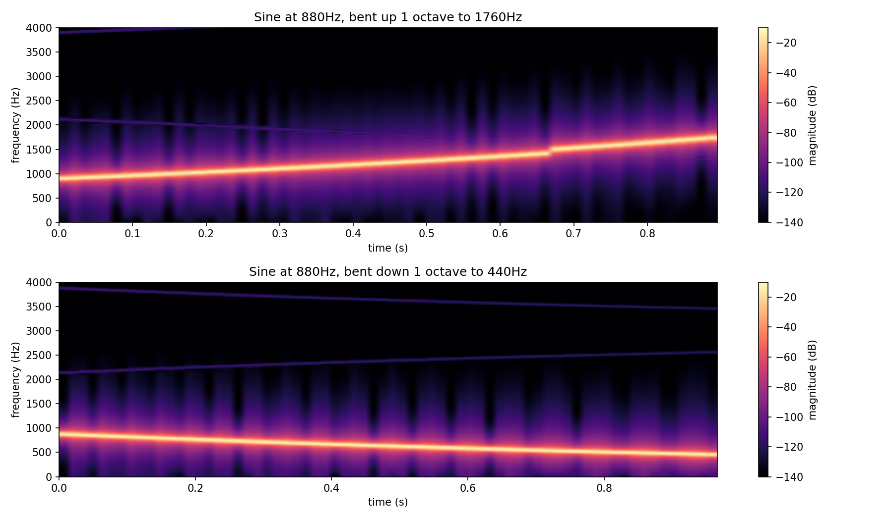

# Wavetables verification plots

Verifies `AbacDsp::WaveTableOscillator`'s mipmap band-limiting
(`src/includes/Wavetables/WaveTableOscillator.h`/`WaveTableStorage.h`)
directly, with no JUCE involved: does the harmonic content it emits actually
stay below Nyquist across the playable pitch range, at a mip-table
switchover, under PWM, and while morphing between two waveforms - and what
happens if the oscillator's table selection is bypassed, both at discrete
before/after snapshots and continuously across a live pitch bend.

`wt_pitch_range.png`, `wt_mip_boundary.png`, `wt_pwm.png`, `wt_morph.png`,
`wt_change_vs_set_frequency.png`, `wt_pitch_bend.png`, and
`wt_pitch_bend_spectrogram.png` in this folder are checked-in samples of
all seven plots, produced by the pipeline described here.

## Quick start

`./generate.sh` runs the whole pipeline in one step: configures/builds
`WavetablesExplore` (behind `EXPLORE_STUFF`, into a gitignored `build/` at
the repo root), runs it, sets up a local `.venv` from `requirements.txt`,
and renders all seven PNGs in this folder (six via `Plot/PyConPlot.py`, the
spectrogram via this folder's own `spectrogram_plot.py`). `generate.sh`
writes the intermediate text into a gitignored `generated/` subfolder,
leaving only the checked-in `.png`s at the top level of this folder.

## Generating the data

Build (behind the `EXPLORE_STUFF` CMake option; no `dev-scripts/` wrapper
covers this) and run it from the repo root (optional arguments are the
eight output files, default `wt_pitch_range.txt` / `wt_mip_boundary.txt` /
`wt_pwm.txt` / `wt_morph.txt` / `wt_change_vs_set_frequency.txt` /
`wt_pitch_bend.txt` / `wt_pitch_bend_spectrogram_up.txt` /
`wt_pitch_bend_spectrogram_down.txt`):

```bash
mkdir -p build && cd build
cmake -DEXPLORE_STUFF=ON -DCMAKE_BUILD_TYPE=Release ..
cmake --build . --target WavetablesExplore
./documentation/Wavetables/WavetablesExplore
```

Every spectrum is the same shape of measurement: a `Saw` or `Square`
`WaveTableOscillator`, driven with a single fixed setting, rendered for
4096 (settle) + 16384 (captured) samples at 48kHz, Hann-windowed and FFT'd
(`AbacDsp::HannWindowMagnitudesFft`, ~2.9Hz resolution - fine enough to
resolve the 55Hz-spaced harmonics of the lowest test note). No decimation
is used, unlike `Modulation/`'s sub-audio-rate LFOs: oscillator content
spans up to Nyquist, which is exactly what's being checked here.

- `wt_pitch_range.txt`: four subplots - a pure `Saw` (slot 0, `morph=-1`)
  at A1/A3/A5/A7 (55/220/880/3520Hz), checking that harmonic content stays
  band-limited from the lowest to the highest practically-played notes.
- `wt_mip_boundary.txt`: two subplots - the same pure `Saw`, just below and
  just above one mip-table switchover. The boundary frequency is read
  straight from `WaveTableStore::getTableSet(BasicWave::Saw)`'s own
  `topFreq` data (the middle table of the chain, whatever that turns out to
  be, not a hand-guessed frequency), converted from phase-increment units
  via `topFreq * sampleRate / 2` (the oscillator queries tables at twice
  the real phase increment - see its own class doc comment).
- `wt_pwm.txt`: three subplots - a `Square` at 880Hz with `PwmMode::Off`,
  `Soft`, and `Strong` (`setPwm(0.3)`), checking the phase-distortion
  subtraction technique (`subtractPwmBlock`) doesn't reintroduce content
  that aliases.
- `wt_morph.txt`: three subplots - `Saw` in slot 0, `Square` in slot 1, at
  880Hz, `morph` swept from `-1` (pure Saw) through `-0.5` to `0` (pure
  Square), checking the crossfade stays clean.
- `wt_change_vs_set_frequency.txt`: two subplots, the one deliberately
  provocative case - trigger a `Saw` at 55Hz (picks a harmonic-rich low mip
  table), let it settle, then jump straight to 3520Hz via `setFrequency()`
  on one oscillator and via `changeFrequency()` on an identical second one.
  `changeFrequency()` updates the phase increment but - unlike
  `setFrequency()` - never calls `updateWaveTableIndices()`, so the table
  selected for 55Hz stays selected at 3520Hz. `changeFrequency()` is
  currently unused anywhere else in the codebase (confirmed by grep).
- `wt_pitch_bend.txt`: four subplots - a `Saw` at A4 (440Hz) and A6
  (1760Hz), each with a steady reference spectrum and a spectrum captured
  after bending up a full octave. The bend calls `setFrequency()` once
  every 16 samples along a linear-in-semitones ramp over 0.2s (a fast,
  realistic MPE slide) - the same cadence `MorphexsynthVoice` actually
  uses (`kFGranularity`), not per-sample. A4 stress-tests a typical
  mid-range MPE lead note; A6 stress-tests the tightest headroom, close to
  the top of the practical playable range.
- `wt_pitch_bend_spectrogram_up.txt` / `_down.txt`: a real time/frequency
  view of the bend itself, rather than a before/after snapshot. A `Sine`
  (not `Saw` - one ridge only, so the bend trace and any alias would stand
  out with nothing to visually separate them from) at 880Hz, bent up to
  1760Hz and separately down to 440Hz over 1s (same 16-sample
  `setFrequency()` cadence as `wt_pitch_bend.txt`). Captured with
  `AbacDsp::SimpleSpectrogram` (`Analysis/Spectrogram.h`) - `setFftLength
  (2048)`, default 1/3 hop - fed in hop-sized chunks with a short sleep
  between (the same offline-feeding idiom `test/Analysis/
  Spectrogram_test.cpp` already uses for this class, since its FFT runs on
  a background worker thread). Rendered as a heatmap by this folder's own
  `spectrogram_plot.py`, since `PyConPlot.py` only draws named x/y line
  series, not a 2D grid.

## What the plots show



**Pitch range**: at every note, the harmonic comb cuts off cleanly at that
mip level's own boundary (about 11kHz at A1, 13kHz at A3), and everything
past the cutoff drops straight to a flat, low noise floor (roughly -110dB
down to -180dB) with no discrete tonal spike anywhere in it - not a residual
aliased partial, just broadband synthesis noise from the mipmap's own FFT
construction. At A5 and especially A7, so few harmonics remain below the
active table's cutoff that the plot is almost entirely that same noise
floor. Band-limiting holds across the whole tested range.



**Mip boundary**: switching tables (here, `Saw`'s table 8 to 9 at 360Hz)
produces no spike or discontinuity at the switchover itself - the harmonic
count and cutoff frequency simply step down one notch, and the noise floor
on both sides looks identical to the pitch-range plot above. The switch is
inaudible in spectral terms, not just in level.



**PWM**: `Off` shows the odd-harmonics-only comb of a plain 50% square wave.
`Soft` and `Strong` both introduce even harmonics, exactly as expected from
breaking the square's half-wave symmetry by phase-distortion - but the
noise floor (about -175 to -180dB) is unchanged across all three modes.
`subtractPwmBlock` doesn't reintroduce or amplify alias energy.



**Morph**: `morph=-1` (pure Saw) shows the full odd+even comb; `morph=0`
(pure Square) shows odd-only; `morph=-0.5` sits cleanly in between, with the
even harmonics partially cancelled rather than clicking between the two
states. The noise floor stays flat at every position - a genuinely
continuous crossfade, not a hard switch with added artifacts.



**`changeFrequency()` vs. `setFrequency()`**: `setFrequency()`'s jump to
3520Hz re-selects the correct mip table, giving the same clean 3-harmonic,
low-noise-floor spectrum as A7 in the pitch-range plot. `changeFrequency()`
leaves the 55Hz table selected - dozens of harmonics, most of them now well
above the new Nyquist-relative safe range - and the result is a dense comb
of strong partials (roughly -20dB to -60dB, i.e. 100-150dB louder than the
noise floor everywhere else in this document) spread across the entire
spectrum up to Nyquist. This is genuine, clearly audible aliasing, not a
subtle effect.



**Pitch bend**: both bent spectra are visually indistinguishable from the
steady-state spectrum at their landing pitch (compare A4-bent-to-880Hz
against A5's own spectrum in `wt_pitch_range.png`, and A6-bent-to-3520Hz
against A7's) - same harmonic count, same cutoff frequency, same noise
floor. A full-octave-up MPE bend, applied the way `MorphexsynthVoice`
actually drives it (`setFrequency()` every 16 samples, not per-sample),
never leaves a stale table behind: every step reselects, so there's no
aliasing anywhere along the bend, including right at the top of the range
near A6. This is the direct, positive counterpart to the
`changeFrequency()` finding above - the same reselection `changeFrequency()`
skips is exactly what keeps a real pitch bend safe.



**Bend spectrogram**: a single clean ridge tracks the sweep in both
directions - 880Hz to 1760Hz smoothly rising, 880Hz to 440Hz smoothly
falling - with no second trace, no discontinuity at any point along
either bend, and the same broadband noise floor throughout as every other
plot in this document. The faint diagonal line well above the main ridge
(roughly -120dB, over 100dB down) is spectral leakage from the moving tone
through the 2048-point Hann window, not an alias of the bend itself - it
tracks the analysis window's own resolution limit, not the oscillator.
This is the clearest single picture in this document of what "no stale
mip table" actually looks like over time, not just before and after.

## Finding: `changeFrequency()` is a real aliasing footgun

`changeFrequency()` updates the oscillator's phase increment but skips the
mip-table reselection that `setFrequency()` always does. A caller that
jumps pitch through `changeFrequency()` (e.g. a large glide or MPE bend
without ever calling `setFrequency()` again) keeps playing whatever table
was chosen at the old pitch, and a big enough jump reintroduces exactly the
aliasing the mipmap system exists to prevent - confirmed directly above.
It is currently unused anywhere in the codebase (confirmed by grep), so
nothing is affected today. Fixing or removing it is out of scope for this
documentation-only investigation; it would need to be an explicit, separate
follow-up.
