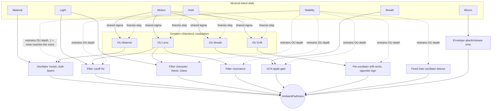
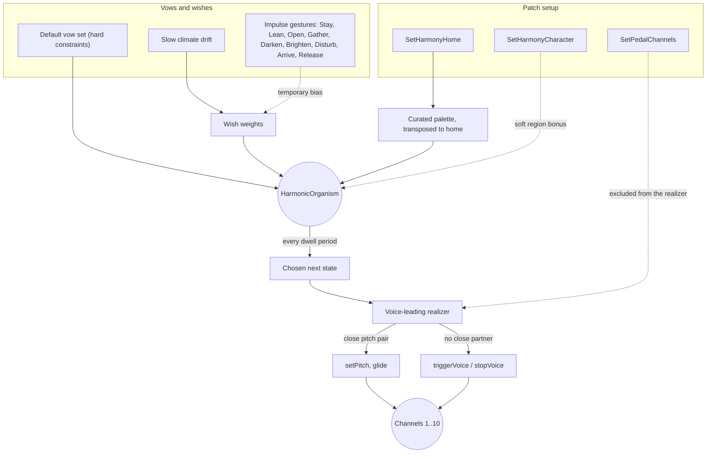

# Ambientpad

A monophonic ambient-pad voice, times up to 10: two morphing wavetable layers through a
resonant pole-mixing filter, a long attack/release amplitude envelope, a distortion stage, and
the same phaser/chorus/reverb master-bus effects as Morphexsynth. There is no MIDI input in this
phase - a voice is played from the Note/Play controls, scripted directly via Lua's
`NoteOn`/`NoteOff`, or, with the harmonic organism enabled (see Harmony below), driven
automatically as it moves through its own palette of harmonic states.

Rather than a conventional LFO and per-destination ADSR envelopes, the voice's motion comes from
four correlated Ornstein-Uhlenbeck (mean-reverting random walk) processes - Breath, Material,
Lens, and Drift - each feeding its own destination at its own depth. The Material/Light/Motion/
Breath/Stability/Bloom dials speak in musical intentions (substance, darkness/light, amount of
drift, presence, firmness, emergence) rather than raw filter/envelope parameters; Hold freezes
all four processes at their current value.

The voice keeps an array of 10 slots (channels) for polyphony: only channel 1 is driven by the
standalone's own Note/Play controls, and the rest sit idle unless a script addresses them
directly with `NoteOn`/`NoteOff` - or the harmonic organism is driving them itself.

## Modulation

How the seven dials and the four Ornstein-Uhlenbeck processes reach the voice:



Motion sets one shared wander range/speed for all four processes; each still reaches a
different destination at its own depth, so the voice reads as one weather system rather than
four independent LFOs. Stability then scales how much of that wander actually reaches every
destination, so Stability=1 is genuinely stable (no wander reaches the voice) regardless of
Motion, not just firmer pitch. Hold pauses every process's own `step()` call, freezing
modulation at whatever value it currently holds rather than resetting it to a center.

## Harmony

A slow, seedable decision process that chooses which notes the channel array plays over time,
layered on top of - not instead of - the per-voice modulation above. Off by default; the
Harmony/Home/Character dials and their Lua equivalents (see Scripting below) reach the same
settings either way.



A dwell period is tens of seconds; the organism reconsiders roughly that often, and mostly
either stays or moves to a nearby state rather than jumping freely through the whole palette.
Character sets a soft preference for one of the five palette regions ("Chromatic" for brief
foreign colour, "Minor Home" to stay close, ...) - a bonus toward matching candidates, not a
filter, so it never forces a jump the vows wouldn't otherwise allow; how strongly it pulls
varies by region, since a region's own tags can already work against or with it (the
chromatic-weather entries, for instance, are inherently at odds with keeping the tonal home
audible, so "Chromatic" reads as "more foreign colour than usual", not "only foreign colour").
A chosen state's notes are realized per channel: a channel whose pitch is close to a note in
the new state glides to it (`setPitch`, keeping that voice's own envelope/modulation state
exactly as it was); everything else cross-fades - a free channel triggers the added note, a
channel with no partner in the new state releases. Pedal channels are never touched by this -
they hold their own note independently.

## Controls

| Control | Range | Description |
|---|---|---|
| Level | -60 - 12 dB, default -30 | Master output level |
| Note | 0 - 127, default 69 (A4) | Pitch for the Play switch (no MIDI input in this phase) |
| Play | on/off | Gates channel 1's voice at the Note pitch |
| Material | 0 - 1 | Wavetable position along each oscillator's material path |
| Light | 0 - 1 | Filter cutoff and character, dark (Velvet) to bright (Glass) |
| Motion | 0 - 1 | Shared range/speed of the Breath/Material/Lens/Drift wander |
| Breath | 0 - 1 | How much the Breath process moves level and cutoff |
| Stability | 0 - 1 | Fragile (0: full drift/detune/wobble) to firm (1: none reaches the voice) |
| Bloom | 0 - 1 | Amplitude attack/release time - short/direct to slow/lingering |
| Hold | on/off | Freezes all four modulation processes at their current value |
| Harmony | on/off | Enables the harmonic organism (see Harmony above); off by default |
| Home | C - B, default E | The harmonic organism's tonal home |
| Character | Any/Minor Home/Major Light/Modal Warmth/Open-Suspended/Chromatic | Soft preference for one palette region |
| Script | (button) | Opens the popup editor for the current patch's script |

**Settings > Scripts** manages a named pool of saved scripts, separate from the script embedded
in the current patch. **Settings > Patches** saves/loads full patches, including whichever
script is currently applied.

## Scripting

This section covers what's specific to Ambientpad. For everything shared with any other
Lua-scripted example - MIDI handlers, `OnStart`/`OnStop`, dynamic UI parameters, the
`Music`/`Vel`/`Rr`/`Rhythm` helper library, `Timer`, `Transport`, the available stdlib
functions, and sandbox/error-handling notes - see `../../LUA-MANUAL.md`.

Like Morphexsynth, Ambientpad has no Play switch/Host Sync concept from Lua's point of view:
`OnStart()` fires exactly once, right after the plugin's engine is constructed - the usual place
to set a patch's static configuration and, for a self-playing patch, to call `NoteOn`.

**Every `SetXxx()`/`NoteOn`/`NoteOff` call below must happen from inside a hook** (`OnStart`, a
`UICreateParameterSet` callback, a `Timer` callback, ...) - never at the script's own top level.

### Triggering a voice

```lua
NoteOn(channel, note, velocity)
NoteOff(channel, note)
```

`channel` is `1..10` and addresses a voice slot directly - there is no voice stealing, a channel
number *is* a voice. Only channel 1 is wired to the standalone's own Note/Play controls; the
rest are for a script's own use (future polyphony). `note` is a MIDI-style note number (`69` =
A4 = 440 Hz); `velocity` is `0..127`.

### Oscillators

```lua
SetOscillator(channel, index, { waveform = 0, level = 0.7, height = 0, cents = 0 })
```

`channel` is `1..10` (see above); `index` is `0` or `1` (the two oscillators). `waveform`
selects the material *path* this layer's Material position sweeps along: `0` Saw-Sine-Square
(the default - warm through hollow to reedy), `1` Triangle-Sine-SharkFin (softer), `2`
Square-White-Saw (noisier, using the noise waveform). `level` is `-1..1`; `height` is a semitone
offset from the played note; `cents` is a fine-tune offset in cents.

### Per-voice gain

```lua
SetGain(channel, gainInDb)
```

A smoothed output trim for one voice, independent of the master Level dial - useful once several
channels are sounding together.

### Pitch glide

```lua
SetPitch(channel, note, cents, glideTimeSeconds)
```

Repitches a channel's held voice without retriggering its envelope or modulation state -
`glideTimeSeconds = 0` is instant (equivalent to setting `NoteOn`'s own note), a positive value
glides smoothly to `note + cents` over that many seconds. `cents` is `-100..100`.

### The four musical-intent controls

```lua
SetMaterial(value)   -- 0..1
SetLight(value)      -- 0..1
SetMotion(value)      -- 0..1
SetBreath(value)      -- 0..1
SetStability(value)   -- 0..1
SetBloom(value)       -- 0..1
SetHold(hold)          -- true/false
```

Each is the scripted equivalent of its dial (see the Controls table above) and, like the dials,
applies to every voice in the array - there is one shared patch, not a per-channel one.

### Distortion

```lua
SetDistortion(presetIndex)
```

`0` bypasses the stage; `1` and up select a 1-indexed preset from `WaveShaperTables.h`'s
`kDistortionWaveTableSet`. Applies to every voice.

### Master effects

```lua
SetPhaser({ rateHz = 0.3, depth = 0.5, feedback = 0, mix = 0.5 })
SetChorus({ rateHz = 0.6, depth = 0.5, mix = 0.5 })
SetReverb({ sizeMeters = 12, decayMs = 1500, dryDb = 0, mixDb = -100 })
```

Identical to Morphexsynth's own (see its README for the full field-by-field description); run
on the summed mix of every voice, in the order phaser -> chorus -> reverb. Each defaults to off
at startup. Note that the oscillator/filter chain itself runs mono per voice - `SetChorus` is
where this instrument's stereo depth actually comes from.

### Harmonic organism

See the Harmony diagram above for the full picture; this is the scripted surface. `SetHarmony`,
`SetHarmonyHome`, and `SetHarmonyCharacter` are the same Harmony/Home/Character dials described
in Controls above, also reachable from a script - whichever sets a value last wins, same as
any other dial.

```lua
SetHarmony(enabled)                 -- off by default
SetHarmonyHome(pitchClass)          -- 0..11, e.g. 4 = E; retunes the palette to a new home
SetHarmonyCharacter(region)         -- 0 no preference, 1..5 the five regions in palette order
SetPedalChannels({ channel, ... })  -- any subset of 1..10, including none or all
```

With harmony off, the instrument behaves exactly as described above - every voice stays under
direct `NoteOn`/`NoteOff`/`SetPitch` control. `SetPedalChannels` replaces the whole pedal set
each call; a channel newly added to it is triggered at the current home note, a channel
removed from it is left sounding rather than stopped - there is no dial for this, Lua-only.

A handful of impulse gestures nudge the organism's moving preferences temporarily - each rises,
holds, then fades over roughly the same tens-of-seconds timescale as the organism's own
decisions, a bias with a life cycle rather than an instant switch. There's no dial for these
either (9 gestures don't fit the dial budget); `base-scripts/harmonic-scene.lua` shows the
usual way to reach them instead - a `UICreateParameterSet` dropdown in the Lua Controls area:

| Impulse | Effect |
|---|---|
| `Stay()` | Delay departure; stay close to the current state |
| `Lean()` | Encourage a small move toward a nearby state |
| `Open()` | Favour open intervals, wider registers, more ambiguity |
| `Gather()` | Favour fewer notes, closer affinity, less ambiguity |
| `Darken()` | Favour darker, more minor-leaning colour |
| `Brighten()` | Favour brighter, more major-leaning colour |
| `Disturb()` | Temporarily admit more tension/friction |
| `Arrive()` | Favour a calm, stable, close resting place |
| `Release()` | Fade out every other currently active impulse |

### Example scripts

`base-scripts/breathing-drone.lua` plays channel 1 at `OnStart`, leans into a slow, wide Motion
setting, and turns the chorus on for width - harmony stays off, a single static voice.

`base-scripts/harmonic-scene.lua` hands the instrument to the organism instead: an E home,
channel 10 as a pedal, an Impulse dropdown wired to all 9 gestures, and `Open`/`Arrive`/`Stay`
nudges on a timer too.
