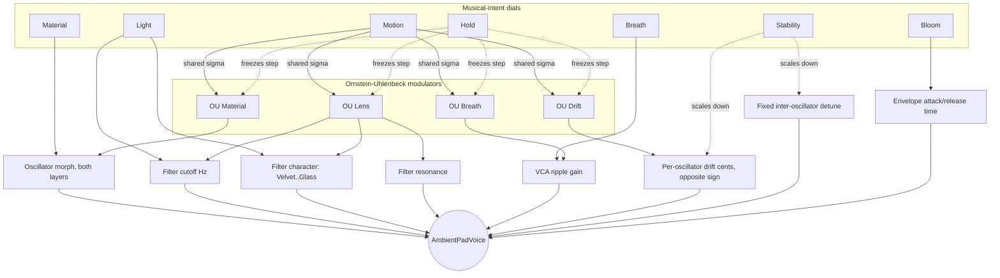

# Ambientpad

A single, monophonic ambient-pad voice: two morphing wavetable layers through a resonant
pole-mixing filter, a long attack/release amplitude envelope, a distortion stage, and the same
phaser/chorus/reverb master-bus effects as Morphexsynth. There is no MIDI input in this phase -
the voice is played from the Note/Play controls, or scripted via Lua's `NoteOn`/`NoteOff`.

Rather than a conventional LFO and per-destination ADSR envelopes, the voice's motion comes from
four correlated Ornstein-Uhlenbeck (mean-reverting random walk) processes - Breath, Material,
Lens, and Drift - each feeding its own destination at its own depth. The Material/Light/Motion/
Breath/Stability/Bloom dials speak in musical intentions (substance, darkness/light, amount of
drift, presence, firmness, emergence) rather than raw filter/envelope parameters; Hold freezes
all four processes at their current value.

The voice keeps an array of 10 slots (channels) for future polyphony, but only channel 1 is
driven by the standalone's own Note/Play controls in this phase - the rest sit idle unless a
script addresses them directly with `NoteOn`/`NoteOff`.

## Modulation

How the seven dials and the four Ornstein-Uhlenbeck processes reach the voice:



Motion sets one shared wander range/speed for all four processes; each still reaches a
different destination at its own depth, so the voice reads as one weather system rather than
four independent LFOs. Hold pauses every process's own `step()` call, freezing modulation at
whatever value it currently holds rather than resetting it to a center.

## Controls

| Control | Range | Description |
|---|---|---|
| Level | -60 - 12 dB, default -30 | Master output level |
| Note | 0 - 127, default 69 (A4) | Pitch for the Play switch (no MIDI input in this phase) |
| Play | on/off | Gates channel 1's voice at the Note pitch |
| Material | 0 - 1 | Wavetable position along each oscillator's material path |
| Light | 0 - 1 | Filter cutoff and character, dark (Velvet) to bright (Glass) |
| Motion | 0 - 1 | Shared range/speed of the Breath/Material/Lens/Drift wander |
| Breath | 0 - 1 | How much the Breath process moves level and cutoff |
| Stability | 0 - 1 | Firm (0: no drift/detune) to fragile (1: more of both) |
| Bloom | 0 - 1 | Amplitude attack/release time - short/direct to slow/lingering |
| Hold | on/off | Freezes all four modulation processes at their current value |
| Script | (button) | Opens the popup editor for the current patch's script |

**Settings > Scripts** manages a named pool of saved scripts, separate from the script embedded
in the current patch. **Settings > Patches** saves/loads full patches, including whichever
script is currently applied.

## Scripting

This section covers what's specific to Ambientpad. For everything shared with any other
Lua-scripted example - MIDI handlers, `OnStart`/`OnStop`, dynamic UI parameters, the
`Music`/`Vel`/`Rr`/`Rhythm` helper library, `Timer`, `Transport`, the available stdlib
functions, and sandbox/error-handling notes - see `../../LUA-MANUAL.md`.

Like Morphexsynth, Ambientpad has no Play switch/Host Sync concept from Lua's point of view:
`OnStart()` fires exactly once, right after the plugin's engine is constructed - the usual place
to set a patch's static configuration and, for a self-playing patch, to call `NoteOn`.

**Every `SetXxx()`/`NoteOn`/`NoteOff` call below must happen from inside a hook** (`OnStart`, a
`UICreateParameterSet` callback, a `Timer` callback, ...) - never at the script's own top level.

### Triggering a voice

```lua
NoteOn(channel, note, velocity)
NoteOff(channel, note)
```

`channel` is `1..10` and addresses a voice slot directly - there is no voice stealing, a channel
number *is* a voice. Only channel 1 is wired to the standalone's own Note/Play controls; the
rest are for a script's own use (future polyphony). `note` is a MIDI-style note number (`69` =
A4 = 440 Hz); `velocity` is `0..127`.

### Oscillators

```lua
SetOscillator(channel, index, { waveform = 0, level = 0.7, height = 0, cents = 0 })
```

`channel` is `1..10` (see above); `index` is `0` or `1` (the two oscillators). `waveform`
selects the material *path* this layer's Material position sweeps along: `0` Saw-Sine-Square
(the default - warm through hollow to reedy), `1` Triangle-Sine-SharkFin (softer), `2`
Square-White-Saw (noisier, using the noise waveform). `level` is `-1..1`; `height` is a semitone
offset from the played note; `cents` is a fine-tune offset in cents.

### Per-voice gain

```lua
SetGain(channel, gainInDb)
```

A smoothed output trim for one voice, independent of the master Level dial - useful once several
channels are sounding together.

### The four musical-intent controls

```lua
SetMaterial(value)   -- 0..1
SetLight(value)      -- 0..1
SetMotion(value)      -- 0..1
SetBreath(value)      -- 0..1
SetStability(value)   -- 0..1
SetBloom(value)       -- 0..1
SetHold(hold)          -- true/false
```

Each is the scripted equivalent of its dial (see the Controls table above) and, like the dials,
applies to every voice in the array - there is one shared patch, not a per-channel one.

### Distortion

```lua
SetDistortion(presetIndex)
```

`0` bypasses the stage; `1` and up select a 1-indexed preset from `WaveShaperTables.h`'s
`kDistortionWaveTableSet`. Applies to every voice.

### Master effects

```lua
SetPhaser({ rateHz = 0.3, depth = 0.5, feedback = 0, mix = 0.5 })
SetChorus({ rateHz = 0.6, depth = 0.5, mix = 0.5 })
SetReverb({ sizeMeters = 12, decayMs = 1500, dryDb = 0, mixDb = -100 })
```

Identical to Morphexsynth's own (see its README for the full field-by-field description); run
on the summed mix of every voice, in the order phaser -> chorus -> reverb. Each defaults to off
at startup. Note that the oscillator/filter chain itself runs mono per voice - `SetChorus` is
where this instrument's stereo depth actually comes from.

### Example script

`base-scripts/breathing-drone.lua` plays channel 1 at `OnStart`, leans into a slow, wide Motion
setting, and turns the chorus on for width.
