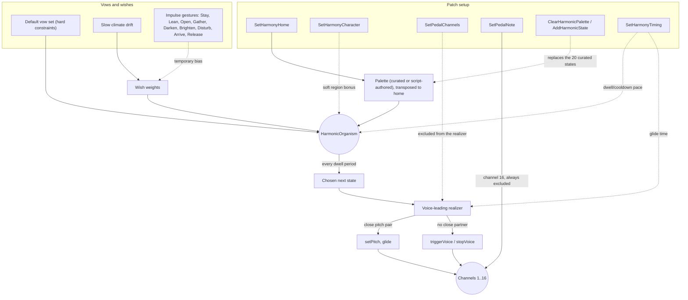

# Ambientpad

A monophonic ambient-pad voice, times up to 16: two morphing wavetable layers through a
resonant pole-mixing filter, a long attack/release amplitude envelope, a distortion stage, and
the same phaser/chorus/reverb master-bus effects as Morphexsynth. There is no MIDI input in this
phase - a voice is played from the Note/Play controls, scripted directly via Lua's
`NoteOn`/`NoteOff`, or, with the harmonic organism enabled (see Harmony below), driven
automatically as it moves through its own palette of harmonic states.

Rather than a conventional LFO and per-destination ADSR envelopes, the voice's motion comes from
four correlated Ornstein-Uhlenbeck (mean-reverting random walk) processes - Breath, Material,
Lens, and Drift - each feeding its own destination at its own depth. The Material/Light/Motion/
Breath/Stability/Bloom dials speak in musical intentions (substance, darkness/light, amount of
drift, presence, firmness, emergence) rather than raw filter/envelope parameters; Hold freezes
all four processes at their current value.

The voice keeps an array of 16 slots (channels) for polyphony: only channel 1 is driven by the
standalone's own Note/Play controls, and the rest sit idle unless a script addresses them
directly with `NoteOn`/`NoteOff` - or the harmonic organism is driving them itself. Each channel
can also carry its own slow, Lua-only LFO on Volume, Cutoff, Material, Resonance, or Pitch - a
genuine periodic sweep, independent of the OU weather system, with its own rate per channel
(see Scripting below); Hold freezes these too.

## Modulation

How the eight dials and the four Ornstein-Uhlenbeck processes reach the voice:

```mermaid
flowchart TD
    subgraph DIALS["Musical-intent dials"]
        MATERIAL["Material"]
        MRANGE["Range"]
        LIGHT["Light"]
        MOTION["Motion"]
        BREATH["Breath"]
        STABILITY["Stability"]
        BLOOM["Bloom"]
        HOLD["Hold"]
    end

    subgraph OU["Ornstein-Uhlenbeck modulators"]
        OUB["OU Breath"]
        OUM["OU Material"]
        OUL["OU Lens"]
        OUD["OU Drift"]
    end

    subgraph PERVOICE["Per-voice LFO (channel-indexed, off by default)"]
        LFOVOL["LFO Volume"]
        LFOCUT["LFO Cutoff"]
        LFOMAT["LFO Material"]
        LFORES["LFO Resonance"]
        LFOPITCH["LFO Pitch"]
    end

    MOTION -->|shared sigma| OUB
    MOTION -->|shared sigma| OUM
    MOTION -->|shared sigma| OUL
    MOTION -->|shared sigma| OUD
    HOLD -.->|freezes step| OUB
    HOLD -.->|freezes step| OUM
    HOLD -.->|freezes step| OUL
    HOLD -.->|freezes step| OUD
    HOLD -.->|freezes step| LFOVOL
    HOLD -.->|freezes step| LFOCUT
    HOLD -.->|freezes step| LFOMAT
    HOLD -.->|freezes step| LFORES
    HOLD -.->|freezes step| LFOPITCH

    MATERIAL --> MORPH["Oscillator morph, both layers"]
    MRANGE -.->|OU depth| MORPH
    OUM --> MORPH
    LFOMAT -.->|SetMaterialLfo depth| MORPH

    LIGHT --> CUTOFF["Filter cutoff Hz"]
    OUL --> CUTOFF
    LFOCUT -.->|SetCutoffLfo depth| CUTOFF
    LIGHT --> CHAR["Filter character: Velvet..Glass"]
    OUL --> RESO["Filter resonance"]
    LFORES -.->|SetResonanceLfo depth, always up| RESO

    BREATH --> RIPPLE["VCA ripple gain"]
    OUB --> RIPPLE

    LFOVOL -.->|SetVolumeLfo depth| TREM["Tremolo gain"]
    LFOPITCH -.->|SetPitchLfo depth| VIBRATO["Vibrato cents, both oscillators"]

    OUD --> DRIFT["Per-oscillator drift cents, opposite sign"]
    DETUNE["Fixed inter-oscillator detune"]

    LUARANGES["SetCutoffRange/SetResonanceRange/SetPitchDriftRange/\nSetBreathVcaRange - Lua only, no dial"]
    LUARANGES -.->|OU depth| CUTOFF
    LUARANGES -.->|OU depth| RESO
    LUARANGES -.->|OU depth| DRIFT
    LUARANGES -.->|OU depth| RIPPLE

    STABILITY -.->|restrains OU depth, 1 = none reaches the voice| MORPH
    STABILITY -.->|restrains OU depth| CUTOFF
    STABILITY -.->|restrains OU depth| RESO
    STABILITY -.->|restrains OU depth| RIPPLE
    STABILITY -.->|restrains OU depth| DRIFT
    STABILITY -.->|restrains OU depth| DETUNE

    BLOOM --> ENV["Envelope attack/release time"]

    MORPH --> VOICE(("AmbientPadVoice"))
    CUTOFF --> VOICE
    CHAR --> VOICE
    RESO --> VOICE
    RIPPLE --> VOICE
    TREM --> VOICE
    DRIFT --> VOICE
    DETUNE --> VOICE
    VIBRATO --> VOICE
    ENV --> VOICE
```



Motion sets one shared wander range/speed for all four processes; each still reaches a
different destination at its own depth, so the voice reads as one weather system rather than
four independent LFOs. Separately, each of the 16 channels can also carry its own slow LFO on
Volume, Cutoff, or Material (see "Per-voice LFO" below) - a deliberately independent,
per-channel modulation source, off by default. Material's own depth is a dial (Range): it sets
the full width, in Material's own 0..1 units, that OU Material can pull the morph position
away from Material's center - center 0.5 (sine) with Range 0.5 wanders roughly between 0.25 and
0.75. Filter cutoff, resonance, per-oscillator drift, and the Breath VCA ripple each have their
own depth too, but as Lua-only fine-tuning controls rather than dials (see Scripting below) -
by default they're subtle enough to read as texture, not an obvious sweep. Filter character
(Velvet..Glass) tracks Light directly and never wanders on its own, unlike the other
destinations. Stability then scales how much of that wander actually reaches every destination,
so Stability=1 is genuinely stable (no wander reaches the voice) regardless of Motion, not just
firmer pitch. Hold pauses every process's own `step()` call - the four OU processes and each
channel's own Volume/Cutoff/Material LFO alike - freezing modulation at whatever value it
currently holds rather than resetting it to a center.

## Harmony

A slow, seedable decision process that chooses which notes the channel array plays over time,
layered on top of - not instead of - the per-voice modulation above. Off by default; the
Harmony/Home/Character dials and their Lua equivalents (see Scripting below) reach the same
settings either way.



A dwell period is tens of seconds; the organism reconsiders roughly that often, and mostly
either stays or moves to a nearby state rather than jumping freely through the whole palette.
Character sets a soft preference for one of the five palette regions ("Chromatic" for brief
foreign colour, "Minor Home" to stay close, ...) - a bonus toward matching candidates, not a
filter, so it never forces a jump the vows wouldn't otherwise allow; how strongly it pulls
varies by region, since a region's own tags can already work against or with it (the
chromatic-weather entries, for instance, are inherently at odds with keeping the tonal home
audible, so "Chromatic" reads as "more foreign colour than usual", not "only foreign colour").
Of the default vows, `NoLargeVoiceJumps` is the one hard ("Never") rule: a candidate is
rejected outright, before Character's bonus is even applied, if realizing it would move any
voice more than 7 semitones from the current chord. With compact, few-note voicings (the
built-in palette, or a modest custom one) this rarely matters. With large or duplicate-heavy
custom voicings (e.g. `AddHarmonicState` chords with 10+ notes) it can - it may leave only a
small handful of your states mutually reachable at all, and Character can only bias among
whichever of those happen to survive that cut; it cannot pull in a state the cap has excluded.
If a custom palette seems to keep landing on the "wrong" region more than Character should
allow, this is usually why - not a bug, but the cap doing its job on chords it wasn't tuned
around. Prefer chords voiced as their actual pitch-class content (no repeated notes) if you
want Character's pull to feel closer to absolute.

A chosen state's notes are realized per channel: a channel whose pitch is close to a note in
the new state glides to it (`setPitch`, keeping that voice's own envelope/modulation state
exactly as it was); everything else cross-fades - a free channel triggers the added note, a
channel with no partner in the new state releases. Pedal channels (from `SetPedalChannels`) are never touched by this -
they hold their own note independently.

Each region also has a bass-forward variant (named with a trailing `/lo`, e.g. `1m9/lo`) - the
same upper structure with a dominant low bass two octaves down, genuinely separated rather than
clustered against the rest of the chord. Since the bass is usually the only note that differs
from its plain counterpart, moving to or from one of these is often just that one note fading
in or out - one of the smoothest transitions the palette has, not the biggest. The organism
picks these on its own merits and only sometimes, so relying on them alone doesn't guarantee an
audible bass; channel 16 is instead a dedicated pedal voice, driven by the Pedal dial or
`SetPedalNote` and always excluded from the realizer, for a bass presence that's always there
when wanted.

## Monitor

An always-on live view, on both the Settings and Performance pages: one thin row per channel
slot, always all 16, each a 1-minute Material/Volume timeline rather than a single instantaneous
value - Volume is the actual VCA output level (envelope x velocity response x Breath ripple x
per-voice gain trim), not just the raw amplitude envelope. Every row sweeps left to right like an
oscilloscope trace - a fixed 600-point ring buffer per row whose write cursor wraps back to the
start once it reaches the end, rather than scrolling the whole history along each frame.

## Controls

| Control | Range | Description |
|---|---|---|
| Level | -60 - 12 dB, default -30 | Master output level |
| Note | 0 - 127, default 69 (A4) | Pitch for the Play switch (no MIDI input in this phase) |
| Play | on/off | Gates channel 1's voice at the Note pitch |
| Material | 0 - 1 | Wavetable position along each oscillator's material path |
| Range | 0 - 1, default 0.35 | Full width of the OU sweep around Material's center |
| Light | 0 - 1 | Filter cutoff and character, dark (Velvet) to bright (Glass) |
| Motion | 0 - 1 | Shared range/speed of the Breath/Material/Lens/Drift wander |
| Breath | 0 - 1 | How much the Breath process moves level and cutoff |
| Stability | 0 - 1 | Fragile (0: full drift/detune/wobble) to firm (1: none reaches the voice) |
| Bloom | 0 - 1 | Amplitude attack/release time - short/direct to slow/lingering |
| Hold | on/off | Freezes all four OU processes and every channel's own LFO at their current value |
| Harmony | on/off | Enables the harmonic organism (see Harmony above); off by default |
| Home | C - B, default E | The harmonic organism's tonal home |
| Character | Any/Minor Home/Major Light/Modal Warmth/Open-Suspended/Chromatic | Soft preference for one palette region |
| Pedal | 0 - 127, default 0 (off) | Dedicated bass note on channel 16, always excluded from the realizer |
| Script | (button) | Opens the popup editor for the current patch's script |

**Settings > Scripts** manages a named pool of saved scripts, separate from the script embedded
in the current patch. **Settings > Patches** saves/loads full patches, including whichever
script is currently applied.

## Scripting

This section covers what's specific to Ambientpad. For everything shared with any other
Lua-scripted example - MIDI handlers, `OnStart`/`OnStop`, dynamic UI parameters, the
`Music`/`Vel`/`Rr`/`Rhythm` helper library, `Timer`, `Transport`, the available stdlib
functions, and sandbox/error-handling notes - see `../../LUA-MANUAL.md`.

Like Morphexsynth, Ambientpad has no Play switch/Host Sync concept from Lua's point of view:
`OnStart()` fires exactly once, right after the plugin's engine is constructed - the usual place
to set a patch's static configuration and, for a self-playing patch, to call `NoteOn`.

**Every `SetXxx()`/`NoteOn`/`NoteOff` call below must happen from inside a hook** (`OnStart`, a
`UICreateParameterSet` callback, a `Timer` callback, ...) - never at the script's own top level.

### Triggering a voice

```lua
NoteOn(channel, note, velocity)
NoteOff(channel, note)
```

`channel` is `1..16` and addresses a voice slot directly - there is no voice stealing, a channel
number *is* a voice. Only channel 1 is wired to the standalone's own Note/Play controls; the
rest are for a script's own use (future polyphony). `note` is a MIDI-style note number (`69` =
A4 = 440 Hz); `velocity` is `0..127`.

### Oscillators

```lua
SetOscillator(channel, index, { waveform = 0, level = 0.7, height = 0, cents = 0 })
```

`channel` is `1..16` (see above); `index` is `0` or `1` (the two oscillators). `waveform`
selects the material *path* this layer's Material position sweeps along: `0` Saw-Sine-Square
(the default - warm through hollow to reedy), `1` Triangle-Sine-SharkFin (softer), `2`
Square-White-Saw (noisier, using the noise waveform). `level` is `-1..1`; `height` is a semitone
offset from the played note; `cents` is a fine-tune offset in cents.

### Per-voice gain

```lua
SetGain(channel, gainInDb)
```

A smoothed output trim for one voice, independent of the master Level dial - useful once several
channels are sounding together.

### Pitch glide

```lua
SetPitch(channel, note, cents, glideTimeSeconds)
```

Repitches a channel's held voice without retriggering its envelope or modulation state -
`glideTimeSeconds = 0` is instant (equivalent to setting `NoteOn`'s own note), a positive value
glides smoothly to `note + cents` over that many seconds. `cents` is `-100..100`.

### Per-voice LFO (Lua only, no dial)

Each of the 16 channels can carry its own slow LFO on one of five destinations, independent
of the OU weather system and of every other channel's own LFO - different channels can run at
different speeds. `depth` defaults to 0, so a channel is untouched until a script opts in, and
freezes right along with the OU processes while `Hold` is on.

```lua
SetVolumeLfo(channel, rateCyclesPerMinute, depthDb, phaseDegrees)        -- tremolo, 0..24 dB dip
SetCutoffLfo(channel, rateCyclesPerMinute, depthSemitones, phaseDegrees) -- filter sweep, 0..48
SetMaterialLfo(channel, rateCyclesPerMinute, depth, phaseDegrees)        -- morph sweep, 0..1
SetResonanceLfo(channel, rateCyclesPerMinute, depth, phaseDegrees)       -- always pulls up, 0..1
SetPitchLfo(channel, rateCyclesPerMinute, depthCents, phaseDegrees)      -- vibrato, 0..100 cents
```

`rateCyclesPerMinute` is meant for slow use - typically `1..10` - and is clamped to `0..60`.
`phaseDegrees` sets where in the cycle the LFO starts (`0..360`); any other value, negative or
past 360, wraps into that range - useful for starting two channels' LFOs out of phase with
each other. `SetResonanceLfo`'s depth is unipolar: it only ever adds to Lens's own resonance,
never subtracts, unlike the other four (which swing symmetrically around their destination).

### The four musical-intent controls

```lua
SetMaterial(value)      -- 0..1
SetMaterialRange(value) -- 0..1, full width of the OU sweep around Material's center
SetLight(value)      -- 0..1
SetMotion(value)      -- 0..1
SetBreath(value)      -- 0..1
SetStability(value)   -- 0..1
SetBloom(value)       -- 0..1
SetHold(hold)          -- true/false
```

Each is the scripted equivalent of its dial (see the Controls table above) and, like the dials,
applies to every voice in the array - there is one shared patch, not a per-channel one.

### Modulation depth (Lua only, no dial)

How far each OU-driven destination can wander - Motion and Stability still scale how much of
this actually reaches the voice, same as everything else. Each defaults to a subtle depth.

```lua
SetCutoffRange(semitones)    -- 0..48, Lens's max pull on the filter cutoff
SetResonanceRange(amount)    -- 0..1, Lens's max pull on resonance
SetPitchDriftRange(cents)    -- 0..100, Drift's max per-oscillator detune
SetBreathVcaRange(amount)    -- 0..10, Breath's max VCA gain boost
```

### Distortion

```lua
SetDistortion(presetIndex)
```

`0` bypasses the stage; `1` and up select a 1-indexed preset from `WaveShaperTables.h`'s
`kDistortionWaveTableSet`. Applies to every voice.

### Master effects

```lua
SetPhaser({ rateHz = 0.3, depth = 0.5, feedback = 0, mix = 0.5 })
SetChorus({ rateHz = 0.6, depth = 0.5, mix = 0.5 })
SetReverb({ sizeMeters = 12, decayMs = 1500, dryDb = 0, mixDb = -100 })
```

Identical to Morphexsynth's own (see its README for the full field-by-field description); run
on the summed mix of every voice, in the order phaser -> chorus -> reverb. Each defaults to off
at startup. Note that the oscillator/filter chain itself runs mono per voice - `SetChorus` is
where this instrument's stereo depth actually comes from.

### Harmonic organism

See the Harmony diagram above for the full picture; this is the scripted surface. `SetHarmony`,
`SetHarmonyHome`, `SetHarmonyCharacter`, and `SetPedalNote` are the same Harmony/Home/Character/
Pedal dials described in Controls above, also reachable from a script - whichever sets a value
last wins, same as any other dial.

```lua
SetHarmony(enabled)                 -- off by default
SetHarmonyHome(pitchClass)          -- 0..11, e.g. 4 = E; retunes the palette to a new home
SetHarmonyCharacter(region)         -- 0 no preference, 1..5 the five regions in palette order
SetPedalNote(note)                  -- 0 no bass, 1..127 a MIDI note held on channel 16
SetPedalChannels({ channel, ... })  -- any subset of 1..16, including none or all
```

With harmony off, the instrument behaves exactly as described above - every voice stays under
direct `NoteOn`/`NoteOff`/`SetPitch` control. `SetPedalNote` drives channel 16 directly: `0`
stops it, any other value triggers it (or glides it, if it's already sounding) to that note -
channel 16 is always excluded from the realizer regardless of `SetPedalChannels`, so it never
competes with the organism's own voice leading. `SetPedalChannels` is a separate, more general
mechanism for marking any subset of channels pedal (excluded from the realizer, left under
manual control); it replaces the whole pedal set each call, a channel newly added to it is
triggered at the current home note, and a channel removed from it is left sounding rather than
stopped - there is no dial for this, Lua-only.

A script can also replace the palette itself, instead of only choosing among the 20 built-in
states:

```lua
ClearHarmonicPalette()                          -- resets the custom palette built so far
AddHarmonicState({ semitones = {...}, region })  -- appends one custom chord
```

`semitones` is a literal, home-relative list, already spread across registers exactly as
wanted - the same convention the library's own 20 states are authored in (e.g.
`{ -24, 0, 4, 7, 10 }` for a dominant 7th with a low bass added two octaves down). There is no
voicing-generation step: what you write is what sounds. A value may be fractional
(e.g. `3.5`): it keeps its own rounded-to-nearest semitone for scoring, naming, and
voice-leading (so it competes and glides exactly as that integer chord would), while the
fractional remainder becomes a cents-level fine tune applied only to the actual sounding pitch
- a chord voiced with a slightly sharp or flat tone, not a different chord shape. `region` is
optional, 1..5 as `SetHarmonyCharacter` above, defaulting to 1 (Home). Every wish-axis tag
(luminosity, minorColor, density, ambiguity, tension) is left at its neutral default (0.5) - a
custom state is a plausible candidate on every axis, neither favoured nor disfavoured by the
organism's climate or impulses.

`AddHarmonicState` appends; a script builds its whole custom vocabulary by calling it several
times, typically once in `OnStart`. `ClearHarmonicPalette()` alone, with no `AddHarmonicState`
calls after it, reverts to the 20 built-in states - a well-defined way to go back to the
defaults, not an empty/undefined palette. See `base-scripts/custom-harmony.lua`. Keep each
chord's note count modest and free of repeated notes - see the `NoLargeVoiceJumps` note under
Character above, since large or duplicate-heavy custom chords are exactly where that cap tends
to surprise people; or use `SetHarmonyMaxVoiceJump` below if you'd rather keep the chords as
written.

The organism's own pace - how often it reconsiders, how long it pauses after a transition, how
long each voice takes to glide into the new chord - is fixed by default (30s/20s/10s) but can
be overridden:

```lua
SetHarmonyTiming({ dwellSeconds = 4, cooldownSeconds = 2, glideSeconds = 1.5 })
```

All three fields are optional and independently reset to their default if omitted (`{}` resets
every one of them). Useful for a demo/preview patch, or any script that wants a livelier pace
than the tens-of-seconds default - see `base-scripts/custom-harmony.lua`.

Character's strength and the `NoLargeVoiceJumps` cap discussed above are also overridable:

```lua
SetHarmonyRegionBonus(bonus)          -- default 0.7, clamped to zero or more
SetHarmonyMaxVoiceJump(semitones)     -- default 7, clamped to 1 or more
```

`SetHarmonyRegionBonus` raises or lowers how strongly Character pulls toward its region -
`0` makes Character a no-op without clearing the preference itself, a large value makes it
close to absolute (as close as the vows still allow). `SetHarmonyMaxVoiceJump` raises or
lowers the `NoLargeVoiceJumps` threshold itself: since that vow is a hard rejection, not a
bias, it's the one setting that can turn an unreachable custom state into a reachable one,
independent of Character's own pull.

A handful of impulse gestures nudge the organism's moving preferences temporarily - each rises,
holds, then fades over roughly the same tens-of-seconds timescale as the organism's own
decisions, a bias with a life cycle rather than an instant switch. There's no dial for these
either (9 gestures don't fit the dial budget); `base-scripts/harmonic-scene.lua` shows the
usual way to reach them instead - a `UICreateParameterSet` dropdown in the Lua Controls area:

| Impulse | Effect |
|---|---|
| `Stay()` | Delay departure; stay close to the current state |
| `Lean()` | Encourage a small move toward a nearby state |
| `Open()` | Favour open intervals, wider registers, more ambiguity |
| `Gather()` | Favour fewer notes, closer affinity, less ambiguity |
| `Darken()` | Favour darker, more minor-leaning colour |
| `Brighten()` | Favour brighter, more major-leaning colour |
| `Disturb()` | Temporarily admit more tension/friction |
| `Arrive()` | Favour a calm, stable, close resting place |
| `Release()` | Fade out every other currently active impulse |

### Example scripts

`base-scripts/breathing-drone.lua` plays channel 1 at `OnStart`, leans into a slow, wide Motion
setting, and turns the chorus on for width - harmony stays off, a single static voice.

`base-scripts/harmonic-scene.lua` hands the instrument to the organism instead: an E home, a
dedicated low pedal note on channel 16, an Impulse dropdown wired to all 9 gestures, and
`Open`/`Arrive`/`Stay` nudges on a slow timer too.

One script per `Character`, all otherwise sharing the same baseline patch and pedal note, each
naming a different home and firing its region's own signature gesture once after 5 seconds:

| Script | Home | Character | Pedal | Gesture |
|---|---|---|---|---|
| `base-scripts/minor-home.lua` | E | Minor Home | E1 (34) | `Arrive()` |
| `base-scripts/major-light.lua` | C | Major Light | C1 (30) | `Brighten()` |
| `base-scripts/modal-warmth.lua` | G | Modal Warmth | G1 (37) | `Lean()` |
| `base-scripts/open-suspended.lua` | D | Open/Suspended | D1 (32) | `Open()` |
| `base-scripts/chromatic-weather.lua` | A | Chromatic | A1 (39) | `Disturb()` |

`base-scripts/pedal-modulation.lua` moves Home, Character, and Pedal together to modulate the
whole instrument to a new key: C major for a minute, then D minor (also centred on D) for a
minute, then F major for a minute, then back to C, looping - a demonstration that the pedal and
the organism's own harmony choices can be kept pointing at the same tonal centre as it moves.

`base-scripts/custom-harmony.lua` replaces the 20 built-in states entirely with two
script-authored regions - diatonic triads in region 1, whole-tone/diminished/chromatic shapes
in region 5 - starts in the diatonic one, and uses `SetHarmonyTiming` to speed the organism up
enough to actually hear several transitions before `SetHarmonyCharacter` switches it to the
foreign region after 60 seconds.
