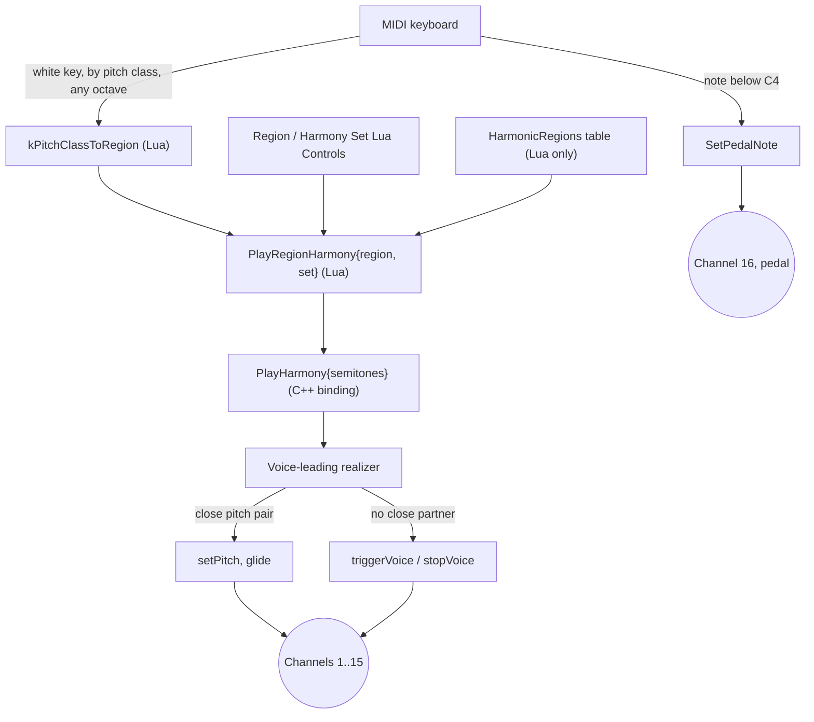

# Ambientsynth

A real-time-performance sibling of Ambientpad: the same two-morphing-wavetable-layer voice
through a resonant pole-mixing filter, times up to 16, but aimed at a human player on a MIDI
keyboard rather than an autonomous harmonic organism. Cutoff, Resonance, Material, Breath, and
Pitch each carry their own Ornstein-Uhlenbeck (mean-reverting random walk) wander plus an
independent per-voice LFO; Drift is LFO-only, spreading the two oscillator layers apart. Filter
type is a discrete choice - LP4, LP2, LP1Notch, Notch, BP2, HP1LP3, or AP4 (a 4-pole allpass,
meant to be swept via Cutoff modulation for phasing) - not a continuous blend.

Harmony lives entirely in Lua, as a plain table of regions and chord "sets" (see Harmony below);
a MIDI keyboard's white keys pick a region, notes below middle C set a bass pedal, and the
built-in `performance.lua` script wires both up out of the box.

## Modulation

How the base-value controls, the five Ornstein-Uhlenbeck processes, and the six per-voice LFOs
reach the voice:

```mermaid
flowchart TD
    subgraph DIALS["Base-value controls"]
        MATERIAL["Material"]
        MRANGE["Range"]
        CUTOFF["Cutoff"]
        RESON["Resonance"]
        FTYPE["Filter (discrete)"]
        BLOOM["Bloom"]
    end

    subgraph OU["Ornstein-Uhlenbeck wander (fixed sigma - no Motion dial)"]
        OUM["OU Material"]
        OUC["OU Cutoff"]
        OUR["OU Resonance"]
        OUB["OU Breath"]
        OUP["OU Pitch"]
    end

    subgraph LFO["Per-voice LFO (channel-indexed, off by default)"]
        LFOC["LFO Cutoff"]
        LFOM["LFO Material"]
        LFOR["LFO Resonance"]
        LFOP["LFO Pitch"]
        LFOBR["LFO Breath"]
        LFOD["LFO Drift"]
    end

    MATERIAL --> MORPH["Oscillator morph, both layers"]
    MRANGE -.->|OU depth| MORPH
    OUM --> MORPH
    LFOM -.->|SetMaterialLfo depth| MORPH

    CUTOFF --> CUTOFFHZ["Filter cutoff Hz"]
    OUC --> CUTOFFHZ
    LFOC -.->|SetCutoffLfo depth| CUTOFFHZ
    CUTOFFOU["SetCutoffOuRange - Lua only"] -.->|OU depth| CUTOFFHZ

    RESON --> RESO["Filter resonance"]
    OUR --> RESO
    LFOR -.->|SetResonanceLfo depth, always up| RESO
    RESRANGE["SetResonanceRange - Lua only"] -.->|OU depth| RESO

    FTYPE --> FILTERTYPE["LP4 / LP2 / LP1Notch / Notch / BP2 / HP1LP3 / AP4"]

    OUB --> RIPPLE["VCA ripple gain, bipolar around unity"]
    LFOBR -.->|SetBreathLfo depth| RIPPLE
    BREATHOU["SetBreathOuRange - Lua only"] -.->|OU depth| RIPPLE

    OUP --> VIBRATO["Vibrato cents, both oscillators identically"]
    LFOP -.->|SetPitchLfo depth| VIBRATO
    PITCHOU["SetPitchOuRange - Lua only"] -.->|OU depth| VIBRATO

    LFOD -.->|SetDriftLfo depth| DRIFT["Per-oscillator drift cents, opposite sign"]
    DETUNE["Fixed inter-oscillator detune"]

    BLOOM --> ENV["Envelope attack/release time"]

    MORPH --> VOICE(("AmbientSynthVoice"))
    CUTOFFHZ --> VOICE
    FILTERTYPE --> VOICE
    RESO --> VOICE
    RIPPLE --> VOICE
    VIBRATO --> VOICE
    DRIFT --> VOICE
    DETUNE --> VOICE
    ENV --> VOICE
```



Material, Cutoff, and Resonance each combine a base dial with their own OU wander and their own
deterministic LFO - three parallel instances of the same pattern. Breath and Pitch are
OU+LFO too, but their destination's own center is implicit (unity gain, no detune) rather than a
dial: nothing to set, only wander/depth to size. Drift is LFO-only - a genuine periodic spread
between the two oscillator layers, not a random one. There is no Motion or Stability control:
each OU process has a fixed internal sigma (no shared "how much randomness" dial), and how far it
reaches its destination is entirely down to that destination's own range setter
(`SetMaterialRange`, `SetCutoffOuRange`, `SetResonanceRange`, `SetBreathOuRange`,
`SetPitchOuRange`) - there is no separate damping multiplier on top. Filter type is a discrete,
unmodulated choice: switching it recomputes the filter's tap-mix weights once, not a continuous
crossfade the way Ambientpad's Light-driven character was.

## Harmony

Unlike Ambientpad's autonomous `HarmonicOrganism`, harmony here only ever changes when something
explicitly asks it to - a MIDI key, a Lua Control knob, or a script calling `PlayHarmony`
directly. The harmonic material itself lives entirely in Lua, not in the core library: there is
no built-in palette, no wish-axis scoring, nothing autonomous to enable or disable.



`PlayHarmony({ semitones = {...} })` is the one C++ binding: a flat, home-relative semitone
array (fractional values keep a cents-level fine tune, same convention Ambientpad's
`AddHarmonicState` used), realized by the same voice-leading as before - a channel whose pitch is
close to a target note glides to it, everything else cross-fades (a free channel triggers the
added note, a channel with no partner in the new chord releases). Channel 16 is always the
dedicated pedal, excluded from this matching.

`PlayRegionHarmony(region, set)` is a plain **Lua function**, not a C++ binding - it lives in the
base script, looks a set of semitones up in a script-authored `HarmonicRegions` table, and calls
`PlayHarmony` with the result. This is deliberate: the harmonic material is Lua's alone to define,
so region/set resolution has to happen in Lua too. `performance.lua`'s own table has 6 ordered
regions - Drone, Major, Minor, Modal warmth, Open suspended, Chromatic - each holding a few
home-relative sets (ported from Ambientpad's old built-in palette, its bass-forward `/lo`
variants dropped, plus one new Drone set); an out-of-range `set` clamps to that region's actual
count in the same Lua lookup (Drone has only one).

Three Lua Controls (Region, Harmony Set, Home) let you change harmony by hand; `OnNoteOn`'s own
mapping (see Scripting below) is the intended real-time path for Region. `SetHarmonyHome(pitchClass)`
retunes the register `PlayHarmony`'s semitones are voiced around (always the octave at and above
MIDI 60, regardless of pitch class); Home is a Lua Control rather than a dial specifically so it
can re-play the current harmony at its new transposition.

## Monitor

An always-on live view, on both the Settings and Performance pages: one thin row per channel
slot, always all 16, each a 1-minute Material/Volume timeline rather than a single instantaneous
value - Volume is the actual VCA output level (envelope x velocity response x Breath ripple x
per-voice gain trim), not just the raw amplitude envelope. Every row sweeps left to right like an
oscilloscope trace - a fixed 600-point ring buffer per row whose write cursor wraps back to the
start once it reaches the end, rather than scrolling the whole history along each frame.

## Controls

| Control | Range | Description |
|---|---|---|
| Level | -60 - 12 dB, default -30 | Master output level |
| Material | 0 - 1, default 0.5 | Wavetable position along each oscillator's material path |
| Range | 0 - 1, default 0.35 | Full width of the Material OU sweep around its center |
| Cutoff | 0 - 1, default 0.5 | Base filter cutoff position |
| Resonance | 0 - 1, default 0.1 | Base filter resonance |
| Filter | LP4/LP2/LP1Notch/Notch/BP2/HP1LP3/AP4 | Discrete filter response, not modulated itself |
| Bloom | 0 - 1, default 0.3 | Amplitude attack/release time - short/direct to slow/lingering |
| Pedal | 0 - 127, default 0 (off) | Bass note on channel 16 - normally set live from the keyboard (see Harmony); this dial is the manual/fallback path |
| Script | (button) | Opens the popup editor for the current patch's script |

Home has no dial of its own - it's a Lua Control (see Scripting below), since changing it
needs to re-play the current harmony, which only a script can do.

**Settings > Scripts** manages a named pool of saved scripts, separate from the script embedded
in the current patch. **Settings > Patches** saves/loads full patches, including whichever
script is currently applied.

## Scripting

This section covers what's specific to Ambientsynth. For everything shared with any other
Lua-scripted example - MIDI handlers, `OnStart`/`OnStop`, dynamic UI parameters, the
`Music`/`Vel`/`Rr`/`Rhythm` helper library, `Timer`, `Transport`, the available stdlib
functions, and sandbox/error-handling notes - see `../../LUA-MANUAL.md`.

`OnStart()` fires exactly once, right after the plugin's engine is constructed - the usual place
to set a patch's static configuration. Unlike Ambientpad, real MIDI reaches this instrument
directly: `OnNoteOn(channel, note, velocity)` and `OnNoteOff(channel, note)` fire on every actual
note from a keyboard or host, in addition to the `NoteOn`/`NoteOff` functions below that a script
can call to trigger a channel directly.

**Every `SetXxx()`/`NoteOn`/`NoteOff`/`PlayHarmony` call below must happen from inside a hook**
(`OnStart`, `OnNoteOn`, a `UICreateParameterSet` callback, a `Timer` callback, ...) - never at
the script's own top level.

### Triggering a voice directly

```lua
NoteOn(channel, note, velocity)
NoteOff(channel, note)
```

`channel` is `1..16` and addresses a voice slot directly - there is no voice stealing, a channel
number *is* a voice. `note` is a MIDI-style note number (`69` = A4 = 440 Hz); `velocity` is
`0..127`. Channel 16 is conventionally the pedal (see Harmony) and is left out of `PlayHarmony`'s
own voice-leading, but nothing stops a script from also triggering it directly.

### Oscillators

```lua
SetOscillator(channel, index, { waveform = 0, level = 0.7, height = 0, cents = 0 })
```

`channel` is `1..16`; `index` is `0` or `1` (the two oscillators). `waveform` selects the
material *path* this layer's Material position sweeps along: `0` Saw-Sine-Square (the default -
warm through hollow to reedy), `1` Triangle-Sine-SharkFin (softer), `2` Square-White-Saw
(noisier, using the noise waveform). `level` is `-1..1`; `height` is a semitone offset from the
played note; `cents` is a fine-tune offset in cents.

### Per-voice gain

```lua
SetGain(channel, gainInDb)
```

A smoothed output trim for one voice, independent of the master Level dial - useful once several
channels are sounding together.

### Pitch glide

```lua
SetPitch(channel, note, cents, glideTimeSeconds)
```

Repitches a channel's held voice without retriggering its envelope or modulation state -
`glideTimeSeconds = 0` is instant (equivalent to setting `NoteOn`'s own note), a positive value
glides smoothly to `note + cents` over that many seconds. `cents` is `-100..100`.

### Per-voice LFO (Lua only, no dial)

Each of the 16 channels can carry its own slow LFO on one of six destinations, independent of the
OU wander above and of every other channel's own LFO - different channels can run at different
speeds. `depth` defaults to 0, so a channel is untouched until a script opts in.

```lua
SetCutoffLfo(channel, rateCyclesPerMinute, depthSemitones, phaseDegrees) -- filter sweep, 0..48
SetMaterialLfo(channel, rateCyclesPerMinute, depth, phaseDegrees)       -- morph sweep, 0..1
SetResonanceLfo(channel, rateCyclesPerMinute, depth, phaseDegrees)      -- always pulls up, 0+
SetPitchLfo(channel, rateCyclesPerMinute, depthCents, phaseDegrees)     -- vibrato, 0..100 cents
SetBreathLfo(channel, rateCyclesPerMinute, depth, phaseDegrees)         -- gain ripple, 0..10
SetDriftLfo(channel, rateCyclesPerMinute, depthCents, phaseDegrees)     -- osc spread, 0..100 cents
```

`rateCyclesPerMinute` is meant for slow use - typically `1..10` - and is clamped to `0..60`.
`phaseDegrees` sets where in the cycle the LFO starts (`0..360`); any other value, negative or
past 360, wraps into that range - useful for starting two channels' LFOs out of phase with each
other. `SetResonanceLfo`'s depth is unipolar: it only ever adds to Resonance's own base, never
subtracts, unlike the other five (which swing symmetrically around their destination). Its depth
has no upper limit either - resonance `1.0` is the filter's own self-oscillation threshold, so a
depth large enough to cross it is a deliberate way to make a voice scream. `SetDriftLfo` spreads
the two oscillator layers apart in opposite directions, unlike `SetPitchLfo`'s identical vibrato
on both.

### The base musical-intent controls

```lua
SetMaterial(value)      -- 0..1
SetMaterialRange(value) -- 0..1, full width of the OU sweep around Material's center
SetCutoff(value)        -- 0..1, base filter cutoff position
SetResonance(value)     -- 0..1, base filter resonance
SetFilterType(type)     -- FilterType.LP4/.LP2/.LP1Notch/.Notch/.BP2/.HP1LP3/.AP4
SetBloom(value)         -- 0..1
```

Each is the scripted equivalent of its dial (see the Controls table above) and, like the dials,
applies to every voice in the array - there is one shared patch, not a per-channel one.
`FilterType` is a global Lua table of named integer constants; pass one of its fields rather than
a raw index (`SetFilterType(FilterType.BP2)`).

### Modulation depth (Lua only, no dial)

How far each OU-driven destination can wander from its own base. There is no Motion or Stability
control scaling this further - each range setter is the only knob.

```lua
SetCutoffOuRange(semitones)  -- 0..48, default 6
SetResonanceRange(amount)    -- 0..1, default 0.15
SetBreathOuRange(amount)     -- 0..10, default 2
SetPitchOuRange(cents)       -- 0..100, default 0 (off)
```

### Distortion

```lua
SetDistortion(presetIndex)
```

`0` bypasses the stage; `1` and up select a 1-indexed preset from `WaveShaperTables.h`'s
`kDistortionWaveTableSet`. Applies to every voice.

### Master effects

```lua
SetPhaser({ rateHz = 0.3, depth = 0.5, feedback = 0, mix = 0.5 })
SetChorus({ rateHz = 0.6, depth = 0.5, mix = 0.5 })
SetReverb({ sizeMeters = 12, decayMs = 1500, dryDb = 0, mixDb = -100 })
```

Identical to Ambientpad's own (see its README for the full field-by-field description); run on
the summed mix of every voice, in the order phaser -> chorus -> reverb. Each defaults to off at
startup. The oscillator/filter chain itself runs mono per voice - `SetChorus` is where this
instrument's stereo depth comes from.

### Harmony

```lua
SetHarmonyHome(pitchClass)              -- 0..11, e.g. 4 = E; retunes PlayHarmony's register
SetPedalNote(note)                      -- 0 no bass, 1..127 a MIDI note held on channel 16
SetHarmonyGlideTime(seconds)            -- 0..60, default 10; a glided channel's own time
PlayHarmony({ semitones = {...} })      -- realizes one chord immediately (see Harmony above)
```

`SetHarmonyGlideTime` only affects channels close enough to a target note to glide rather than
cross-fade (see the realizer in Harmony above) - a cross-faded channel's own envelope timing
(Bloom) is unrelated and unaffected.

`PlayRegionHarmony(region, set)` is not a C++ binding - it is defined in the base script itself
(see Harmony above), by indexing its own `HarmonicRegions` table and calling `PlayHarmony`. A
script that wants its own harmonic material defines its own such table and helper rather than
calling into any core-library palette; there isn't one to call into.

### Real-time MIDI mapping

`performance.lua`'s own `OnNoteOn`/`OnNoteOff` (see Example scripts below) is the reference
implementation of the note-to-region/pedal mapping described in Harmony above - copy and adapt
it rather than re-deriving the pitch-class table from scratch. In short: note `< 60` sets the
pedal; a white key `60..69` (by pitch class, any octave) selects one of the 6 regions, using
whatever the Harmony Set Lua Control is currently on; black keys are ignored for region
selection. A third Lua Control, Hold, latches the pedal: while on, `OnNoteOff` ignores the
pedal note entirely (it holds until Hold goes off again) instead of reverting to
`defaultPedalNote`.

### Example scripts

`base-scripts/performance.lua` is a complete patch, not a fragment - the one real MIDI actually
plays: the `HarmonicRegions` table, `PlayRegionHarmony`, the Region/Harmony Set/Hold/Home Lua
Controls, the `OnNoteOn`/`OnNoteOff` note mapping, and an `OnStart` that sets up oscillators (each
channel carrying all six per-voice LFOs, phase-spread so multiple notes shimmer independently),
the base musical-intent controls, chorus/reverb, home, a faster-than-default 2-second
`SetHarmonyGlideTime`, and a default pedal note before playing the default region/set. Load it
(or start from it) rather than building a patch from an empty script.

`base-scripts/full-api-reference.lua` calls every function the API offers, including a couple
(`NoteOn`/`NoteOff` on channel 3, two back-to-back `PlayHarmony` calls) that only make musical
sense spaced out over a real performance, not fired in one `OnStart()`. It's a syntax reference,
not a patch to build on.

`base-scripts/soundscape-journey.lua` is a self-playing patch, not a real-time performance one:
one `OnNoteOn` takes that note as home/pedal and plays a fixed arc entirely on its own - calm,
widely-spaced drones (5-7 voices, modulation building partway through), a Lydian-mode harmonic
section cycling chords up to a 9th via `PlayHarmony`, a short chromatic-tension section, then
quieter drones that fade out and stop. Voice choice, chord order, and every dwell time are
randomized each run. Playing another note anywhere cancels the run in progress and restarts
the arc from that note.
