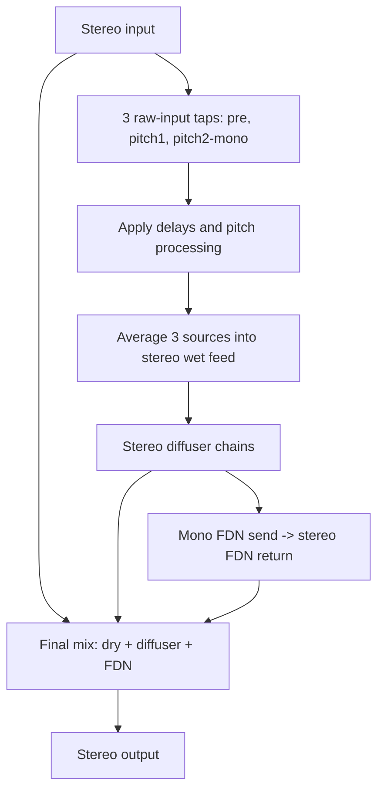
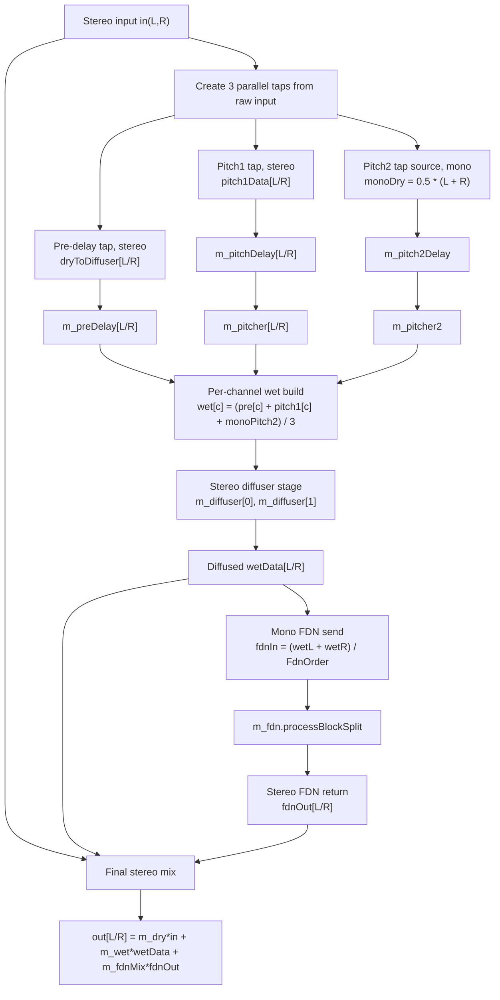

# Max Diffuser

A diffuser (kind of reverb) where you can control a behaviour to extreme reflections.
The diffuser chain can be tweaked with several parameter ot obtain various effects that vary
from early reflection style of reverb to tsunami style of very slow building up reverberation.

## Purpose

| Use case | How |
|---|---|
| Small room effect | Low number of diffusers, slight short reverb |
| Tsunami | 30+ elements with range sizes 1...100m, add strong modulation to cause extrem noise and lowpass everything |
| Chorus effect | Few elements, slight Mod Depth, low Diffusion |
| Alien effects | Pitch and/or Pitch 2 with their own Pitch Delay, moderate Pitch Mix, low Diffusion |
| Simple tap delay | Few elements, slight Diffusion, low Tap Span so single echoes stay distinct |
| Washing out effects | Strong Mod Depth and Mod Speed to blur the chain into a smeared wash |
| Stereo widener / doubler | Few elements, low Diffusion, moderate Size Spread for decorrelated width without a reverb tail |
| Metallic ringing | Early Size and Late Size close together with high Diffusion, for pitched, comb-like resonance |
| Density ramp instead of decay | Set Early Size above Late Size so echoes get denser toward the tail instead of thinning out |
| Thicker tail without more elements | Raise Tap Span to blend several late elements into the output instead of adding more Elements |
| Ambient pad | Keep the diffuser subtle (few elements, low Diffusion) and lean on Reverb Mix/Size/Decay for a smoother, longer wash |

## Controls

| Control | Range | Description |
|---|---|---|
| Dry | -100 - 12 dB | Level of the unprocessed input in the output |
| Wet | -100 - 12 dB | Level of the diffuser chain's output in the output |
| Pre Delay | 0 - 1000 ms | Delay before the dry (unpitched) signal enters the diffuser chain |
| Elements | 0 - 50 | Number of allpass delay stages in series; more elements thicken the diffusion |
| Tap Span | 0 - 100% | How many of the active chain's last elements are averaged into the output tap; 0% taps only the final element, 100% averages the whole active chain |
| Diffusion | -100 - 100% | Feedback amount of each allpass stage; higher values smear transients into a denser wash |
| Bulge | -1 - 1 | Skews the Early/Late Size distribution across elements toward the early or late end |
| Early Size | 0.5 - 100 m | Physical size (converted to delay length) of the first element in the chain |
| Late Size | 0.5 - 100 m | Physical size of the last element in the chain; set below Early Size to make echoes denser toward the end instead of the start |
| Size Spread | 0 - 10 m | Per-element size offset, alternated between channels, for stereo decorrelation; 0 keeps the chain mono, larger values widen the stereo image |
| Mod Depth | 0 - 1 | Depth of the pitch-modulating LFO applied to every second delay element |
| Mod Speed | 0.01 - 5 Hz | Rate of that modulation LFO |
| Low Pass | 20 - 20000 Hz | Damping filter cutoff applied inside each element's feedback path |
| Pitch Mix | 0 - 100% | Blend of the two pitch-shifted taps into the signal feeding the diffuser |
| Pitch | -24 - 24 st | Pitch shift of the first, per-channel pitch tap |
| Pitch Delay | 0 - 1000 ms | Delay before the first pitch tap |
| Pitch 2 | -24 - 24 st | Pitch shift of the second, mono pitch tap |
| Pitch 2 Delay | 0 - 1000 ms | Delay before the second pitch tap |
| Pitch Mode | Drift / Sync / Vocoder | Pitch-shifting algorithm shared by both pitch taps |
| Reverb Mix | -100 - 12 dB | Level of the FDN reverb tail (fed from the diffuser output) in the output |
| Reverb Size | 1 - 330 m | Average delay-line size of the FDN reverb tank |
| Reverb Decay | 1 - 100000 ms | RT60-style decay time of the FDN reverb tail |

## Displays

| Display | Shows |
|---|---|
| Bands | Per-element low/mid/high band level meters across the active diffuser chain |
| Sizes | Per-element delay size, visualizing the Early/Late Size and Bulge distribution |

## Audio flow

