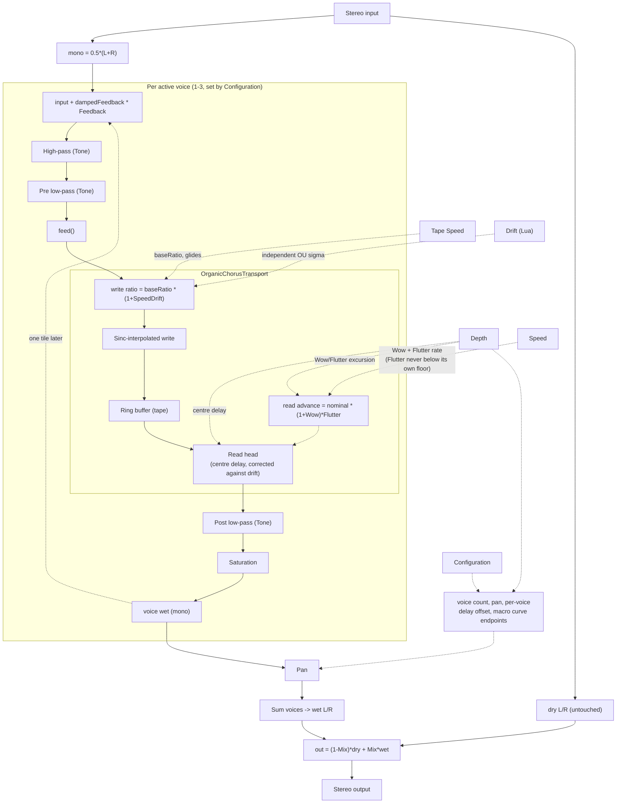

# Organic Chorus

A multi-voice BBD-style chorus/flanger built on a genuine variable-speed tape transport
per voice (`OrganicChorusTransport`, a fork of tapelooper's `VariSpeedTapeDelay` tuned
for this instrument's own artistic use of the tape concept), rather than a read-position
fake: the write clock stays clean, carrying only the transport's own baseline speed plus
an independent, mean-reverting (Ornstein-Uhlenbeck) drift process (Drift) wandering it on
top, while a slow sine LFO (Depth) and a fast flutter component (Speed) instead modulate
each voice's read head - so the ensemble drifts and breathes without ever repeating on an
obvious cycle. Seven macros (Configuration, Tone, Speed, Tape Speed, Depth, Feedback, Mix)
drive per-configuration curves onto that engine; the underlying voice count, delay ranges,
tone endpoints and feedback policy stay internal to each configuration.

## Signal Flow



Depth drives both the sine-LFO wobble depth and the centre delay (per `baseDelayMs` in
`ChorusConfigurations.h`); Drift is deliberately independent of it (see the design note in
`ChorusConfigurations.h` on `speedDriftMaxSigma`) - that decoupling is what "Speed
variations of the mechanics" in the Scripting section below refers to.

## Controls

| Control | Range | Description |
|---|---|---|
| Configuration | Classic / Wide / Tri Ensemble / Flanger | Selects the voice topology and every macro curve's endpoints below - see "Configurations" below. |
| Tone | 0-100 | Unitless: wet high-pass + pre/post low-pass cutoffs (three different filters at once, so no single physical unit fits), dark at 0 and bright at 100, per configuration. |
| Speed | 0.05-6.0 Hz | Wow/Flutter modulation rate - how fast the wobble breathes. Shared across configurations; a configuration whose own safe range is narrower clamps internally rather than exceeding it. Below 1 Hz the stochastic (Ornstein-Uhlenbeck) drift component fades out, leaving the bounded sine LFO alone - that component genuinely accumulates drift over time and isn't safe to sustain at very slow rates. |
| Tape Speed | -24 to +24 semitones | The transport's own baseline speed (0 = unity) - a manual pitch/time offset every voice's Wow/Flutter wobble then rides on top of, independent of Speed. Glides smoothly rather than jumping, like changing a real tape machine's speed. |
| Depth | 0-100% | Wow/Flutter modulation depth (delay-time excursion). |
| Feedback | -100-100% | Filtered wet feedback gain and polarity, every configuration included. |
| Mix | 0-100% | Dry/wet balance. |
| Script | (button) | Opens the popup editor for the current patch's script. |

**Settings > Scripts** manages a named pool of saved scripts, separate from the script
embedded in the current patch. **Settings > Patches** saves/loads full patches, including
whichever script is currently applied.

## Configurations

| Configuration | Voices | Character |
|---|---:|---|
| Classic | 1 | Short, tight, classic "watery" chorus |
| Wide | 2 | Classic-style voices panned hard for stereo spread |
| Tri Ensemble | 3 | Wider, slower, cleaner (less BBD colour), moderate feedback |
| Flanger | 1 | Very short delay, bipolar feedback, faster/deeper sweep |

### Future configurations

The original design plan also called for Small Clone / Deep BBD, Dimension 1-4 (fixed
internal presets), Quad Chorus, Bass Chorus, Organic Ensemble, and Tape Chorus. These are
not built yet; the engine (`OrganicChorusEngine`/`OrganicChorusVoice` in
`src/includes/Delays/`) supports up to 4 voices per instance, so adding one is a matter of
a new `ChorusConfigurationSpec` entry in `src/impl/ChorusConfigurations.h`, not new C++.

### A path to tape defects

Because this engine's transport is a genuine variable-speed tape model
(`OrganicChorusTransport`, not a read-position approximation), it also opens the door to
simulating period tape defects - dropout, hiss, print-through - later, the same way
tapelooper's own transport does. Nothing here builds that yet; it is recorded as a
natural next step this architecture enables, not a promise.

## Scripting

This section covers what's specific to Organic Chorus: two extra live-tweak knobs beyond
the seven macros above. For everything shared with any other Lua-scripted example - MIDI
handlers, `OnStart`/`OnStop`, dynamic UI parameters, `Timer`, `Transport`, the available
stdlib functions, and sandbox/error-handling notes - see `../../LUA-MANUAL.md`.

There are no custom bound functions here: the default script only claims two dynamic UI
parameter slots, each of which drives a plain engine setter directly (no scripting logic
in between).

```lua
UICreateParameterSet({
    { id = "drift", name = "Drift", type = "knob", range = { min = 0, max = 1, step = 0, skew = 1 }, default = 0.5 },
    { id = "spread", name = "Spread", type = "knob", range = { min = 0, max = 1, step = 0, skew = 1 }, default = 0.5 },
})
```

| Slot | Effect |
|---|---|
| Drift | Real mechanical speed wander on the transport's own clock (an independent Ornstein-Uhlenbeck process on the ratio), not scaled by Depth - a physical "the motor isn't perfectly steady" character, separate from the deliberate chorus wobble. |
| Spread | Per-voice rate detuning: 0 keeps every voice's Wow rate locked together, 1 is maximally independent. Has no audible effect on the single-voice Classic/Flanger configurations. |

A claimed slot's `On<Id>Changed(value)` handler is not needed here since the base engine
already reads the raw parameter value directly - see `LUA-MANUAL.md`'s "Dynamic UI
parameters" section for the general mechanism.
