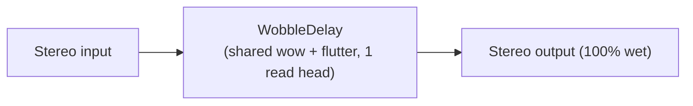

# Pathfinder

The first graph of a planned Lua tape-modulation toolbox (see `chorus.md`): a single
shared-stereo tape transport (`WobbleDelay`, organicchorus's own fork of
`VariSpeedTapeDelay`), one read head, driven purely by its internal wow and flutter,
100% wet. Left and right share one transport, so the wobble stays coherent across the
stereo image rather than drifting independently per channel.

This is deliberately minimal: no dry path, no filters, no feedback, no multiple heads.
Those, along with the general Lua graph-description layer the full toolbox calls for,
are later, separately-planned phases; this example is just the toolbox's seed graph,
built as an ordinary fixed-topology example like every other one in `examples/`.

## Signal Flow

## Controls

| Control | Range | Description |
|---|---|---|
| Depth | 0-100% | Wow/flutter modulation depth (delay-time excursion); flutter's own depth follows more gently than wow's. |
| Speed | 0.05-6.0 Hz | Wow/flutter modulation rate. Flutter is floored at 0.6 Hz regardless of how slow Speed goes. |
| OU Aggressivity | 0-100% | Variance and drift of the wow process's own mean-reverting (Ornstein-Uhlenbeck) wander, on top of its bounded sine component. |
| Character | 0-100% | The transport's own baseline speed: 0% is tape-oriented (below nominal), 50% is nominal, 100% is a cleaner, faster transport. Glides rather than jumping. |
