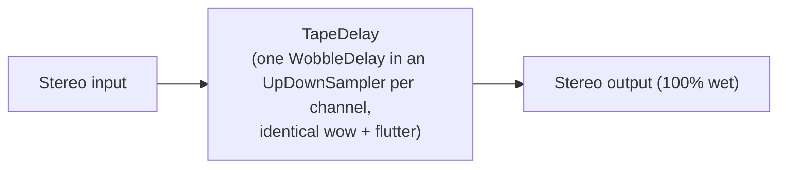

# Pathfinder

A tape-modulation effect whose signal chain and controls are a Lua graph script you can edit
in the app. It starts as a shared-stereo tape vibrato: one delay read head per channel,
modulated by tape-like wow and flutter, 100% wet. Both channels are seeded identically, so the
wobble stays coherent across the stereo image. The samplers around each delay add a
ratio-dependent latency, about 1.4 ms at nominal speed (see `documentation/OverSampling/`).

The script decides everything: which nodes exist, how they are wired, and which knobs the
plugin shows. Ten ready-made graphs (vibrato, chorus families, a BBD-style chorus, a widener and
a resonant feedback loop) are offered as templates; see Presets below.

## Signal Flow

The default script:



## Controls

The window shows the CPU load, the output level, the spectrogram and signal displays, and the Lua
Controls area. Every control in that area is a macro declared by the current script, so it changes
when you apply another script. The default script declares four:

| Control | Display | Description |
|---|---|---|
| Depth | 0-100 % | Wow and flutter depth (delay-time excursion). |
| Speed | 1-10 Hz | Flutter rate, and with it the wow rate. |
| OU Aggressivity | 0-100 % | Variance and drift of the wow process's own mean-reverting (Ornstein-Uhlenbeck) wander. |
| Character | 0-100 % | The transport's baseline speed: 50% is nominal, below is tape-like and slower, above is cleaner and faster. Glides rather than jumping. |

The knobs are host-automatable as Lua Param 1 to 8 and answer MIDI CC 16 to 23.

## Scripting

A script is Lua that returns one table, the graph. It is compiled on Apply and swapped in with a
30 ms crossfade; the graph's own nodes start from silence, so the tail of the old sound fades out
while the new one fades in.

### The editor

The Script button opens the editor. Apply compiles the text and swaps the graph; if it does not
compile, the first error is shown (node, port, field and line where known, plus a count of any
more) and the running graph keeps playing. Reset puts the default script in the editor without
applying it. The dropdown lists the ten preset scripts, read-only, so you can copy one and edit
it (in a build made from a source checkout). Settings > Scripts keeps a named pool of your own
scripts. The script is saved with the patch; loading a patch restores its script and its knob
positions. Applying a script moves the knobs to the defaults it declares.

### A script

A complete graph with one knob:

```lua
return {
  version = 1,
  name = "My Vibrato",
  io = { inputs = { "inL", "inR" }, outputs = { "outL", "outR" } },
  nodes = {
    { id = "tape", type = "TapeDelay", config = { baseDelayMs = 10 },
      params = { flutterDepth = 0.5, flutterRate = 5.0 } },
  },
  edges = {
    { from = "inL", to = "tape.inL" }, { from = "inR", to = "tape.inR" },
    { from = "tape.outL", to = "outL" }, { from = "tape.outR", to = "outR" },
  },
  macros = {
    { id = "depth", label = "Depth", unit = "%", min = 0, max = 100, default = 50,
      targets = { { to = "tape.flutterDepth", min = 0, max = 1 } } },
  },
}
```

The table's fields:

- `version`: 1. `name`: shown in error text.
- `io`: exactly two inputs and two outputs; their names are yours, they are what `edges` refer to.
- `nodes`: each has an `id`, a `type` from the reference below, optional `params` (numbers) and
  `config` (strings, numbers or booleans). Config is fixed when the graph is compiled; params can
  be driven by macros and control edges.
- `edges`: audio and control connections, `from` and `to` written `"node.port"`, or just a graph
  port name from `io`. One output may feed several inputs; an input takes one edge unless it is
  multi-connectable. Only `from` and `to` are read: `gain`, `polarity` and `label` on an edge are
  ignored, so use a `Gain` or `Matrix` node for level and polarity.
- `controls`: modulation, see below.
- `macros`: the knobs, see below.

A wiring loop is a feedback cycle and must contain a node that breaks it, normally `FeedbackDelay`
(one block). This adds an echo to the tape delay:

```lua
return {
  version = 1,
  name = "Tape Echo",
  io = { inputs = { "inL", "inR" }, outputs = { "outL", "outR" } },
  nodes = {
    { id = "tape", type = "TapeDelay", config = { baseDelayMs = 120 } },
    { id = "level", type = "Gain", params = { gainDb = -12 } },
    { id = "returnL", type = "FeedbackDelay" },
    { id = "returnR", type = "FeedbackDelay" },
  },
  edges = {
    { from = "inL", to = "tape.inL" }, { from = "inR", to = "tape.inR" },
    { from = "tape.outL", to = "outL" }, { from = "tape.outR", to = "outR" },
    { from = "tape.outL", to = "level.inL" }, { from = "tape.outR", to = "level.inR" },
    { from = "level.outL", to = "returnL.in" }, { from = "level.outR", to = "returnR.in" },
    { from = "returnL.out", to = "tape.feedbackL" }, { from = "returnR.out", to = "tape.feedbackR" },
  },
}
```

### Macros and knobs

A macro is one knob. Its value travels 0 to 1; `unit`, `min` and `max` are what the knob displays
for that travel, and `default` is in those units (all optional; 0 to 1 by default). Each target
names `node.param` and sweeps it from its own `min` to `max` as the knob travels, or over the
parameter's whole range when both are left out. `curve = "exp"` sweeps geometrically and needs a
positive `min` and `max`.

```lua-fragment
{ id = "character", label = "Character", unit = "%", min = 0, max = 100, default = 50,
  targets = { { to = "tape.transportRatio", min = 0.5, max = 2, curve = "exp" } } },
```

Several targets may share a macro. The macros become the knobs in the order they are declared, at
most eight; any beyond that are ignored. A knob's displayed range does not have to match its
targets: it is only what the knob shows.

### Modulation with control edges

A control node produces a value that a control edge writes into a parameter. The LFO below sweeps
the flutter depth; `ScaleOffset` turns its output into the range the parameter wants.

```lua
return {
  version = 1,
  name = "Breathing Vibrato",
  io = { inputs = { "inL", "inR" }, outputs = { "outL", "outR" } },
  nodes = {
    { id = "tape", type = "TapeDelay", config = { baseDelayMs = 10 }, params = { flutterRate = 5.0 } },
    { id = "lfo", type = "LFO", params = { rateHz = 0.2 } },
    { id = "range", type = "ScaleOffset", params = { scale = 0.25, offset = 0.5 } },
  },
  edges = {
    { from = "inL", to = "tape.inL" }, { from = "inR", to = "tape.inR" },
    { from = "tape.outL", to = "outL" }, { from = "tape.outR", to = "outR" },
    { from = "lfo.out", to = "range.in" },
  },
  controls = {
    { from = "range.out", to = "tape.flutterDepth" },
  },
}
```

A control edge's source is a node's control output, and its target is a parameter. Control ports
and audio ports cannot be wired to each other. Macros use the same mechanism: each one becomes a
control node feeding its targets, so do not drive one parameter from both a knob and a control edge.

### TapeDelay

The main building block: a stereo delay whose two channels share one modulation. Ports are `inL`,
`inR`, `feedbackL`, `feedbackR` (added to the input) and `outL`, `outR`.

- `baseDelayMs` sets the delay in milliseconds; the range is the safety margin (`safetyMarginSamples`,
  250 samples) up to about 170 ms. The wobble never reaches closer than the margin.
- `seed` picks the random part of the wow. Two nodes with the same seed and parameters move in
  lockstep, like two heads on one transport; different seeds move independently.
- `wowDepth` is cubed and limited to plus or minus 1 ms, so it is subtle. `flutterDepth` sets a
  speed error of about 31 cents at 1.0, whatever the rate, so the delay swing grows with it and falls
  with `flutterRate`. For a chorus-like swing of 2 to 3 ms use a flutter depth around 0.4 at 0.5 to 1 Hz;
  for an audible vibrato use around 0.6 at 4 to 6 Hz.
- `transportRatio` is the medium's speed, from 1/16 to 8; changes glide.
- A parameter you do not set starts at the value in the table, and for the depths that is 0: no
  wobble at all. Set the depths you want.
- Each instance costs roughly 0.5 to 1.4 percent of one core.

<!-- NODE-REFERENCE:BEGIN -->
| Type | Ports | Parameters | Config |
|---|---|---|---|
| `Add` | in: inA (ctl), inB (ctl); out: out (ctl) |  |  |
| `BandPass` | in: in; out: out | `frequencyHz` (20 to 20000, default 1000); `Q` (0.1 to 20, default 0.707107) |  |
| `Biquad` | in: in; out: out | `frequencyHz` (20 to 20000, default 1000); `Q` (0.1 to 20, default 0.707107); `peakGainDb` (-24 to 24, default 0) | `mode`: lowpass (default), highpass, notch, peak |
| `Clamp` | in: in (ctl); out: out (ctl) | `min` (-100 to 100, default 0); `max` (-100 to 100, default 1) |  |
| `Compander` | in: in; out: out | `thresholdDb` (-60 to 0, default 0); `ratio` (1 to 20, default 1); `attackMs` (0.01 to 1000, default 10); `releaseMs` (0.01 to 2000, default 100) |  |
| `Constant` | out: out (ctl) |  | `value` (0) |
| `CrossoverLR4` | in: in; out: lowOut, highOut | `frequencyHz` (20 to 20000, default 1000) |  |
| `Curve` | in: in (ctl); out: out (ctl) | `exponent` (0.01 to 100, default 1) |  |
| `DCBlocker` | in: in; out: out |  |  |
| `EnvelopeFollower` | in: in; out: out (ctl) | `attackMs` (0.01 to 5000, default 5); `releaseMs` (0.01 to 5000, default 50) |  |
| `ExpMap` | in: in (ctl); out: out (ctl) | `inMin` (-1000 to 1000, default 0); `inMax` (-1000 to 1000, default 1); `outMin` (0.0001 to 100000, default 1); `outMax` (0.0001 to 100000, default 2) |  |
| `FeedbackDelay` | in: in; out: out |  |  |
| `Gain` | in: inL, inR; out: outL, outR | `gainDb` (-60 to 24, default 0 dB) |  |
| `LFO` | out: out (ctl) | `rateHz` (0 to 20, default 1); `phaseOffsetDegrees` (-360 to 360, default 0) | `waveform`: sine (default), triangle, saw, square, noise |
| `MS_Decode` | in: inM, inS; out: outL, outR |  |  |
| `MS_Encode` | in: inL, inR; out: outM, outS |  |  |
| `Macro` | out: out (ctl) | `value` (0 to 1, default 0) |  |
| `Map` | in: in (ctl); out: out (ctl) | `inMin` (-1000 to 1000, default 0); `inMax` (-1000 to 1000, default 1); `outMin` (-1000 to 1000, default 0); `outMax` (-1000 to 1000, default 1) |  |
| `Matrix` | in: inL, inR; out: outL, outR | `gainLL` (-2 to 2, default 1); `gainLR` (-2 to 2, default 0); `gainRL` (-2 to 2, default 0); `gainRR` (-2 to 2, default 1) |  |
| `Mixer` | in: in1L, in1R, in2L, in2R; out: outL, outR |  |  |
| `MonoToStereo` | in: in; out: outL, outR |  |  |
| `Multiply` | in: inA (ctl), inB (ctl); out: out (ctl) |  |  |
| `OnePoleHP` | in: in; out: out | `cutoffHz` (20 to 20000, default 1000) |  |
| `OnePoleLP` | in: in; out: out | `cutoffHz` (20 to 20000, default 1000) |  |
| `PhaseOffset` | in: in (ctl); out: out (ctl) | `offset` (-1 to 1, default 0) |  |
| `SampleHold` | in: in (ctl), trigger (ctl); out: out (ctl) |  |  |
| `Saturator` | in: in; out: out | `drive` (0 to 20, default 0) |  |
| `ScaleOffset` | in: in (ctl); out: out (ctl) | `scale` (-100 to 100, default 1); `offset` (-100 to 100, default 0) |  |
| `ShelfEQ` | in: in; out: out | `frequencyHz` (20 to 20000, default 4000); `gainDb` (-24 to 24, default 0); `Q` (0.1 to 20, default 0.707107) |  |
| `Slew` | in: in (ctl); out: out (ctl) | `timeMs` (0.01 to 10000, default 20) |  |
| `Split` | in: inL, inR; out: out1L, out1R, out2L, out2R |  |  |
| `StereoToMono` | in: inL, inR; out: out | `gainL` (0 to 1, default 0.5); `gainR` (0 to 1, default 0.5) |  |
| `TapeDelay` | in: inL, inR, feedbackL, feedbackR; out: outL, outR | `transportRatio` (0.0625 to 8, default 1 ratio); `wowDepth` (0 to 1, default 0); `wowRate` (0 to 10, default 1 Hz); `wowVariance` (0 to 1, default 0); `wowDrift` (0 to 1, default 0); `flutterDepth` (0 to 1, default 0); `flutterRate` (0 to 20, default 0.3 Hz) | `baseDelayMs` (8), `safetyMarginSamples` (250), `seed` (1) |
| `TiltEQ` | in: in; out: out | `tiltDb` (-24 to 24, default 0); `pivotHz` (20 to 20000, default 1000) |  |
| `Width` | in: inL, inR; out: outL, outR | `width` (0 to 2, default 1) |  |
<!-- NODE-REFERENCE:END -->

Ports marked (ctl) are control ports. The table is generated from the registered nodes; regenerate it
with `dev-scripts/dev-pathfinder-docs.sh`.

### Limits and errors

- A script is at most 64 KB, has at most 128 nodes, and needs exactly two graph inputs and outputs.
- Only Lua's `base`, `math`, `string` and `table` libraries exist: no `io`, `os` or `require`. A
  script that runs more than about 20 million Lua instructions, or allocates more than 64 MB, is
  stopped with an error.
- A misspelled parameter or config key is not reported: it is ignored. A macro or target that names
  an unknown node or parameter is skipped without a message. Check the sound, or a target, when a
  knob does nothing.
- Feedback can build up level. The validator refuses a cycle without a breaker and warns about
  undamped or resonant ones, but only errors are shown in the editor. Put a `Saturator` in a loop
  you push hard; it limits to plus or minus 1.

### Presets

The scripts in `src/includes/Graph/Presets/lua/` are the templates the editor offers:
`tape_vibrato` (the default), `classic_stereo_chorus`, `shared_transport_heads`,
`ensemble_tri_chorus`, three `crossover_*` recipes that keep the low end dry, mono or high-passed,
`bbd_inspired`, `dimension` and `experimental_resonant_feedback`. Each declares its own knobs. See
`src/includes/Graph/README.md` for how they are built and measured.
